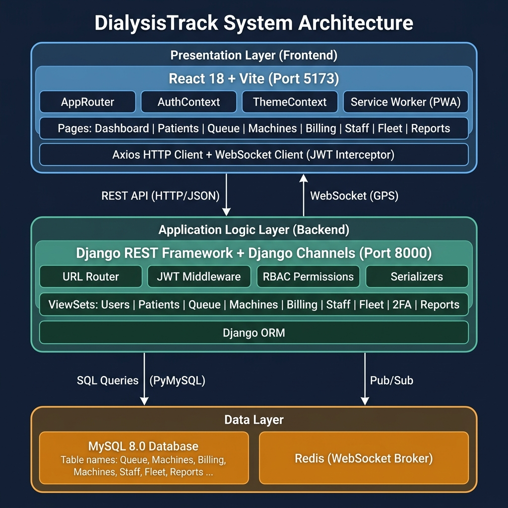
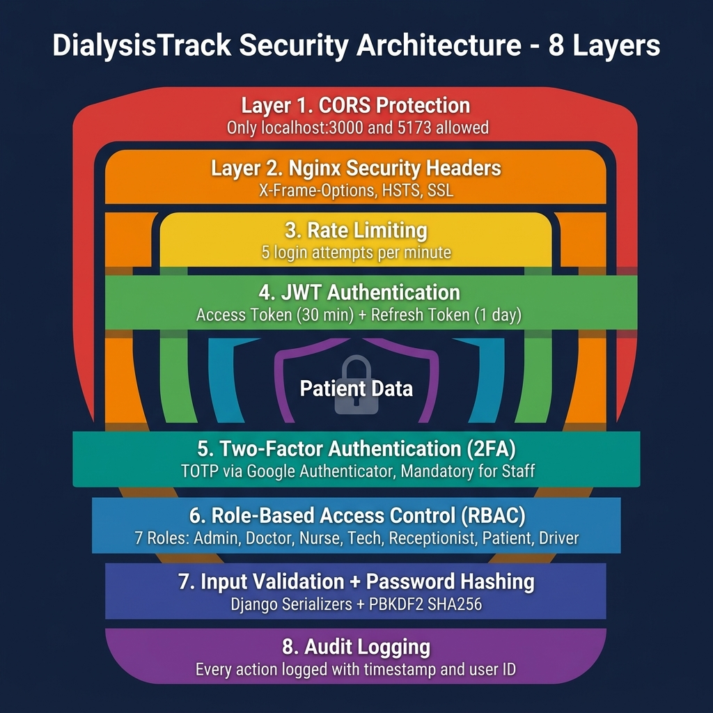
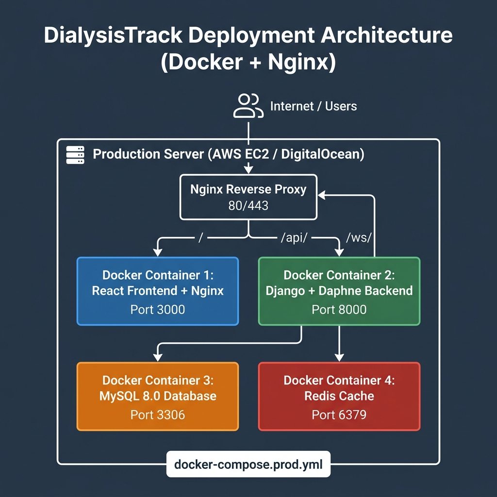
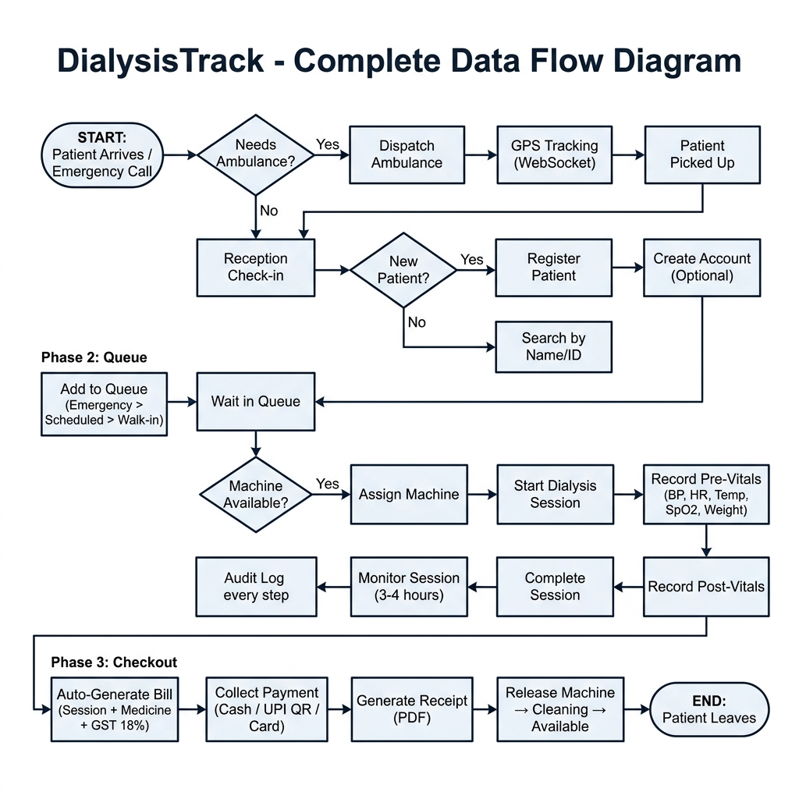

# DialysisTrack — Complete System Architecture

## Architecture Diagrams (Images)

> All architecture diagrams are available as PNG images in this folder for use in blackbook/reports.

| Diagram | File |
|---------|------|
| System Architecture (3-Tier) | [system_architecture.png](system_architecture.png) |
| Security Architecture (8 Layers) | [security_architecture.png](security_architecture.png) |
| Deployment Architecture (Docker) | [deployment_architecture.png](deployment_architecture.png) |
| Data Flow Diagram (Patient Journey) | [data_flow_diagram.png](data_flow_diagram.png) |

---

## 1. High-Level Architecture Overview

DialysisTrack follows a **3-Tier Decoupled Architecture** where the Frontend, Backend, and Database run as independent layers communicating through well-defined interfaces.

```
┌─────────────────────────────────────────────────────────────────────────────────┐
│                            CLIENT LAYER (Browser)                               │
│                                                                                 │
│  ┌──────────────────────────────────────────────────────────────────────────┐   │
│  │                    React 18 + Vite (Port 5173)                           │   │
│  │                                                                          │   │
│  │  ┌──────────┐  ┌──────────┐  ┌───────────┐  ┌────────────────────────┐  │   │
│  │  │ AppRouter│  │AuthContext│  │ThemeContext│  │  Service Worker (PWA)  │  │   │
│  │  └────┬─────┘  └────┬─────┘  └─────┬─────┘  └────────────────────────┘  │   │
│  │       │              │              │                                     │   │
│  │  ┌────▼──────────────▼──────────────▼─────────────────────────────────┐  │   │
│  │  │                      Page Components                               │  │   │
│  │  │  Dashboard │ Patients │ Queue │ Machines │ Billing │ Staff │ Fleet │  │   │
│  │  └──────────────────────────┬─────────────────────────────────────────┘  │   │
│  │                             │                                            │   │
│  │  ┌──────────────────────────▼─────────────────────────────────────────┐  │   │
│  │  │              Axios HTTP Client + WebSocket Client                   │  │   │
│  │  │         (JWT Token Interceptor + Auto-Refresh + Error Handler)     │  │   │
│  │  └──────────────────────────┬──────────────────┬──────────────────────┘  │   │
│  └─────────────────────────────┼──────────────────┼──────────────────────────┘   │
└────────────────────────────────┼──────────────────┼──────────────────────────────┘
                                 │ REST API (HTTP)   │ WebSocket (WS)
                                 │ Port 8000         │ Port 8000
┌────────────────────────────────┼──────────────────┼──────────────────────────────┐
│                        APPLICATION LAYER (Server)                                │
│                                                                                  │
│  ┌─────────────────────────────▼──────────────────▼──────────────────────────┐   │
│  │                  Django REST Framework + Django Channels                   │   │
│  │                                                                           │   │
│  │  ┌─────────────┐  ┌──────────────┐  ┌──────────────┐  ┌──────────────┐  │   │
│  │  │  URL Router  │  │  Middleware   │  │  Permissions │  │  Serializers │  │   │
│  │  │  (urls.py)   │  │  (JWT Auth)  │  │  (RBAC)      │  │  (Validate)  │  │   │
│  │  └──────┬───────┘  └──────┬───────┘  └──────┬───────┘  └──────┬───────┘  │   │
│  │         │                 │                  │                 │           │   │
│  │  ┌──────▼─────────────────▼──────────────────▼─────────────────▼───────┐  │   │
│  │  │                         ViewSets (Business Logic)                    │  │   │
│  │  │  Users│Patients│Queue│Machines│Billing│Staff│Fleet│2FA│Reports│Appts│  │   │
│  │  └──────────────────────────┬──────────────────────────────────────────┘  │   │
│  │                             │                                             │   │
│  │  ┌──────────────────────────▼─────────────────────────────────────────┐   │   │
│  │  │                    Django ORM (Object-Relational Mapping)           │   │   │
│  │  └──────────────────────────┬─────────────────────────────────────────┘   │   │
│  └─────────────────────────────┼─────────────────────────────────────────────┘   │
└────────────────────────────────┼─────────────────────────────────────────────────┘
                                 │ SQL Queries (PyMySQL)
┌────────────────────────────────┼─────────────────────────────────────────────────┐
│                            DATA LAYER                                            │
│                                                                                  │
│  ┌─────────────────────────────▼──────────┐  ┌───────────────────────────────┐   │
│  │           MySQL 8.0 Database            │  │     Redis (Message Broker)    │   │
│  │                                         │  │                               │   │
│  │  users_user          billing_bill       │  │  WebSocket Channel Groups     │   │
│  │  patients_patient    billing_payment    │  │  ride_1, ride_2, ride_3...    │   │
│  │  appointments        fleet_ambulance    │  │  (GPS coordinate broadcast)   │   │
│  │  dialysis_queue      fleet_ride         │  │                               │   │
│  │  dialysis_session    notifications      │  │                               │   │
│  │  machines            audit_log          │  │                               │   │
│  │  maintenance_log     two_factor         │  │                               │   │
│  └─────────────────────────────────────────┘  └───────────────────────────────┘   │
└──────────────────────────────────────────────────────────────────────────────────┘
```

---

## 2. The Three Layers Explained

### Layer 1 — Presentation Layer (Frontend)

| Component | Technology | Purpose |
|-----------|-----------|---------|
| **Build Tool** | Vite | Fast development server, ES module bundling |
| **UI Framework** | React 18 | Component-based user interface |
| **Routing** | React Router v6 | Single Page App navigation |
| **HTTP Client** | Axios | API calls with JWT interceptor |
| **Styling** | Tailwind CSS + Custom CSS | Responsive UI with dark/light theme |
| **State** | React Context (Auth, Theme) | Global state management |
| **PWA** | Service Worker + Manifest | Installable app, offline support |
| **WebSocket** | Native WebSocket API | Real-time GPS tracking |
| **Charts** | Recharts | Data visualization |
| **Animations** | Framer Motion | Micro-interactions |
| **Icons** | Lucide React | SVG icon library |

### Layer 2 — Application Logic Layer (Backend)

| Component | Technology | Purpose |
|-----------|-----------|---------|
| **Framework** | Django 4.2 + DRF | REST API, ORM, admin panel |
| **WSGI Server** | Gunicorn | Handles HTTP requests |
| **ASGI Server** | Daphne | Handles WebSocket connections |
| **Authentication** | SimpleJWT | JWT access + refresh tokens |
| **2FA** | django-otp + pyotp | TOTP-based two-factor auth |
| **WebSocket** | Django Channels | Real-time communication |
| **PDF Generation** | ReportLab | Patient reports, receipts |
| **Excel Export** | openpyxl | Spreadsheet reports |
| **QR Codes** | python-qrcode | UPI payment QR, 2FA setup QR |
| **Environment** | python-decouple | Secure config from .env file |

### Layer 3 — Data Layer (Database + Cache)

| Component | Technology | Purpose |
|-----------|-----------|---------|
| **Primary DB** | MySQL 8.0 | Persistent data storage (ACID compliant) |
| **DB Driver** | PyMySQL | Python-MySQL connection |
| **Dev DB** | SQLite | Local development fallback |
| **Message Broker** | Redis | WebSocket channel layer for GPS broadcast |
| **ORM** | Django ORM | Python objects ↔ SQL queries |

---

## 3. Communication Flows

### 3.1 Standard REST API Flow (HTTP)

When a Receptionist clicks "Register Patient":

```
┌──────────┐    POST /api/patients/    ┌──────────────┐    INSERT INTO    ┌───────┐
│  React   │ ──────────────────────►   │    Django     │ ──────────────►  │ MySQL │
│ Frontend │   Authorization:          │   Backend     │                  │  DB   │
│          │   Bearer <JWT token>      │              │                  │       │
│          │ ◄──────────────────────   │              │ ◄──────────────  │       │
│          │   201 Created + JSON      │              │   Row inserted   │       │
└──────────┘                           └──────────────┘                  └───────┘
```

**Step-by-step:**
1. React form captures patient data
2. `AuthContext` retrieves JWT Access Token from `localStorage`
3. Axios interceptor attaches `Authorization: Bearer <token>` header
4. HTTP `POST` sent to `http://localhost:8000/api/patients/`
5. Django URL Router routes to `PatientViewSet`
6. JWT Middleware verifies the token (rejects if expired → 401)
7. `HospitalRolePermission` checks if user's role allows `POST` on patients
8. `PatientSerializer` validates the JSON payload
9. Django ORM inserts record into MySQL
10. Django returns `HTTP 201 Created` with new patient data as JSON

### 3.2 WebSocket Flow (Live GPS Tracking)

When a Driver is transporting a patient:

```
┌──────────┐  ws://host/ws/ride/1/   ┌──────────────┐   Pub/Sub    ┌───────┐
│  Driver  │ ═══════════════════════► │   Django     │ ◄──────────► │ Redis │
│  Phone   │   {lat, lng} every 3s   │   Channels   │              │       │
└──────────┘                          └──────┬───────┘              └───────┘
                                             │ Broadcast
                              ┌──────────────┼──────────────┐
                              ▼              ▼              ▼
                        ┌──────────┐  ┌──────────┐  ┌──────────┐
                        │ Patient  │  │Reception │  │  Admin   │
                        │ Browser  │  │ Browser  │  │ Browser  │
                        └──────────┘  └──────────┘  └──────────┘
```

**Step-by-step:**
1. React uses `navigator.geolocation.watchPosition` to get GPS every 3 seconds
2. WebSocket connection established: `ws://localhost:8000/ws/fleet/ride/1/`
3. Django Channels (ASGI) accepts the connection
4. Driver is added to Redis Channel Group `ride_1`
5. Driver sends `{"lat": 19.1, "lng": 72.4}` through WebSocket
6. Backend validates coordinates, saves to MySQL, broadcasts via Redis
7. All browsers subscribed to `ride_1` receive the location instantly
8. React updates the map marker — ambulance icon moves in real time

### 3.3 Authentication Flow (JWT + 2FA)

```
┌──────────┐                              ┌──────────────┐
│  User    │  POST /api/auth/login/       │   Django     │
│ Browser  │  {email, password}           │   Backend    │
│          │ ──────────────────────────►   │              │
│          │                              │  ┌─────────┐ │
│          │                              │  │ Check   │ │
│          │                              │  │ password│ │
│          │                              │  └────┬────┘ │
│          │                              │       │      │
│          │                              │  Is staff?   │
│          │                              │  ┌─Yes─┐ No──┼──► Return JWT tokens
│          │                              │  │     │     │
│          │                              │  Has 2FA?   │
│          │                              │  ┌─Yes─┐ No──┼──► Return {requires_2fa_setup: true}
│          │                              │  │     │     │
│          │                              │  Grace OK?  │
│          │                              │  ┌─Yes─┐ No──┼──► Return {requires_2fa: true}
│          │                              │  │     │     │
│          │  ◄── JWT tokens + user data  │  Return JWT  │
│          │      (grace login used)      │  tokens      │
└──────────┘                              └──────────────┘
```

---

## 4. Module Architecture Map

### Backend Modules (12 Django Apps)

```
backend/
├── config/              # Project settings, URL routing, ASGI/WSGI
├── users/               # User model, login, register, RBAC permissions
├── patients/            # Patient CRUD, portal, PDF generation
├── appointments/        # Scheduling with shift system (morning/evening/night)
├── dialysis_queue/      # Queue management + dialysis session recording
├── machines/            # Machine inventory, maintenance logs, cleaning logs
├── staff/               # Staff schedules, attendance, leave requests
├── billing/             # Bills, payments (Cash/UPI/Card), UPI QR generation
├── reports/             # Dashboard stats, CSV/Excel/PDF exports
├── fleet/               # Ambulance dispatch, GPS tracking via WebSocket
├── two_factor/          # Mandatory TOTP 2FA with grace period
├── notifications/       # System notifications + audit logging
└── testing/             # 38 test scripts + setup scripts
```

### Frontend Modules (37 React Components)

```
frontend/src/
├── pages/               # 15 page components
│   ├── Login.jsx              # Auth page with 2FA support
│   ├── Dashboard.jsx          # Admin/staff dashboard
│   ├── PatientDashboard.jsx   # Patient portal (28.4KB)
│   ├── Patients.jsx           # Patient management
│   ├── PatientForm.jsx        # Patient registration (13.1KB)
│   ├── PatientAppointments.jsx# Calendar appointments (16.2KB)
│   ├── Queue.jsx              # Live queue management
│   ├── Sessions.jsx           # Session history
│   ├── Machines.jsx           # Machine status cards
│   ├── BillingPage.jsx        # Bills + payments
│   ├── BillingDashboard.jsx   # Financial analytics
│   ├── Staff.jsx              # Staff management
│   ├── Reports.jsx            # Reports + exports
│   ├── AmbulanceManagement.jsx# Fleet management (24KB, largest)
│   ├── DriverDashboard.jsx    # Mobile driver UI
│   └── TrackAmbulance.jsx     # Live GPS tracking map
│
├── components/          # 22 reusable components
│   ├── Layout, Navbar, Sidebar         # Navigation (role-based menus)
│   ├── Table.jsx                       # Sortable, searchable data table
│   ├── Charts.jsx                      # Bar, Pie, Line charts
│   ├── InstallPrompt, OfflineBanner    # PWA components
│   ├── ChatBot.jsx                     # Floating chat widget
│   ├── MicroInteractions.jsx           # Animations
│   ├── ThemeToggle.jsx                 # Dark/light mode
│   └── ErrorBoundary.jsx              # Crash recovery
│
├── context/             # React Context providers
│   ├── AuthContext.jsx         # JWT token management
│   └── ThemeContext.jsx        # Dark/light theme state
│
├── api/                 # API call functions
│   ├── auth.js, patients.js, queue.js, machines.js
│   ├── billing.js, staff.js, fleet.js, reports.js
│   └── appointments.js
│
├── hooks/               # Custom React hooks
│   ├── useApi.js, useFetch.js, useOnlineStatus.js
│
├── utils/               # Utilities
│   ├── api.js (Axios config), toast.js, errorHandler.js
│
└── styles/              # CSS files
    ├── index.css (11.8KB), dark-mode-fixes.css (34.3KB)
    ├── typography.css, accessibility.css
```

---

## 5. Security Architecture

```
┌─────────────────────────────────────────────────────────────────────┐
│                        SECURITY LAYERS                              │
│                                                                     │
│  Layer 1: CORS Protection                                          │
│  ├── Only localhost:3000 and localhost:5173 can call the API        │
│  └── django-cors-headers enforces allowed origins                  │
│                                                                     │
│  Layer 2: JWT Authentication                                       │
│  ├── Access Token: 30 min expiry (stateless)                       │
│  ├── Refresh Token: 1 day expiry                                   │
│  ├── Tokens stored in localStorage                                 │
│  └── Auto-refresh via Axios interceptor                            │
│                                                                     │
│  Layer 3: Two-Factor Authentication (Mandatory for Staff)          │
│  ├── TOTP via Google Authenticator / Authy                         │
│  ├── 10 backup codes for recovery                                  │
│  ├── Grace period: 3 logins or 24 hours after verification         │
│  └── ±60 second time drift tolerance                               │
│                                                                     │
│  Layer 4: Role-Based Access Control (RBAC)                         │
│  ├── 7 roles: Admin, Doctor, Nurse, Tech, Receptionist, Patient    │
│  ├── Permission matrix checked on every API request                │
│  ├── Frontend hides unauthorized menu items                        │
│  └── IDOR protection: patients see only their own data             │
│                                                                     │
│  Layer 5: Input Validation                                         │
│  ├── Django serializers validate all incoming data                 │
│  ├── Rate limiting: 5 login attempts per minute                    │
│  └── SQL injection prevented by ORM (no raw SQL)                   │
│                                                                     │
│  Layer 6: Password Security                                        │
│  ├── PBKDF2 + SHA256 hashing (Django default)                     │
│  └── Passwords never stored in plain text                          │
│                                                                     │
│  Layer 7: Audit Logging                                            │
│  ├── Every action logged: create, update, delete, login, logout    │
│  └── Timestamp + user ID + IP address recorded                     │
│                                                                     │
│  Layer 8: Production Security Headers (via Nginx)                  │
│  ├── X-Frame-Options: SAMEORIGIN (blocks clickjacking)            │
│  ├── X-Content-Type-Options: nosniff (blocks MIME sniffing)       │
│  ├── HSTS: Strict Transport Security                               │
│  └── SSL/TLS encryption (HTTPS required in production)             │
└─────────────────────────────────────────────────────────────────────┘
```

---

## 6. Database Architecture (ER Summary)

### Table Relationships

```
users_user (PK: id)
    │
    ├── 1:1 ──► patients_patient (FK: user_id)
    │               │
    │               ├── 1:N ──► appointments_appointment
    │               ├── 1:N ──► dialysis_queue_queue
    │               ├── 1:N ──► dialysis_queue_dialysissession
    │               ├── 1:N ──► billing_bill
    │               └── 1:N ──► fleet_ambulanceride
    │
    ├── 1:N ──► fleet_ambulance (FK: driver_id)
    ├── 1:N ──► billing_payment (FK: processed_by_id)
    ├── 1:N ──► staff_staffschedule
    ├── 1:N ──► staff_staffattendance
    ├── 1:N ──► staff_leaverequest
    ├── 1:1 ──► two_factor_twofactorreminder
    ├── 1:N ──► two_factor_backupcode
    └── 1:N ──► notifications_auditlog

machines_dialysismachine (PK: id)
    │
    ├── 1:N ──► dialysis_queue_queue (FK: machine_id)
    ├── 1:N ──► dialysis_queue_dialysissession (FK: machine_id)
    ├── 1:N ──► machines_maintenancelog
    └── 1:N ──► machines_cleaninglog

billing_bill (PK: id)
    │
    └── 1:N ──► billing_payment (FK: bill_id)
```

### Key Statistics
- **15+ database tables** across 12 Django apps
- **ACID compliant** MySQL with foreign key constraints
- **Auto-calculated fields**: bill totals, GST, session durations
- **Django ORM**: zero raw SQL queries — all database access through Python

---

## 7. Deployment Architecture (Production)

```
┌─────────────────────────────────────────────────────────────────┐
│                        PRODUCTION SERVER                         │
│                    (AWS EC2 / DigitalOcean)                      │
│                                                                  │
│  ┌───────────────────────────────────────────────────────────┐  │
│  │                   Nginx (Reverse Proxy)                    │  │
│  │                   Port 80 / 443 (HTTPS)                   │  │
│  │                                                           │  │
│  │  /           →  React Frontend (Port 3000)                │  │
│  │  /api/       →  Django Backend (Port 8000)                │  │
│  │  /ws/        →  Django Channels / Daphne (Port 8000)      │  │
│  │  /static/    →  Serve static files directly               │  │
│  │  /media/     →  Serve uploaded files                      │  │
│  │                                                           │  │
│  │  + Security Headers + SSL Termination + Gzip Compression  │  │
│  └───────────────────────────────────────────────────────────┘  │
│                                                                  │
│  ┌──────────────┐  ┌──────────────┐  ┌────────┐  ┌──────────┐  │
│  │    Docker     │  │    Docker    │  │ Docker │  │  Docker  │  │
│  │  Container 1  │  │ Container 2  │  │Cont. 3 │  │ Cont. 4  │  │
│  │              │  │              │  │        │  │          │  │
│  │ React + Nginx│  │ Django +     │  │ MySQL  │  │  Redis   │  │
│  │ (Frontend)   │  │ Daphne       │  │  8.0   │  │ (Cache)  │  │
│  │              │  │ (Backend)    │  │        │  │          │  │
│  └──────────────┘  └──────────────┘  └────────┘  └──────────┘  │
│                                                                  │
│         docker-compose.prod.yml orchestrates all 4 containers    │
└──────────────────────────────────────────────────────────────────┘
```

---

## 8. PWA Architecture

```
┌──────────────────────────────────────────────────┐
│              Progressive Web App (PWA)            │
│                                                   │
│  manifest.json                                   │
│  ├── App name: "DialysisTrack"                   │
│  ├── Theme: Blue (#2563eb)                       │
│  ├── Display: Standalone (no browser bar)        │
│  ├── Icons: Multiple sizes (192px, 512px)        │
│  └── Shortcuts: Dashboard, Queue, Patients       │
│                                                   │
│  Service Worker (service-worker.js)              │
│  ├── Static Cache: HTML, CSS, JS files           │
│  ├── Image Cache: Icons, assets                  │
│  ├── API Cache: Recent API responses (5 min)     │
│  ├── Strategy: Cache First (static assets),      │
│  │             Network First (API calls)         │
│  └── Offline Fallback: Shows offline page        │
│                                                   │
│  Frontend Components                             │
│  ├── InstallPrompt.jsx: "Install App" banner     │
│  ├── SmallInstallButton.jsx: Compact button      │
│  ├── OfflineBanner.jsx: "You are offline" bar    │
│  └── useOnlineStatus.js: Network detection hook  │
│                                                   │
│  Capabilities                                    │
│  ├── ✅ Install on phone/desktop                 │
│  ├── ✅ Offline UI access (cached pages)         │
│  ├── ✅ Auto-update on new version               │
│  ├── ❌ Offline API calls (needs server)         │
│  └── ❌ Push notifications (not implemented)     │
└──────────────────────────────────────────────────┘
```

---

## 9. Feature-to-Module Mapping

| Feature | Backend Module | Frontend Component | Database Table |
|---------|---------------|-------------------|----------------|
| User Login | `users/` | `Login.jsx` | `users_user` |
| 2FA Setup | `two_factor/` | `TwoFactorSetup.jsx` | `otp_totp_totpdevice` |
| Dashboard Stats | `reports/` | `Dashboard.jsx` | All tables (aggregated) |
| Patient CRUD | `patients/` | `Patients.jsx`, `PatientForm.jsx` | `patients_patient` |
| Patient Portal | `patients/` | `PatientDashboard.jsx` | `patients_patient` + related |
| Appointments | `appointments/` | `PatientAppointments.jsx` | `appointments_appointment` |
| Queue Management | `dialysis_queue/` | `Queue.jsx` | `dialysis_queue_queue` |
| Dialysis Session | `dialysis_queue/` | `Sessions.jsx` | `dialysis_queue_dialysissession` |
| Machine Tracking | `machines/` | `Machines.jsx` | `machines_dialysismachine` |
| Maintenance | `machines/` | `Machines.jsx` | `machines_maintenancelog` |
| Bill Generation | `billing/` | `BillingPage.jsx` | `billing_bill` |
| Payment (Cash/UPI) | `billing/` | `RealPaymentForm.jsx` | `billing_payment` |
| UPI QR Code | `billing/` | `BillingPage.jsx` | Generated on-the-fly |
| Staff Management | `staff/` | `Staff.jsx`, `AddStaffModal.jsx` | `users_user` + `staff_*` |
| Reports Export | `reports/` | `Reports.jsx` | All tables (aggregated) |
| Ambulance Dispatch | `fleet/` | `AmbulanceManagement.jsx` | `fleet_ambulance` |
| GPS Tracking | `fleet/` (WebSocket) | `TrackAmbulance.jsx` | `fleet_ambulanceride` |
| Driver Dashboard | `fleet/` | `DriverDashboard.jsx` | `fleet_ambulanceride` |
| Dark/Light Theme | — | `ThemeToggle.jsx` | — (localStorage) |
| PWA Install | — | `InstallPrompt.jsx` | — (browser API) |
| Offline Detection | — | `OfflineBanner.jsx` | — (browser API) |
| ChatBot | — | `ChatBot.jsx` | — (client-side) |
| Audit Logging | `notifications/` | — | `notifications_auditlog` |

---

## 10. Architecture Diagram Images

### System Architecture (3-Tier)


### Security Architecture (8 Layers)


### Deployment Architecture (Docker + Nginx)


### Data Flow Diagram (Patient Journey)

