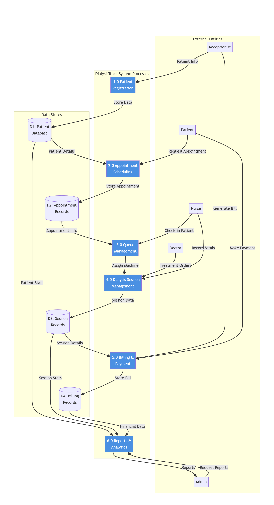
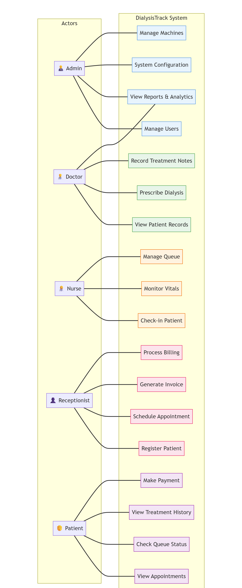
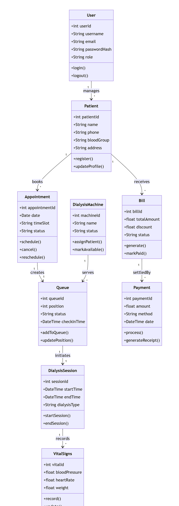
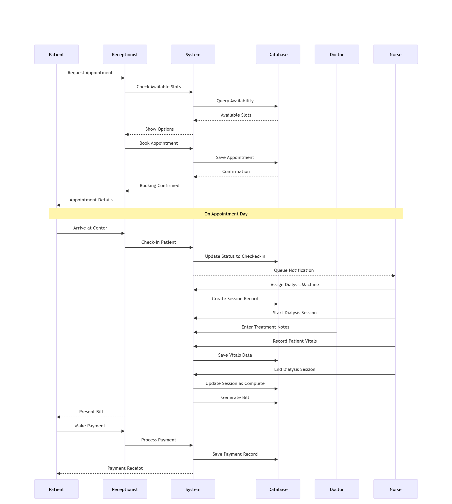
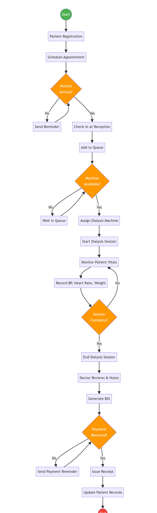
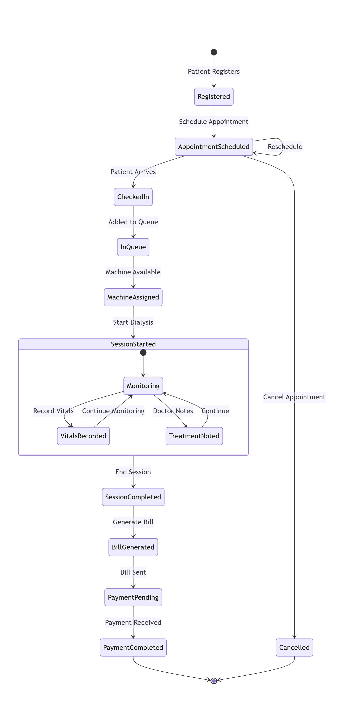
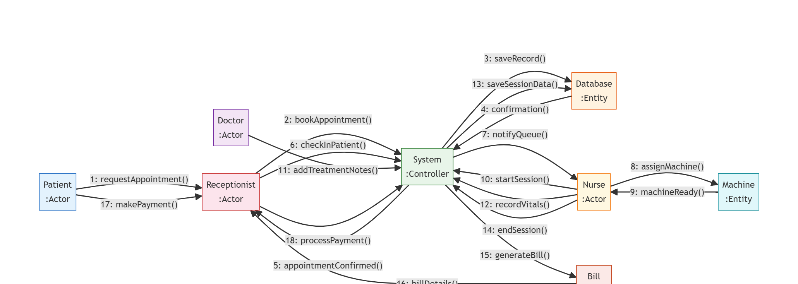
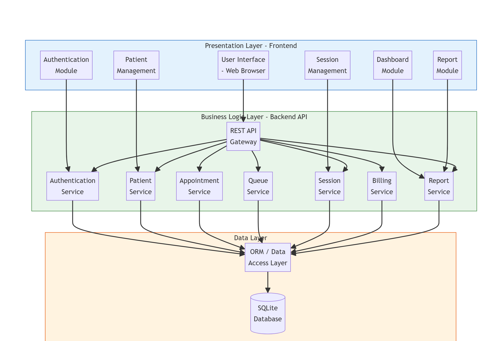
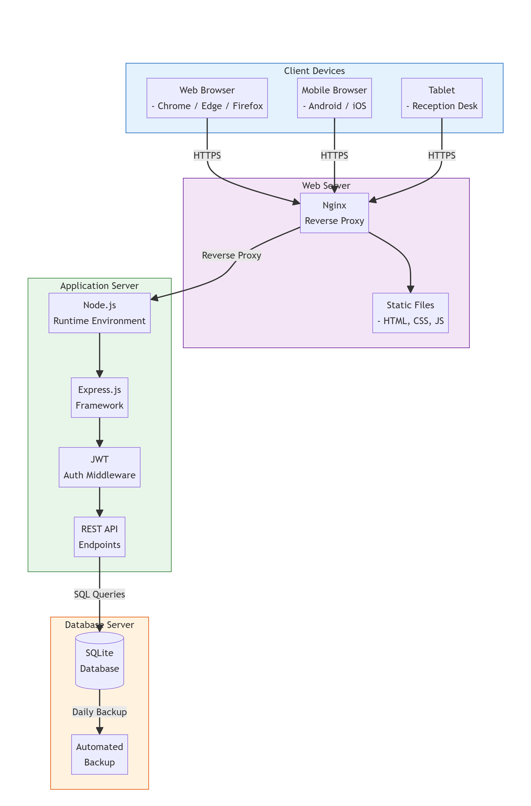

# 3. SYSTEM ANALYSIS AND DESIGN

Before we started writing code, we spent a few weeks analysing how a real dialysis centre operates. We visited two centres in Pune and spoke with the admin staff, nurses and a nephrologist. Based on those conversations, we mapped out the workflows and designed the system architecture using standard UML diagrams.

This chapter documents that design process. We first explain the symbols and notation used, and then present each diagram with a detailed description of what it represents and why certain design choices were made.

---

## 3.1 Nomenclature — Diagram Symbols and Notation

Before reading the diagrams, you should know what each shape means. We follow standard UML 2.0 notation as taught in our Software Engineering course.

### 3.1.1 Data Flow Diagram (DFD) Symbols

| Symbol | Shape | Meaning |
|:-------|:------|:--------|
| External Entity | Rectangle | A person or system outside the boundary — provides or receives data |
| Process | Rounded rectangle | A function the system performs (numbered 1.0, 2.0, etc.) |
| Data Store | Open-ended rectangle | Where data is saved (database table or file) |
| Data Flow | Arrow | The direction in which data travels, labelled with what is flowing |

The DFD does not show control logic or decision-making. It only shows the flow of data from sources, through processes, to stores and destinations. We used the Yourdon-DeMarco notation where processes are circles/rounded shapes and external entities are rectangles.

### 3.1.2 Use Case Diagram Symbols

| Symbol | Shape | Meaning |
|:-------|:------|:--------|
| Actor | Stick figure or labelled box | A user role that interacts with the system |
| Use Case | Oval or labelled box | A specific function the system offers |
| Association | Line | Connects an actor to the use cases they can perform |
| System Boundary | Large rectangle | Encloses all use cases that belong to the system |

### 3.1.3 Class Diagram Symbols

| Symbol | Meaning |
|:-------|:--------|
| Class box (3 sections) | Top: Class name, Middle: Attributes, Bottom: Methods |
| Solid line with arrow | Association (one class references another) |
| Diamond (hollow) | Aggregation (has-a, lifecycle independent) |
| Diamond (filled) | Composition (has-a, lifecycle dependent) |
| Numbers at line ends | Multiplicity (1, *, 0..1 etc.) |
| + prefix | Public visibility |
| - prefix | Private visibility |

### 3.1.4 Sequence Diagram Symbols

| Symbol | Shape | Meaning |
|:-------|:------|:--------|
| Lifeline | Vertical dashed line below actor/object box | Represents the object's existence over time |
| Solid arrow | Horizontal arrow from left to right | A message or method call |
| Dashed arrow | Horizontal arrow right to left | A return or response |
| Activation bar | Thin rectangle on lifeline | Period during which the object is active |
| Fragment | Labelled box around messages | A group of messages with a condition (loop, alt, opt)  |

### 3.1.5 Activity Diagram Symbols

| Symbol | Shape | Meaning |
|:-------|:------|:--------|
| Initial node | Filled circle | Where the workflow begins |
| Final node | Filled circle with ring | Where the workflow ends |
| Action | Rounded rectangle | A single step the system or user performs |
| Decision | Diamond | A branch point with conditions on outgoing arrows |
| Fork/Join | Thick horizontal bar | Splits or merges parallel activities |

### 3.1.6 Statechart Diagram Symbols

| Symbol | Shape | Meaning |
|:-------|:------|:--------|
| State | Rounded rectangle | A condition the object is in at a point in time |
| Transition | Arrow between states | A trigger that causes the object to change state |
| Composite state | Large rounded rectangle containing sub-states | A state with internal substates |
| Initial state | Filled circle | The starting state |
| Final state | Bull's-eye (filled circle with ring) | The terminal state |

---

## 3.2 Data Flow Diagram

The Data Flow Diagram shows how data moves through our system. We created a Level-1 DFD because it gives enough detail to understand each major process without getting lost in implementation specifics.

### 3.2.1 DFD Diagram

**Figure 3.1 — Level-1 Data Flow Diagram**

---

### 3.2.2 DFD Description

The diagram identifies **6 major processes**, **4 data stores**, and **5 external entities**. Let us walk through each process.

**Process 1.0 — Patient Registration:**
The receptionist enters patient information (name, phone, blood type, diagnosis, emergency contacts) into the system. The process validates the data and stores it in the Patient Database (D1). It also generates a unique patient ID in the format P001, P002, etc.

**Process 2.0 — Appointment Scheduling:**
The patient (directly or through the receptionist) requests an appointment. The process fetches patient details from D1, checks available slots for the chosen date and shift (morning, evening, or night), and stores the confirmed appointment in D2 (Appointment Records). The patient receives a confirmation with date, shift, and queue estimate.

**Process 3.0 — Queue Management:**
When the patient arrives, the nurse checks them in. The system fetches the appointment info from D2 and creates a queue entry. It assigns a queue number and calculates estimated wait time based on the current queue length and average session duration. Emergency patients are automatically placed at the top of the queue.

**Process 4.0 — Dialysis Session Management:**
Once a machine is available, the nurse assigns it to the patient's queue entry. The session starts and the nurse records pre-dialysis vitals (blood pressure, heart rate, temperature, oxygen saturation, weight). During the session, dialysis parameters (blood flow rate, dialysate flow rate, UF volume, heparin dose) are entered. After the session, post-dialysis vitals are recorded. The doctor adds treatment notes. All session data flows into D3 (Session Records).

**Process 5.0 — Billing and Payment:**
Session details from D3 flow into the billing process. The system computes the bill (session cost × number of sessions + medicine + consultation + other charges), applies 18% GST, subtracts any discount, and generates a bill number. The bill is stored in D4 (Billing Records). When the patient pays, a payment record is created.

**Process 6.0 — Reports and Analytics:**
The admin requests reports. The system pulls data from all four data stores (D1–D4), aggregates it, and generates reports in the chosen format (CSV, Excel, or PDF). Reports cover patient statistics, session trends, machine utilization, revenue summaries, and staff attendance.

---

## 3.3 Use Case Diagram

The use case diagram maps every user role to the specific actions they can perform in the system. It is the foundation of our access control design.

### 3.3.1 Use Case Diagram

**Figure 3.2 — Use Case Diagram**

---

### 3.3.2 Use Case Descriptions

The diagram shows **5 actors** and **16 use cases**. Each actor has a defined set of actions:

**Admin:**
The administrator has the broadest access. They manage machines (add, edit, deactivate, schedule maintenance), configure system settings (queue rotation, shift timings), manage user accounts (create/edit staff and patient accounts, assign roles), and view reports and analytics. The admin is the only role that can access the Staff Management and Reports modules.

**Doctor:**
Doctors view patient records including past dialysis sessions and vital trends. They prescribe dialysis parameters (type, duration, blood flow rate) and record treatment notes during or after each session. Doctors cannot edit patient demographics or billing information.

**Nurse:**
Nurses are the primary operators during dialysis. They manage the treatment queue (check-in patients, assign machines, start/end sessions), monitor and record vital signs before and after treatment, and check-in patients when they arrive at the centre.

**Receptionist:**
The receptionist handles the front-desk workflow: registering new patients with their personal and medical information, scheduling appointments for specific dates and shifts, processing billing (creating bills, applying discounts), and generating invoices for patients.

**Patient:**
Patients have a self-service portal where they can view their upcoming appointments, check their current queue status, review their treatment history (past session vitals and doctor notes), and make payments against pending bills.

### 3.3.3 Access Control Matrix

This is the permission matrix we derived from the use case diagram and implemented in the code:

| Module | Admin | Doctor | Nurse | Technician | Receptionist | Patient |
|:-------|:-----:|:------:|:-----:|:----------:|:------------:|:-------:|
| Patients | Full | Read, Update | Read, Update | — | Full | Own only |
| Queue | Full | Read, Update | Full | Read | — | Own only |
| Machines | Full | Read | Read, Update | Full | Read | — |
| Billing | Full | — | — | — | Full | Own only |
| Staff | Full | — | — | — | — | — |
| Reports | Full | — | — | — | — | — |
| Appointments | Full | Read | Read | — | Full | Own only |
| Fleet | Full | — | — | — | — | Track only |

---

## 3.4 Class Diagram

The class diagram shows the key domain objects in the system, their attributes and methods, and the relationships between them.

### 3.4.1 Class Diagram

**Figure 3.3 — Class Diagram**

---

### 3.4.2 Class Descriptions

**User** — The root class. Every person in the system (admin, doctor, nurse, receptionist, patient, driver, technician) is a User. Key attributes are username, email, passwordHash, and role. The role field is what drives the entire RBAC system.

**Patient** — Extends the user concept with medical data. A User with role='patient' has a one-to-one relationship with a Patient record that stores blood group, address, emergency contacts, diagnosis, allergies, dialysis type, vascular access, and dry weight. The Patient class has register() and updateProfile() methods.

**Appointment** — A patient books appointments. Each appointment has a date, timeSlot (morning/evening/night), and status (scheduled/completed/cancelled). Methods include schedule(), cancel(), and reschedule().

**Queue** — When a patient arrives, the receptionist creates a queue entry. The Queue class links to both the patient and the appointment. It tracks position, status, and checkInTime. The addToQueue() method auto-generates a queue number.

**DialysisMachine** — Each machine has a unique machineId (M-001 format), name, status, and methods to assignPatient() and markAvailable(). The machine status cycles through: available → in_use → cleaning → available.

**DialysisSession** — A queue entry initiates a session. The session records startTime, endTime, and dialysisType. It has a one-to-one relationship with VitalSigns for pre/post treatment measurements.

**VitalSigns** — Captures bloodPressure (systolic/diastolic), heartRate, and weight. The record() method saves the data and the update() method allows corrections during the session.

**Bill** — Generated after a session is completed. Stores totalAmount, discount, and status. The generate() method computes the total by pulling session costs and applying GST. The markPaid() method updates the status when full payment is received.

**Payment** — Settles a bill. Stores the amount, method (cash/UPI/card/net_banking), and date. The process() method links the payment to the bill and updates the bill's paid amount. The generateReceipt() method creates a printable receipt.

### 3.4.3 Relationships

| Relationship | Type | Multiplicity |
|:-------------|:-----|:-------------|
| User manages Patient | Association | 1 : * |
| Patient books Appointment | Association | 1 : * |
| Appointment creates Queue | Association | 1 : 1 |
| DialysisMachine serves Queue | Association | 1 : * |
| Queue initiates DialysisSession | Association | 1 : 1 |
| DialysisSession records VitalSigns | Composition | 1 : * |
| Patient receives Bill | Association | 1 : * |
| Bill settledBy Payment | Association | 1 : * |

---

## 3.5 Sequence Diagram

The sequence diagram shows the step-by-step interaction between actors and the system during the complete patient journey — from booking an appointment to making the final payment.

### 3.5.1 Sequence Diagram

**Figure 3.4 — Sequence Diagram (Patient Journey)**

---

### 3.5.2 Sequence Description

The diagram involves **6 lifelines**: Patient, Receptionist, System, Database, Doctor, and Nurse. The flow is divided into two phases:

**Phase 1 — Booking (before appointment day):**

1. The patient approaches or calls the centre and requests an appointment.
2. The receptionist opens the scheduling page and the system checks available slots by querying the database.
3. The database returns the available time slots for the chosen date.
4. The system displays the options. The receptionist selects a slot and confirms the booking.
5. The system saves the appointment to the database and sends a confirmation back to the receptionist, who relays the details (date, shift, approximate time) to the patient.

**Phase 2 — Treatment Day:**

6. The patient arrives at the centre. The receptionist checks them in.
7. The system updates the appointment status to "Checked-In" and sends a notification to the queue management module.
8. The system assigns an available dialysis machine to the patient.
9. The nurse prepares the machine. The system creates a session record in the database.
10. The dialysis session starts. The nurse monitors the patient.
11. The doctor reviews the patient and enters treatment notes.
12. The nurse records vital signs (BP, heart rate, temperature, O2 saturation, weight) — both pre and post treatment.
13. The session data (vitals + parameters + notes) is saved to the database.
14. The nurse ends the dialysis session when the prescribed duration is complete.
15. The system updates the session status to "Completed" and generates a bill.
16. The bill details are calculated and sent to the receptionist.
17. The patient makes the payment (cash, UPI, card, or net banking).
18. The receptionist processes the payment. The system saves the payment record and issues a receipt.

This entire flow typically takes 4–5 hours per patient visit (including 3–4 hours of actual dialysis).

---

## 3.6 Activity Diagram

The activity diagram shows the workflow as a flowchart, including decision points and parallel actions. We modelled the complete patient treatment workflow from registration to payment.

### 3.6.1 Activity Diagram

**Figure 3.5 — Activity Diagram (Treatment Workflow)**

---

### 3.6.2 Activity Description

The workflow has **15 activities** and **3 decision points**:

1. **Patient Registration** — The starting point. Patient details are entered and stored.
2. **Schedule Appointment** — Date and shift are selected. The system checks slot availability.
3. **Decision: Patient Arrives?** — On the appointment day, the system checks if the patient has arrived.
   - **No** → Send Reminder (via the notification system) and wait.
   - **Yes** → Check-in at Reception.
4. **Check-in at Reception** — The receptionist confirms identity and marks arrival.
5. **Add to Queue** — A queue entry is created with a queue number.
6. **Decision: Machine Available?** — The system checks if any dialysis machine is free.
   - **No** → Wait in Queue. The system periodically rechecks.
   - **Yes** → Assign Dialysis Machine.
7. **Assign Dialysis Machine** — The system links the queue entry to a specific machine.
8. **Start Dialysis Session** — The nurse connects the patient and starts the machine.
9. **Monitor Patient Vitals** — During the 3–4 hour session, the nurse periodically checks and records vitals.
10. **Record BP, Heart Rate, Weight** — Specific vital measurements are entered into the system.
11. **Decision: Session Complete?** — After the prescribed duration:
    - **No** → Continue monitoring (loop back to step 9).
    - **Yes** → End Dialysis Session.
12. **End Dialysis Session** — The machine is stopped, patient is disconnected.
13. **Doctor Reviews and Notes** — The doctor examines the patient post-treatment and adds clinical notes.
14. **Generate Bill** — The bill is auto-calculated with GST.
15. **Decision: Payment Received?**
    - **No** → Send Payment Reminder. Bill status remains "pending".
    - **Yes** → Issue Receipt and Update Patient Records.

---

## 3.7 Statechart Diagram

The statechart diagram shows all the possible states a patient's treatment journey goes through, and what events (triggers) cause transitions between states.

### 3.7.1 Statechart Diagram

**Figure 3.6 — Statechart Diagram (Patient Treatment States)**

---

### 3.7.2 State Descriptions

The patient journey passes through **11 states**:

| # | State | Trigger to Enter | Description |
|:-:|:------|:----------------|:------------|
| 1 | Registered | Patient registers | Patient record created, no appointment yet |
| 2 | AppointmentScheduled | Schedule Appointment | Date and shift booked. Can be rescheduled |
| 3 | CheckedIn | Patient Arrives | Patient physically present at the centre |
| 4 | InQueue | Added to Queue | Waiting for a machine to become available |
| 5 | MachineAssigned | Machine Available | Specific machine allocated to this patient |
| 6 | SessionStarted | Start Dialysis | Composite state — dialysis is in progress |
| 6a | Monitoring | (sub-state) | Nurse is actively monitoring vitals |
| 6b | VitalsRecorded | Record Vitals | Latest vitals saved in the system |
| 6c | TreatmentNoted | Doctor Notes | Doctor has added clinical notes |
| 7 | SessionCompleted | End Session | Dialysis finished, post-vitals recorded |
| 8 | BillGenerated | Generate Bill | Bill auto-calculated with breakdown |
| 9 | PaymentPending | Bill Sent | Bill sent to patient, awaiting payment |
| 10 | PaymentCompleted | Payment Received | Full payment received, journey complete |
| 11 | Cancelled | Cancel Appointment | Patient cancels — can happen from AppointmentScheduled |

The **SessionStarted** state is a **composite state** (shown with a nested diagram) because during dialysis, multiple sub-activities happen concurrently — the nurse monitors vitals, records measurements, and the doctor adds treatment notes. These sub-states cycle back to Monitoring until the session is completed.

Notice that the **Reschedule** transition loops back to AppointmentScheduled rather than creating a new state — this is because rescheduling just updates the date and shift on the existing appointment record.

---

## 3.8 Collaboration Diagram

The collaboration diagram (also called communication diagram) shows how objects interact with each other and in what sequence. Unlike the sequence diagram which emphasises time ordering, the collaboration diagram emphasises the structural relationships between objects.

### 3.8.1 Collaboration Diagram

**Figure 3.7 — Collaboration Diagram**

### 3.8.2 Collaboration Description

The System (Controller) is at the centre because it mediates all interactions. The numbered messages show the sequence:

1. Patient → Receptionist: requestAppointment()
2. Receptionist → System: bookAppointment()
3. System → Database: saveRecord()
4. Database → System: confirmation()
5. System → Receptionist: appointmentConfirmed()
6. Receptionist → System: checkInPatient()
7. System → Queue: notifyQueue()
8. System → Machine: assignMachine()
9. Machine → Nurse: machineReady()
10. Nurse → System: startSession()
11. Doctor → System: addTreatmentNotes()
12. Nurse → System: recordVitals()
13. System → Database: saveSessionData()
14. Nurse → System: endSession()
15. System → Bill: generateBill()
16. Bill → Receptionist: billDetails()
17. Patient → Receptionist: makePayment()
18. Receptionist → System: processPayment()

This shows that the System Controller acts as a central hub — no actor communicates directly with the database or with another actor. All interactions pass through the system, which is how our REST API architecture works in the actual implementation.

---

## 3.9 Component Diagram

The component diagram shows the major software components and how they are connected. This is the closest diagram to the actual code architecture.

### 3.9.1 Component Diagram

**Figure 3.8 — Component Diagram (3-Tier Architecture)**

### 3.9.2 Component Description

The system is organised into **three layers** (tiers):

**Presentation Layer (Frontend):**
The top layer contains all the user-facing modules built with React. These include the Authentication Module (login, register, 2FA), Patient Management, Session Management, Dashboard Module, and Report Module. Each module is a React component that communicates with the backend through HTTP API calls.

**Business Logic Layer (Backend API):**
The middle layer is the Django REST Framework application. It contains a REST API Gateway that routes incoming requests to the appropriate service. The services include Authentication Service (JWT + TOTP), Patient Service, Appointment Service, Queue Service, Session Service, Billing Service, and Report Service. Each service handles the business logic for its module — validation, computation, authorisation checks.

**Data Layer:**
The bottom layer is the ORM/Data Access Layer (Django's ORM) which translates Python object operations into SQL queries. The queries go to the SQLite database (in development) or MySQL (in production). The ORM handles connection pooling, query optimisation, and migration management.

The key principle here is that no layer "skips" — the frontend never directly touches the database. Every request must go through the API layer, which enforces authentication, permission checks, and data validation before any database operation occurs.

---

## 3.10 Deployment Diagram

The deployment diagram shows the physical infrastructure — what hardware nodes run what software, and how they communicate.

### 3.10.1 Deployment Diagram

**Figure 3.9 — Deployment Diagram**

### 3.10.2 Deployment Description

**Client Devices (Top):**
Three types of client devices connect to the system — web browsers (Chrome, Edge, Firefox) on desktop PCs, mobile browsers (Android/iOS) for nurses and doctors on the floor, and tablets at the reception desk. All communication uses HTTPS for security.

**Web Server (Middle):**
Nginx acts as the reverse proxy and web server. It receives all incoming HTTPS requests and routes them:
- Static file requests (HTML, CSS, JS, images) → served directly from the file system with 1-year cache headers
- API requests (/api/*) → forwarded to the application server
- WebSocket requests (/ws/*) → forwarded to the Daphne ASGI server
Nginx also handles SSL termination (converting HTTPS to HTTP internally).

**Application Server:**
The Node.js runtime (for the built React frontend) and Django application run here. The JWT Auth Middleware verifies tokens on every request before passing it to the REST API endpoints. The application server processes business logic and generates SQL queries.

**Database Server (Bottom):**
SQLite for development, MySQL 8.0 for production. The database server stores all persistent data. An automated daily backup process creates snapshots that can be restored in case of data loss.

The entire stack is containerised with Docker Compose, so all four components (Nginx, Frontend, Backend, Database) run as separate containers on the same host machine in production.

