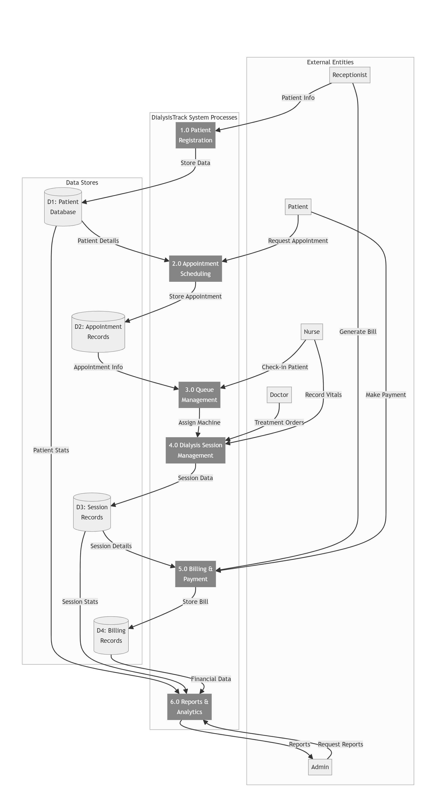

Chapter – 3 : Analysis

---

3.1 Nomenclature — ERD, DFD, and FDD Symbols

Before presenting the system diagrams for DialysisTrack, it is important to define the standard notation and symbols used across the Entity-Relationship Diagram, Data Flow Diagram, and Functional Decomposition Diagram. Understanding these symbols is necessary for correctly interpreting the diagrams that follow.

Entity-Relationship Diagram (ERD) Symbols:

In an Entity-Relationship Diagram, a Rectangle represents an Entity — a real-world object or concept about which data is stored in the system. In the DialysisTrack ERD, examples of entities include Patient, Appointment, DialysisMachine, BillingRecord, and AmbulanceRide. An Ellipse (or oval) represents an Attribute — a property or characteristic of an entity. For example, the Patient entity has attributes such as patient_id, first_name, last_name, date_of_birth, and blood_type. A Diamond represents a Relationship — the association between two or more entities. Relationships are labelled with a verb that describes the nature of the association, such as "Patient Books Appointment" or "Session Generates Bill." Lines connecting entities to diamonds carry Cardinality Notation — typically expressed as one-to-one (1:1), one-to-many (1:N), or many-to-many (M:N) — indicating how many instances of one entity may be associated with instances of another. A Double Rectangle indicates a Weak Entity — one that cannot be uniquely identified by its own attributes and depends on a parent entity for its existence. A Underlined attribute in the ellipse indicates that the attribute is the Primary Key of the entity.

Data Flow Diagram (DFD) Symbols:

In a Data Flow Diagram, a Rectangle (or square) with a label represents an External Entity — a person, organisation, or system that exists outside the boundary of the system being modelled but interacts with it by sending or receiving data. In the DialysisTrack DFD, external entities include the Receptionist, Doctor, Nurse, Technician, Patient, and Driver. A Rounded Rectangle (or circle) represents a Process — a transformation or function that acts on incoming data to produce output data. Processes in the DialysisTrack DFD include functions such as Authenticate User, Schedule Appointment, Process Payment, and Track Ambulance. An Open Rectangle (two parallel lines, open at the ends) represents a Data Store — a repository where data is held at rest, corresponding to a database table or file. The DialysisTrack DFD data stores correspond to the MySQL database tables, including the Patient Store, Appointment Store, Session Store, Billing Store, and Fleet Store. Arrows with labels represent Data Flows — the movement of data between entities, processes, and stores. Each arrow is labelled with the name of the data being transferred, such as "Login Credentials," "Appointment Details," or "Payment Confirmation."

Functional Decomposition Diagram (FDD) Symbols:

A Functional Decomposition Diagram uses a Hierarchical Tree Structure to represent the breakdown of a system's main function into progressively more detailed sub-functions. The Top-Level Box at the root of the tree represents the entire system. Each level below this decomposes the parent function into its constituent sub-functions. Connecting Lines from a parent box to child boxes indicate that the child functions are components of the parent function. The FDD does not show data flow — it shows functional containment and decomposition. In the DialysisTrack FDD, the top-level function is the DialysisTrack system itself, which decomposes into the major modules of User Management, Patient Management, Appointment Scheduling, Session Management, Billing, Machine Inventory, Fleet Management, Reporting, and Notifications. Each of these modules further decomposes into their specific sub-functions.

---

3.2 Functional Decomposition Diagram

The Functional Decomposition Diagram for DialysisTrack provides a hierarchical view of the complete system, breaking down the overall functionality into its major modules and then further decomposing each module into its specific sub-functions. This diagram serves as a functional map of the entire system and was used during the planning phase to define the scope of development.

At the top level, DialysisTrack is represented as a single system. This system decomposes into eleven primary functional modules: User Management, Patient Management, Appointment and Scheduling, Queue and Session Management, Machine Inventory Management, Billing and Payment Processing, Fleet and Ambulance Management, Clinical Data Management, Reporting and Analytics, Notification Management, and Audit and Security.

The User Management module decomposes into the sub-functions of User Registration, Role Assignment, Login and JWT Authentication, Two-Factor Authentication Setup and Verification, Password Management including forgot-password and reset, and Account Activation and Deactivation.

The Patient Management module decomposes into Patient Registration with auto-generated Patient ID, Patient Profile View and Update, Emergency Patient Flag Management, Patient Portal Account Creation, Patient Medical History maintenance, and Patient Search and Listing with pagination.

The Appointment and Scheduling module decomposes into New Appointment Booking with conflict detection, Appointment Confirmation, Appointment Cancellation, Appointment Rescheduling, Doctor Availability Checking, and Machine Availability Checking.

The Queue and Session Management module decomposes into Patient Check-In, Queue Position Management, Session Start Recording, Vital Sign Entry during session including pre and post dialysis readings, Session Completion with auto-billing trigger, and Queue Priority Management for emergency cases.

The Billing and Payment Processing module decomposes into Automatic Bill Generation on session completion, Manual Bill Creation for walk-in patients, GST Computation at eighteen percent, Razorpay Online Payment Integration, UPI QR Code Generation, Cash Payment Recording, Emergency Surcharge Application at twenty percent, and Bill History and Status Tracking.

The Fleet and Ambulance Management module decomposes into Ambulance Registration, Driver Account Management, Ambulance Dispatch, Real-Time GPS Location Update via WebSocket, HTTP Polling Fallback for location updates, Google Maps Tracking View, and Ride Status Transitions.

The Clinical Data Management module decomposes into Infection Status Recording for Hepatitis B, Hepatitis C, and HIV, Infection Screening Overdue Detection, Dialysis Prescription Management, Laboratory Result Entry, Kt/V and URR Auto-Calculation, Critical Value Flagging, and Consent Status Tracking.

---

3.3 Context Level Diagram

The Context Level Diagram, also known as the Level 0 Data Flow Diagram, provides the highest-level view of the DialysisTrack system. At this level, the entire software system is represented as a single central process block. This single process block is labelled "DialysisTrack — Dialysis Centre Management System." All external entities that interact with the system are shown around the central block, connected by labelled arrows indicating the data flowing in and out.

The external entities at the context level are the seven human actor roles defined in the system. The Receptionist external entity sends Patient Registration Data, Appointment Booking Requests, and Payment Transactions into the system, and receives Appointment Confirmations, Generated Bills, and UPI QR Codes from the system. The Doctor entity sends Clinical Session Notes, Prescription Updates, and Lab Result Interpretations into the system, and receives Patient History Reports and Clinical Alert Notifications from the system. The Nurse entity sends Vital Sign Readings and Session Start or Completion events into the system, and receives Queue Board Updates and Session Task Notifications. The Technician entity sends Machine Status Updates and Session Start or Completion events into the system, and receives Machine Maintenance Alerts and Session Assignment Notifications. The Patient entity receives Appointment Reminders, Bill Notifications, and Ambulance Dispatch Notifications from the system, and can send Self-Registration Data through the patient portal. The Driver entity sends GPS Location Coordinates and Ride Status Updates into the system, and receives Ride Assignment Notifications. The Administrator entity has the broadest interaction — sending all categories of administrative data into the system and receiving comprehensive operational reports, audit logs, and system-wide alerts in return.

The Context Level Diagram makes clear that DialysisTrack is a hub of data exchange for all seven categories of user, with all data flowing through the system's centralised database and business logic layer. No external entity communicates directly with another external entity through the system — all communication passes through the central process, ensuring that every data exchange is logged, validated, and processed by the system's business rules.

Figure 3.3: Context Level Diagram — DialysisTrack System Boundary

---

3.4 Entity Relationship Diagram

The Entity Relationship Diagram for DialysisTrack maps the complete data structure of the system, showing every major entity, its attributes, and the relationships between entities. This diagram directly reflects the Django ORM model definitions that form the backbone of the application's data layer.

The central entity in the DialysisTrack data model is the User entity, which represents every person who has an account in the system, regardless of role. The User entity carries the attributes of user_id, username, email, hashed password, role (an enumeration of Admin, Doctor, Nurse, Technician, Receptionist, Patient, and Driver), phone number, address, is_active flag, and date_joined. The User entity is the parent for all role-specific profile entities.

The Patient entity has a one-to-one relationship with the User entity through the user foreign key. The Patient entity carries a comprehensive set of attributes: an auto-generated patient_id (formatted as P-001, P-002, and so on), first_name, last_name, date_of_birth, gender, blood_type, address, phone_number, emergency_contact_name, emergency_contact_phone, primary_diagnosis, comorbidities, allergies, current_medications, dialysis_type, vascular_access type, dry_weight, hepatitis_b_status, hepatitis_c_status, hiv_status, last_infection_screening_date, consent_given flag, consent_date, consent_expiry_date, and an is_emergency flag.

The Appointment entity has a many-to-one relationship with Patient (one patient can have many appointments) and a many-to-one relationship with the assigned machine. Appointment attributes include appointment_id, appointment_date, start_time, end_time, status (Scheduled, Confirmed, Completed, or Cancelled), and notes. The system's conflict validation logic operates on this entity to prevent overlapping appointments for the same machine.

The Queue entity has a many-to-one relationship with Patient and an optional one-to-one relationship with Appointment. Queue attributes include queue_number, priority (Emergency, Scheduled, or Walk-in), status (Waiting, In Progress, Completed, or Cancelled), check_in_time, actual_start_time, actual_end_time, assigned_machine, blood_pressure, weight_before, and weight_after.

The DialysisSession entity has a one-to-one relationship with Queue. It carries the detailed clinical data for each session: pre and post dialysis vital signs (blood pressure systolic, blood pressure diastolic, heart rate, temperature, oxygen saturation), dialysis parameters (blood flow rate, dialysate flow rate, ultrafiltration volume, heparin dose), medications administered, complications noted, nurse notes, and doctor notes.

The Bill entity has a many-to-one relationship with Patient and an optional many-to-one relationship with Appointment. Bill attributes include bill_number, dialysis_sessions count, session_cost, medicine_cost, consultation_cost, other_charges, subtotal, discount, tax_amount (computed at eighteen percent GST), total_amount, paid_amount, and status (Pending, Paid, Partially Paid, Overdue, or Cancelled). The Payment entity has a many-to-one relationship with Bill and records each individual payment transaction with attributes including payment_id, amount, payment_method (Cash or UPI), transaction_id, and gateway_response.

The DialysisPrescription entity has a many-to-one relationship with Patient and records the doctor-defined treatment parameters: session duration in minutes, dialysis frequency, target blood flow rate, dialyzer type and model, heparin dose, target dry weight, target Kt/V, and dialysate composition.

The LabResult entity has a many-to-one relationship with Patient and records the patient's periodic laboratory test results, including pre and post dialysis BUN for Kt/V computation, hemoglobin, serum electrolytes, iron studies, albumin, PTH, and infection screening results.

The Ambulance entity carries the vehicle's registration number, make and model, capacity, and current status (Available or On Trip), along with a reference to the assigned Driver user. The AmbulanceRide entity has a many-to-one relationship with Ambulance and with Patient, and carries the pickup address, status of the ride, and the live GPS coordinates stored as driver_lat and driver_lng decimal fields.

Figure 3.4: Entity Relationship Diagram — DialysisTrack Data Model

---

3.5 Data Flow Diagram

The Data Flow Diagram for DialysisTrack illustrates how data moves through the system, from initial input by an external entity, through the system's processing functions, and into or out of the system's data stores. The DFD was drawn at two levels of detail — the Level 0 Context Diagram described in section 3.3, and the Level 1 DFD described here, which decomposes the central process into its major functional components.

At Level 1, the DialysisTrack system is decomposed into eight major process bubbles. The first process is User Authentication, which receives login credentials from any user role, validates them against the User data store, and returns a JWT access token upon successful authentication. For roles that require Two-Factor Authentication, a second validation step is inserted between password verification and token issuance.

The second process is Patient Management, which receives patient registration data from the Receptionist, writes new patient records to the Patient data store, generates the unique patient_id, and returns the confirmed patient profile. Read operations on this process allow any authorised role to retrieve patient records from the store.

The third process is Appointment Scheduling, which receives appointment request data (patient, machine, doctor, date, time) from the Receptionist, reads the Appointment data store to perform conflict validation, and either writes a new confirmed appointment or returns a conflict error. The process also reads the Machine Status store to verify machine availability.

The fourth process is Queue and Session Management, which receives check-in events and session start or completion requests from Nurse and Technician users, reads and updates the Queue data store, writes session details to the DialysisSession data store, and triggers the automatic billing process upon session completion.

The fifth process is Billing and Payment, which receives the session completion trigger, reads session details and the patient record, computes the bill with GST, writes the bill record to the Bill data store, generates the UPI QR code payload, and processes payment transactions through the Razorpay gateway.

The sixth process is Fleet Management, which receives dispatch requests from the Receptionist, writes ride records to the AmbulanceRide data store, receives GPS coordinate updates from the Driver, updates the ride's location fields in the data store, and sends real-time location data to the monitoring client through the WebSocket channel.

The seventh process is Clinical Data Management, which receives prescription entries and lab results from the Doctor, writes them to the respective data stores, computes derived metrics such as Kt/V and URR, and generates clinical alert data that flows to the Dashboard process for display to administrative and clinical supervisors.

The eighth process is Reporting and Analytics, which reads across multiple data stores — Patient, Appointment, Session, Bill, and Machine stores — to aggregate operational metrics and produce formatted reports for the Administrator.

Figure 3.5: Data Flow Diagram — Level 1 Processing Modules

---
