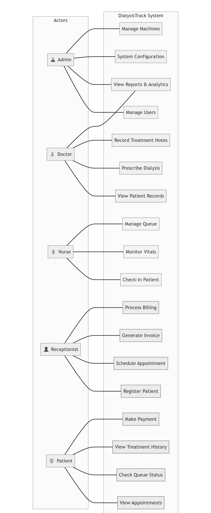
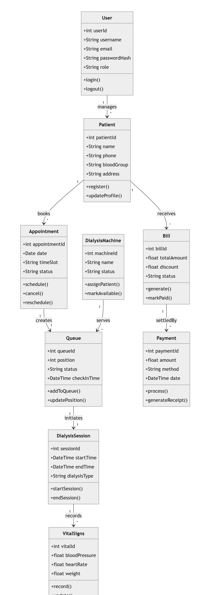
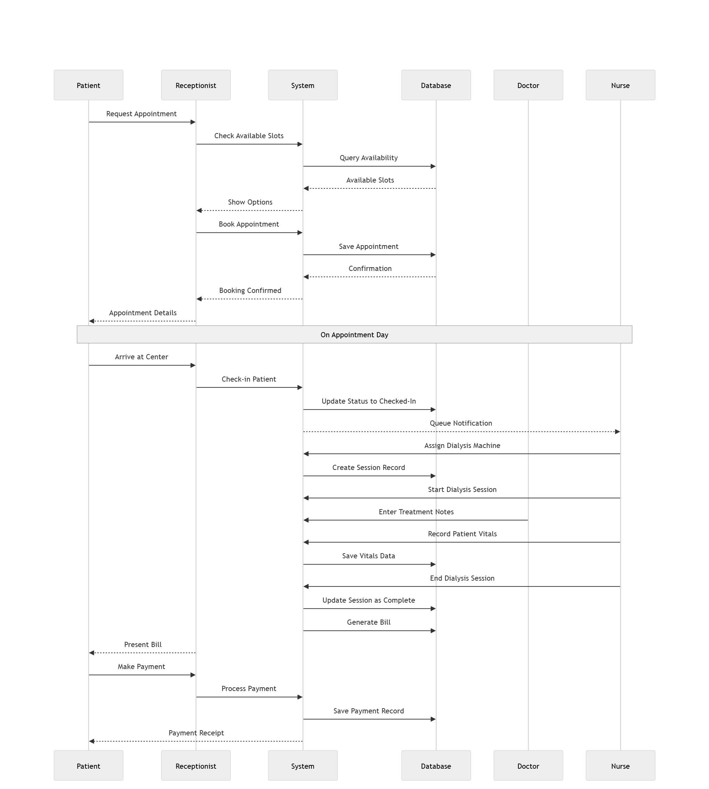
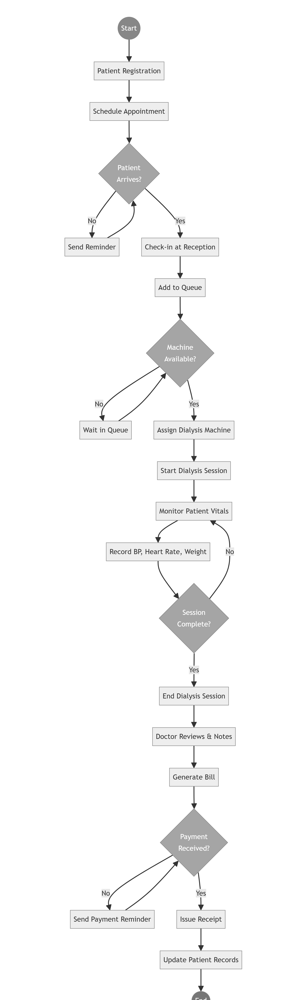
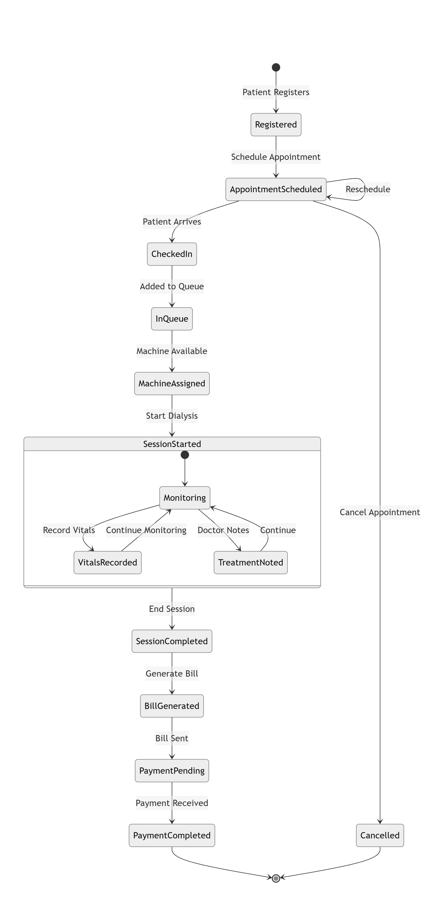
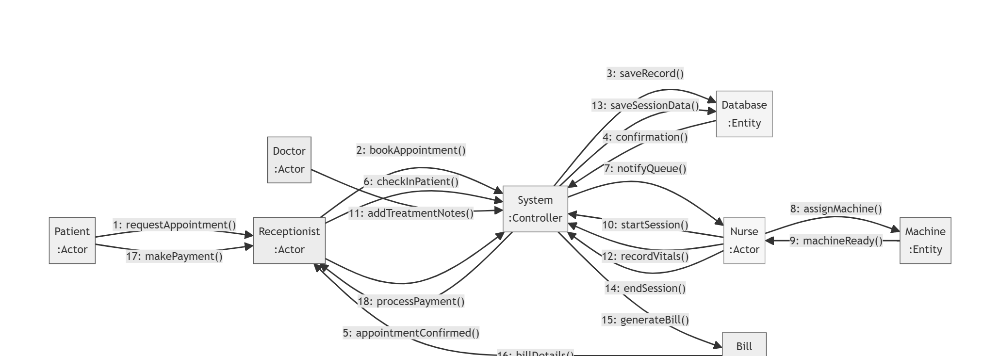
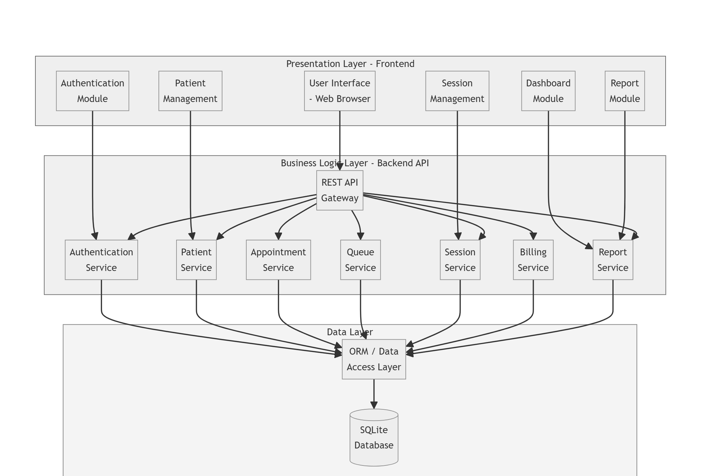
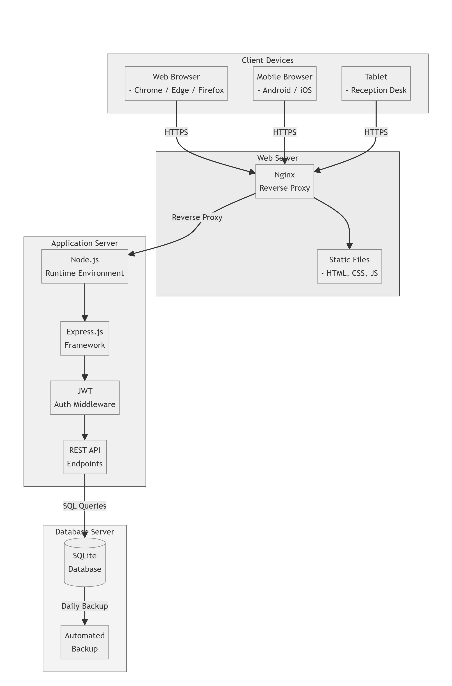

Chapter – 4 : System Design

---

4.1 Data Element Dictionary

The Data Element Dictionary defines every data element used across all the data stores of the DialysisTrack system, specifying the element's name, the data type used to store it, its permitted range or allowed values, whether it is mandatory or optional, and a description of its purpose. The dictionary serves as the authoritative reference for the meaning and constraints of every field in the system.

patient_id — Data Type: Character String, Maximum Length: 20 characters, Mandatory: Yes, Unique: Yes. Description: The auto-generated unique identifier assigned to every patient at the time of registration. Generated using a sequential numbering scheme. Example format: P-001, P-0087.

first_name / last_name — Data Type: Character String, Maximum Length: 100 characters each, Mandatory: Yes. Description: The patient's or staff member's legal given name and family name as they appear on identity documents.

date_of_birth — Data Type: Date (YYYY-MM-DD format), Mandatory: Yes. Description: The patient's date of birth, used for age computation and patient identity verification.

blood_type — Data Type: Enumeration, Allowed Values: A+, A-, B+, B-, AB+, AB-, O+, O-, Mandatory: No. Description: The patient's ABO and Rhesus blood group, relevant for clinical management.

hepatitis_b_status / hepatitis_c_status / hiv_status — Data Type: Enumeration, Allowed Values: negative, positive, unknown, Mandatory: Yes, Default: unknown. Description: The patient's infection status for each pathogen. A positive Hepatitis B status triggers the isolated machine requirement flag. These fields are critical for machine segregation compliance in the dialysis centre.

last_infection_screening_date — Data Type: Date, Mandatory: No. Description: The date on which the patient most recently underwent infection screening. The system auto-flags this field as overdue when the current date exceeds the screening date by more than ninety days.

consent_given — Data Type: Boolean, Default: False. Description: Whether the patient has signed the dialysis treatment consent form. Sessions cannot be safely started without valid consent.

consent_expiry_date — Data Type: Date, Mandatory: No. Description: The date on which the signed consent form expires, typically one year from the consent date. The system flags expired consent on the clinical dashboard.

dry_weight — Data Type: Decimal, Precision: 5 digits with 2 decimal places, Mandatory: No. Description: The patient's target dry weight in kilograms, as prescribed by the treating doctor. Used to compute the target fluid removal volume for each session.

bill_number — Data Type: Character String, Maximum Length: 20 characters, Mandatory: Yes, Unique: Yes, Auto-generated: Yes. Description: The unique invoice reference number assigned to each bill. Generated by the system using the format DT followed by the date and a random suffix.

session_cost — Data Type: Decimal, Precision: 10 digits with 2 decimal places, Default: 2500.00. Description: The base cost of a single dialysis session in Indian Rupees.

tax_amount — Data Type: Decimal, Computed Field. Description: The GST amount computed as eighteen percent of the subtotal. This field is auto-calculated by the system and is not entered manually.

payment_method — Data Type: Enumeration, Allowed Values: cash, upi. Description: The method by which a payment was made. UPI payments generate a QR code and record the UPI transaction reference number.

queue_number — Data Type: Character String, Maximum Length: 10 characters, Auto-generated: Yes. Description: The sequential queue ticket number assigned when a patient checks in for their session on a given day.

priority — Data Type: Enumeration, Allowed Values: emergency, scheduled, walk_in, Default: scheduled. Description: The priority classification of a queue entry. Emergency patients are processed ahead of scheduled and walk-in patients.

pre_bp_systolic / pre_bp_diastolic — Data Type: Integer, Mandatory: No. Description: The patient's systolic and diastolic blood pressure readings recorded before the dialysis session begins.

driver_lat / driver_lng — Data Type: Decimal, Precision: 9 digits with 6 decimal places, Mandatory: No. Description: The most recently received GPS latitude and longitude coordinates of the ambulance driver. Updated in real time via the WebSocket connection from the driver's mobile device.

role — Data Type: Enumeration, Allowed Values: admin, doctor, nurse, technician, receptionist, patient, driver, Mandatory: Yes. Description: The functional role of a user account in the system. This field controls every aspect of what the user can see and do within DialysisTrack.

---

4.2 Table Design

The DialysisTrack database is implemented in MySQL 8.0 and consists of a set of normalised relational tables that map directly to the Django ORM model definitions. The following describes the design of each major table in the system.

Table: users_user

This is the central authentication table, extending Django's built-in user model. It stores one record for every person who has a login account in the system, regardless of their role.

| Column Name | Data Type | Constraints | Description |
|---|---|---|---|
| id | BIGINT | PRIMARY KEY, AUTO INCREMENT | Unique user identifier |
| username | VARCHAR(150) | UNIQUE, NOT NULL | Login username (typically the email) |
| email | VARCHAR(254) | UNIQUE, NOT NULL | Email address |
| password | VARCHAR(128) | NOT NULL | Bcrypt hashed password |
| role | VARCHAR(20) | NOT NULL | User role enumeration |
| first_name | VARCHAR(150) | NOT NULL | Given name |
| last_name | VARCHAR(150) | NOT NULL | Family name |
| phone_number | VARCHAR(15) | NULLABLE | Contact phone number |
| address | TEXT | NULLABLE | Residential or work address |
| is_active | BOOLEAN | DEFAULT TRUE | Account active flag |
| date_joined | DATETIME | NOT NULL | Account creation timestamp |

Table: patients_patient

Stores the complete medical and demographic profile for every registered dialysis patient.

| Column Name | Data Type | Constraints | Description |
|---|---|---|---|
| id | BIGINT | PRIMARY KEY, AUTO INCREMENT | Internal record ID |
| patient_id | VARCHAR(20) | UNIQUE, NOT NULL | Auto-generated patient code |
| user_id | BIGINT | FK → users_user, NULLABLE | Linked login account |
| first_name | VARCHAR(100) | NOT NULL | Patient given name |
| last_name | VARCHAR(100) | NOT NULL | Patient family name |
| date_of_birth | DATE | NOT NULL | Date of birth |
| gender | VARCHAR(10) | NOT NULL | Gender enumeration |
| blood_type | VARCHAR(3) | NULLABLE | ABO/Rh blood group |
| primary_diagnosis | TEXT | NOT NULL | Renal diagnosis |
| hepatitis_b_status | VARCHAR(20) | NOT NULL, DEFAULT 'unknown' | HBsAg status |
| hepatitis_c_status | VARCHAR(20) | NOT NULL, DEFAULT 'unknown' | Anti-HCV status |
| hiv_status | VARCHAR(20) | NOT NULL, DEFAULT 'unknown' | HIV status |
| consent_given | BOOLEAN | DEFAULT FALSE | Consent form status |
| is_emergency | BOOLEAN | DEFAULT FALSE | Emergency patient flag |
| is_active | BOOLEAN | DEFAULT TRUE | Active patient flag |
| created_at | DATETIME | AUTO | Registration timestamp |

Table: billing_bill

Stores all invoices generated by the system, whether automatically triggered by session completion or manually created by reception staff.

| Column Name | Data Type | Constraints | Description |
|---|---|---|---|
| id | BIGINT | PRIMARY KEY, AUTO INCREMENT | Bill record ID |
| bill_number | VARCHAR(20) | UNIQUE, NOT NULL | Auto-generated invoice number |
| patient_id | BIGINT | FK → patients_patient | Billed patient |
| appointment_id | BIGINT | FK → appointments, NULLABLE | Linked appointment |
| dialysis_sessions | INT | DEFAULT 1 | Number of sessions billed |
| session_cost | DECIMAL(10,2) | DEFAULT 2500.00 | Base session charge |
| medicine_cost | DECIMAL(10,2) | DEFAULT 0.00 | Medication charges |
| consultation_cost | DECIMAL(10,2) | DEFAULT 500.00 | Consultation fee |
| other_charges | DECIMAL(10,2) | DEFAULT 0.00 | Miscellaneous charges |
| subtotal | DECIMAL(10,2) | Computed | Sum before GST |
| tax_amount | DECIMAL(10,2) | Computed | GST at 18% |
| total_amount | DECIMAL(10,2) | Computed | Grand total |
| paid_amount | DECIMAL(10,2) | DEFAULT 0.00 | Amount received |
| status | VARCHAR(20) | NOT NULL | Bill status enumeration |
| due_date | DATE | NOT NULL | Payment due date |
| created_at | DATETIME | AUTO | Bill generation timestamp |

Table: dialysis_queue_queue

Represents each patient's entry in the daily session queue.

| Column Name | Data Type | Constraints | Description |
|---|---|---|---|
| id | BIGINT | PRIMARY KEY | Queue record ID |
| patient_id | BIGINT | FK → patients_patient | Patient in queue |
| appointment_id | BIGINT | FK → appointments, NULLABLE | Linked appointment |
| queue_number | VARCHAR(10) | UNIQUE, NULLABLE | Auto-assigned queue ticket |
| priority | VARCHAR(20) | NOT NULL | emergency / scheduled / walk_in |
| status | VARCHAR(20) | NOT NULL | Waiting / In Progress / Completed |
| check_in_time | DATETIME | AUTO | Time patient checked in |
| actual_start_time | DATETIME | NULLABLE | Session start timestamp |
| actual_end_time | DATETIME | NULLABLE | Session end timestamp |
| assigned_machine | VARCHAR(50) | NULLABLE | Machine assigned to session |
| weight_before | DECIMAL(5,2) | NULLABLE | Pre-session weight in kg |
| weight_after | DECIMAL(5,2) | NULLABLE | Post-session weight in kg |

Table: fleet_ambulanceride

Records each ambulance dispatch event and tracks the journey status and GPS location.

| Column Name | Data Type | Constraints | Description |
|---|---|---|---|
| id | BIGINT | PRIMARY KEY | Ride record ID |
| ambulance_id | BIGINT | FK → fleet_ambulance | Dispatched vehicle |
| patient_id | BIGINT | FK → patients_patient | Patient being transported |
| dispatched_by_id | BIGINT | FK → users_user | Staff who dispatched |
| pickup_address | TEXT | NOT NULL | Patient pickup location |
| status | VARCHAR(20) | NOT NULL | assigned / en_route / arrived / completed |
| driver_lat | DECIMAL(9,6) | NULLABLE | Live GPS latitude |
| driver_lng | DECIMAL(9,6) | NULLABLE | Live GPS longitude |
| updated_at | DATETIME | AUTO UPDATE | Last location update time |

---

4.3 Program Specification

The DialysisTrack system is structured as a set of independently developed but tightly integrated software modules. Each module corresponds to a distinct functional area of the system and is implemented as a Django application (or "app") on the backend and a set of React pages and components on the frontend. The following describes the specification of each major program module.

User Authentication Module: This module handles all aspects of identity verification and session establishment. On the backend, the login view accepts a POST request with an email and password, verifies the password hash, and either issues a JWT token pair (for non-2FA users) or initiates the OTP verification step (for 2FA-enabled roles). The forgot password flow sends a time-limited password reset token to the user's email. The reset password view validates the token and updates the user's password hash. On the frontend, the Login page handles credential submission, redirects 2FA users to the verification page, and stores tokens in React context.

Patient Management Module: The backend patients app provides REST API endpoints for creating patient records (POST /api/patients/), retrieving patient lists (GET /api/patients/), and retrieving or updating individual patient profiles (GET and PUT /api/patients/{id}/). The auto-generation of the patient_id is handled in the Patient model's save method, which queries the current maximum ID and increments it. The frontend Patients page renders a searchable, paginated table of patients and provides a modal form for registration and profile editing.

Appointment Scheduling Module: The appointments app backend implements conflict detection in the appointment serializer's validation method. Before accepting a new appointment, the validator queries the Appointment table for any existing records that share the same machine and date and have an overlapping time range. If any overlap is found, a validation error is raised and returned to the client as a 400 response. Doctor availability is checked against the doctor's scheduled working days. The frontend PatientAppointments page provides the booking form and calendar view.

Billing and Payment Module: The billing app provides endpoints for bill retrieval, payment processing, and payment method selection. The Bill model's save method auto-computes the subtotal, tax, and total fields on every save. The Razorpay integration calls the Razorpay REST API to create an order and verify the payment signature. The UPI QR code is generated by constructing a UPI deep link URL and encoding it using the qrserver.com API endpoint. Emergency surcharges of twenty percent are applied when the patient's is_emergency flag is set.

Fleet Management Module: The fleet app implements standard CRUD operations for ambulance records and driver accounts, a dispatch endpoint that creates an AmbulanceRide record and marks the ambulance as on_trip, and a location update endpoint that accepts lat/lng coordinates and saves them to the ride record. A Django Channels WebSocket consumer accepts WebSocket connections for real-time location streaming. The frontend TrackAmbulance page dynamically loads the Google Maps JavaScript API, renders the map with custom markers, and either connects via WebSocket for live updates or falls back to HTTP polling every three seconds.

Clinical Data Module: The clinical management module on the frontend provides a unified interface for doctors and clinical staff to record and review a patient's infection status, prescriptions, and lab results. The backend LabResult model automatically computes the URR and estimated Kt/V from pre and post dialysis BUN values, and sets the is_critical flag when potassium exceeds six millimoles per litre or haemoglobin falls below eight grams per decilitre.

---

4.4 Menu Design

The DialysisTrack interface uses a role-specific navigation sidebar as its primary menu structure. The sidebar is rendered in the main application layout and its visible menu items are dynamically filtered based on the currently authenticated user's role. This means each category of user sees only the navigation items that are relevant and accessible to them.

For the Administrator role, the sidebar displays the following menu items: Dashboard, Patients, Appointments, Queue, Sessions, Machines, Staff, Billing, Reports, Ambulance Management, Clinical Data, Audit Logs, and a link to the Django Admin panel for super-administrative functions.

For the Doctor role, the sidebar displays: Dashboard, My Patients, Clinical Data, Prescriptions, and Lab Results.

For the Nurse role, the sidebar displays: Dashboard, Queue, Sessions, and Patients (read-only).

For the Technician role, the sidebar displays: Dashboard, Queue, Machines, and Sessions.

For the Receptionist role, the sidebar displays: Dashboard, Patients, Appointments, Billing, and Ambulance Management.

For the Patient role, the sidebar displays: My Dashboard, My Appointments, My Bills, and My Medical History.

For the Driver role, the sidebar displays: My Active Rides, and Ride History.

All roles have access to a profile menu accessible from the top navigation bar, which provides links to the user's own profile settings, password change, Two-Factor Authentication management, and the logout function. Notification alerts for real-time system events appear as a bell icon in the top navigation bar, with a count badge showing the number of unread notifications.

---

4.5 Input Screen Design

The input screens of DialysisTrack are designed to be clean, task-focused, and optimised for the physical context in which they will be used. All forms follow consistent layout conventions: labels appear above their corresponding input fields, mandatory fields are marked with an asterisk, validation errors are displayed in red text immediately below the relevant field, and submit buttons are placed at the bottom of the form and are disabled during submission to prevent duplicate submissions.

Patient Registration Form: This is a multi-section form accessible to Receptionist and Admin roles. It is divided into two logical sections. The first section collects personal information: first name, last name, date of birth (date picker), gender (dropdown), blood type (dropdown), phone number, email address, address (text area), emergency contact name, and emergency contact phone. The second section collects medical information: primary diagnosis, comorbidities, allergies, current medications, dialysis type, vascular access type (dropdown), dry weight, and infection status for Hepatitis B, Hepatitis C, and HIV (three separate dropdowns with values of Negative, Positive, and Unknown). The form also includes a consent section with a checkbox for consent given, a date picker for the consent date, and a date picker for the consent expiry date.

Appointment Booking Form: This form allows a Receptionist to book a new appointment for a patient. Input fields include a patient search box (with auto-complete from registered patients), an appointment date picker, a machine selection dropdown filtered to available machines on the selected date, a doctor selection dropdown filtered to doctors available on the selected day, a start time picker, and a notes text area. When the date is changed, the machine and doctor dropdowns automatically update to reflect current availability for the new date.

Queue and Session Vital Sign Entry Form: This form is used by Nurse and Technician staff on the treatment floor. It is designed with large input fields optimised for tablet use. Pre-session fields include systolic blood pressure, diastolic blood pressure, heart rate, temperature, and oxygen saturation. Dialysis parameter fields include blood flow rate, dialysate flow rate, ultrafiltration volume, and heparin dose. A medications textarea allows the nurse to document medications administered during the session. A complications textarea captures any adverse events. Post-session fields mirror the pre-session vital sign fields.

Payment Form: The payment form is shown when a bill is processed. It displays a summary of the bill including the itemised charges, GST computation, and total amount. A payment method selector offers Cash and UPI options. When UPI is selected, a QR code image is dynamically generated for the bill total. When the receptionist confirms payment receipt, a simple confirmation button marks the bill as Paid and records the payment timestamp.

Ambulance Dispatch Form: The dispatch form allows a Receptionist to send an ambulance to a patient. Input fields include a patient search selector, a vehicle selector (dropdown of available ambulances with vehicle numbers), and a pickup address text field. Upon submission, the system creates the ride record and sends a notification to the patient's account.

---

4.6 Use Case Diagram

The Use Case Diagram provides a high-level, actor-centric view of the DialysisTrack system. It identifies all human actors that interact with the system and maps each actor to the specific use cases — that is, the system functions — available to them.

In DialysisTrack, seven primary actors are defined: Admin, Doctor, Nurse, Technician, Receptionist, Patient, and Driver. The Admin actor has the broadest access and can manage all modules. The Doctor actor can view assigned patients, access treatment records, and update prescriptions. The Nurse manages session vitals and queue updates. The Technician oversees machine preparation and session start/completion. The Receptionist handles patient registration, appointment booking, and billing. The Patient can view their own appointment and billing history. The Driver manages ambulance dispatch status and submits GPS coordinates.

Key use cases depicted include Patient Registration, Appointment Scheduling, Session Management, Billing Generation, Machine Status Update, Staff Attendance, Fleet Dispatch, and Django Admin Access (exclusive to Super Admin). Inclusion and extension relationships are shown where use cases share common sub-flows — for example, Generate Bill includes the sub-use-case Apply GST and can optionally extend to Generate UPI QR.

Figure 4.6: Use Case Diagram – DialysisTrack

4.7 Class Diagram

The Class Diagram maps the object-oriented structure of the DialysisTrack backend, showing all major model classes, their attributes, methods, and the relationships between them. This diagram directly reflects the Django ORM models that form the backbone of the application's data layer.

The central class is CustomUser, which extends Django's AbstractUser and carries an additional `role` field that determines each user's permissions within the RBAC system. Branching off from CustomUser are role-specific profile classes — DoctorProfile, PatientProfile, NurseProfile, TechnicianProfile, and DriverProfile — each linked to CustomUser via a OneToOne relationship and carrying role-specific attributes.

The Appointment class has Many-to-One relationships with both PatientProfile and DoctorProfile, and a Many-to-One relationship with the DialysisMachine class. The DialysisSession class links an Appointment to a specific time range and carries status information. The BillingRecord class has a OneToOne relationship with DialysisSession, ensuring that each completed session has exactly one corresponding bill.

Additional classes depicted include MachineInventory (tracking consumable stock for each machine), StaffAttendance (linked to CustomUser), AmbulanceDispatch (linked to DriverProfile and PatientProfile), and GPSTrackingEvent (linked to AmbulanceDispatch). Inheritance relationships between CustomUser and Django's AbstractUser are also shown.

Figure 4.7: Class Diagram – DialysisTrack

4.8 Sequence Diagram

The Sequence Diagram models the dynamic behaviour of the system by showing the chronological order of messages exchanged between actors and system objects to complete a specific use case. The sequence diagram for DialysisTrack focuses on the core workflow of booking a dialysis appointment.

The interaction begins with the Receptionist actor submitting an appointment booking request through the React frontend. The front end sends a POST request to the Django REST API's `/appointments/create/` endpoint. The JWT Middleware first intercepts the request and validates the access token. If the token is valid, the request proceeds to the AppointmentViewSet.

The Appointment ViewSet queries the DialysisMachine Availability Service to confirm that the requested machine has no existing bookings that overlap with the requested time window. Simultaneously, it checks the Doctor Schedule to verify availability. If both checks pass, the appointment record is written to the MySQL database via the Django ORM. A success response is returned to the React frontend with the confirmed appointment details. If either check fails, a conflict error response is returned, and the frontend displays an informative message to the Receptionist.

This sequence illustrates the multi-step validation chain that protects the system from appointment conflicts, which was a primary operational pain point in the existing manual systems.

Figure 4.8: Sequence Diagram – Appointment Booking Workflow

4.9 Activity Diagram

The Activity Diagram shows the procedural flow of actions within the system, including decision points, parallel actions, and termination conditions. It is comparable to a flowchart but is richer in its ability to represent concurrent activities and swim lanes that separate responsibilities between different actors.

The Activity Diagram for DialysisTrack depicts the complete lifecycle of a dialysis session, from patient arrival to bill payment. The flow begins at the node labelled "Patient Arrives at Centre." The Receptionist swim lane shows the actions of checking in the patient, verifying their appointment, and confirming machine assignment. The Technician swim lane shows preparing the machine and initiating the session. The Nurse swim lane shows the ongoing recording of vitals at intervals during the session. When the session ends, two parallel branches are activated — the Doctor reviews and documents the session outcome, while the Billing system automatically generates the bill. The flow then converges at the payment step, where the patient pays at the reception counter using the generated UPI QR or cash. The activity ends at the "Patient Discharged / Transported" node.

Decision points shown include the check for whether the assigned machine has completed its maintenance cycle before a session can begin, and whether the bill payment is confirmed before the session record is closed.

Figure 4.9: Activity Diagram – Dialysis Session Lifecycle

4.10 Statechart Diagram

The Statechart Diagram models the lifecycle of a specific object by showing all the states it can be in at any given time, and the events or conditions that cause it to transition from one state to another. In DialysisTrack, the statechart was drawn for two key dynamic objects: the Dialysis Machine and the Dialysis Session.

For the Dialysis Machine, the states defined are: Available, Reserved (when an appointment has been confirmed but the session has not yet started), In Use (when an active session is running), Requires Maintenance (triggered when a usage count threshold is reached after a configured number of sessions), Under Maintenance, and Offline (when a machine is taken out of service). The transitions between these states are triggered by system events — for example, the confirmation of an appointment transitions a machine from Available to Reserved; a technician marking a session as started transitions it from Reserved to In Use.

For the Dialysis Session, states include: Scheduled, In Progress, Paused (in case of a medical interrupt), Completed, and Cancelled. Each state transition is accompanied by a guard condition — for instance, a session can only transition to Completed if all mandatory vital signs have been recorded by the nursing staff. This enforced workflow prevents administrative shortcuts from introducing gaps in patient records.

Figure 4.10: Statechart Diagram – Dialysis Machine and Session States

4.11 Collaboration Diagram

The Collaboration Diagram, also known as a Communication Diagram in UML 2.x, focuses on the structural relationships between objects that participate in a specific interaction. While the Sequence Diagram emphasises the time ordering of messages, the Collaboration Diagram emphasises which objects communicate with which other objects — making it particularly useful for understanding the system's architectural dependencies.

The Collaboration Diagram drawn for DialysisTrack covers the billing generation process triggered after a session is marked as completed. The central object is the BillingService, which communicates with the CompletedSession object to retrieve session details, with the PatientProfile object to collect patient metadata for the bill header, with the GSTRate configuration object to apply the correct tax brackets, and with the PaymentGateway component to generate the UPI QR payload.

Numbered message labels on each link indicate the sequence of calls, while the structural layout of the diagram shows that the BillingService acts as the central orchestrator, directly communicating with four surrounding objects. This is consistent with the implementation, where a single Django signal — `post_save` on the DialysisSession model — triggers the BillingService to initiate the billing workflow automatically when a session's status changes to "Completed."

Figure 4.11: Collaboration Diagram – Billing Generation Workflow

4.12 Component Diagram

The Component Diagram illustrates the physical makeup of the DialysisTrack software system, showing the major software components, the interfaces that each component exposes or requires, and the dependencies between them. This diagram is particularly useful for understanding how a system is structured at the deployment level.

The primary components in the DialysisTrack architecture are: the React Frontend Bundle (compiled JavaScript — the PWA), the Nginx Reverse Proxy, the Django Application Server (WSGI — handling standard HTTP requests), the Django Channels Worker (ASGI — handling WebSocket connections), the MySQL Database Server, and the Redis Message Broker (used by Django Channels for pub-sub messaging between WebSocket workers).

The Nginx component is the single entry point, routing standard HTTP/HTTPS requests to the Django WSGI server and WebSocket upgrade requests to the Django Channels ASGI worker. The Django models component is shared between the WSGI and ASGI servers, both reading from and writing to the same MySQL database. The React frontend communicates exclusively with the Nginx layer — it has no direct knowledge of or connection to the backend services.

Interfaces depicted include the REST API interface exposed by Django DRF (consumed by the React frontend), the WebSocket interface provided by Django Channels (consumed by the React GPS tracking module), and the Django Admin interface (accessed by the Super Admin directly through the browser).

Figure 4.12: Component Diagram – DialysisTrack System Components

4.13 Deployment Diagram

The Deployment Diagram maps the software components of DialysisTrack to the physical or virtual hardware nodes on which they execute. This diagram provides a concrete picture of what the production environment looks like — which services run on which servers, and how they communicate with each other across the network.

In the DialysisTrack deployment architecture, all server-side components run on a single Linux Virtual Machine (Ubuntu 22.04), managed using Docker Compose. The VM hosts the following Docker containers: the Nginx container (which serves as the reverse proxy and static file server), the Django Backend container (running Gunicorn as the WSGI server), the Django Channels container (running Daphne as the ASGI server), the MySQL container, and the Redis container.

Client devices — including desktop browsers at the reception desk, tablets used by nursing staff on the ward, and mobile phones used by drivers for GPS submission — connect to the system through the internet via HTTPS. All traffic enters through the Nginx container.

The driver's mobile device submits GPS coordinates via a WebSocket connection that passes through Nginx and is handled by the Daphne/Channels container. These coordinates are published to a Redis channel and pushed in real time to all frontend clients subscribed to the relevant ambulance tracking room.

The deployment diagram confirms that the entire system runs within a single Docker Compose network, making it straightforward to back up, migrate, or scale individual services independently.

Figure 4.13: Deployment Diagram – DialysisTrack Production Architecture

