

Chapter – 6 : Output Screens

---

This chapter presents the actual user interface screens of DialysisTrack as captured from the live running application. Each screen is accompanied by an explanation of what the user sees, what actions are available, and how the screen fits into the overall system workflow. The screens are arranged in the order a user would typically encounter them during a standard operational day at the dialysis centre.

---

6.1 Login and Authentication Screen

The login screen is the entry point to DialysisTrack for all user types. It presents a clean, minimal interface asking for the user's registered email address and password. The design avoids any unnecessary visual clutter — only the fields essential for authentication are shown.

When a user submits their credentials, the frontend sends a POST request to `/api/auth/login/`. The Django backend validates the credentials against the hashed password in the database. If the user's role requires Two-Factor Authentication — which applies to Admin, Doctor, and Nurse accounts — the user is redirected to the OTP verification screen after the password is accepted. Only after the OTP from their authenticator application is verified does the backend issue the JWT access and refresh tokens.

The login page also features a "Forgot Password" link that initiates an email-based password reset flow. Error messages are deliberately generic ("Invalid credentials") to avoid revealing whether it was the username or the password that was incorrect, which is a standard security practice.

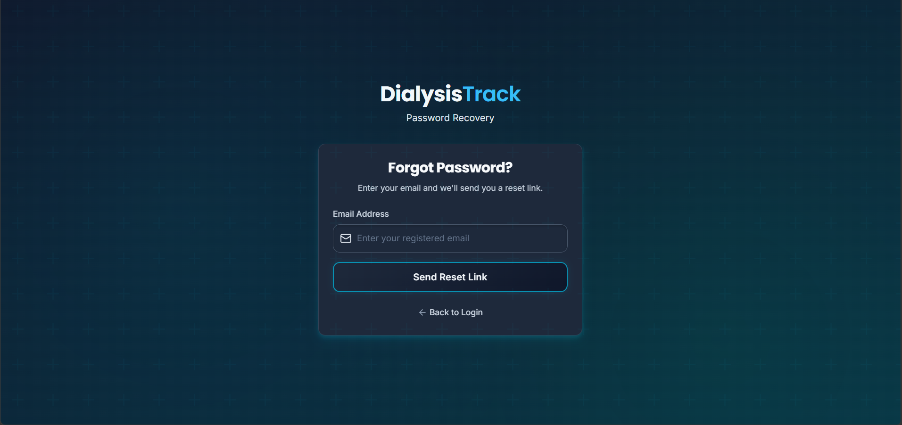

Figure 6.1: Login and Authentication – DialysisTrack Entry Point

6.2 Admin Dashboard – Main Overview

After successful login, an Admin user lands on the main dashboard. The dashboard is designed to give the Admin a complete situational overview of the centre at a glance — without requiring them to navigate to individual modules. The top section shows key metrics in card format: total active patients, sessions scheduled for today, machines currently in use, pending bills, and ambulances currently dispatched.

Below the metric cards, the dashboard displays a real-time activity feed showing the most recent events in the system — new patient registrations, session completions, and payments received. A side panel shows the day's appointment schedule in chronological order, allowing the Admin to quickly spot any upcoming sessions.

This dashboard replaces the need for a morning briefing call or a walkthrough of the physical floor to understand the centre's current status. All relevant information is accessible from one screen.

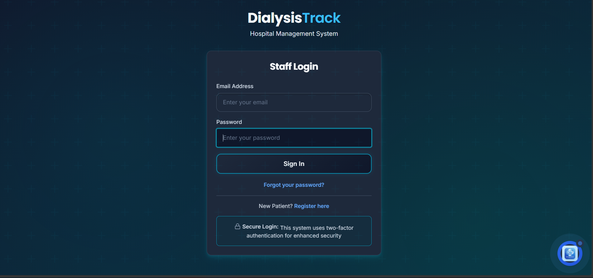

Figure 6.2: Admin Dashboard – Real-Time Centre Overview

6.3 Dashboard – Secondary Statistics View

A secondary tab on the Admin dashboard provides graphical statistical summaries of the centre's activity over the past week and month. Bar charts show the daily session count for the past seven days, making it easy to identify patterns — such as higher load on certain days of the week. A pie chart shows the distribution of patients by their dialysis frequency (patients visiting 2 times per week vs 3 times per week). A line chart tracks daily revenue from billing over the past thirty days.

These visualisations are generated client-side in React using a charting library, with the underlying data fetched from the `/api/reports/summary/` endpoint. The data is read-only — the Admin uses this view for monitoring and planning purposes.

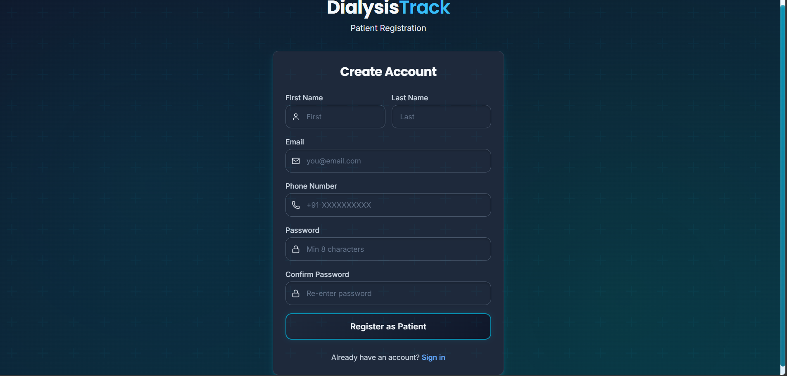

Figure 6.3: Admin Dashboard – Statistical Summary and Reporting Charts

6.4 Patient Management – Registration and Listing

The Patient Management module, accessible to the Receptionist and Admin, provides the tools for registering new patients and browsing the existing patient database. The patient listing page shows all registered patients in a searchable, paginated table. Columns displayed include the auto-generated Patient Code (e.g., DT-00087), the patient's full name, primary diagnosis, assigned doctor, and the number of sessions completed to date.

Clicking on any patient row opens the patient's detailed profile, showing all demographic information, medical history, document attachments, and a tabbed history of previous appointments and sessions.

The "Register New Patient" button opens a multi-step registration form. Step one collects personal information. Step two collects medical history and the primary diagnosis. Step three assigns a treating doctor and sets the dialysis frequency. On submission, the backend generates the unique patient code, creates the PatientProfile record, and sends a registration confirmation email to the patient's registered address.

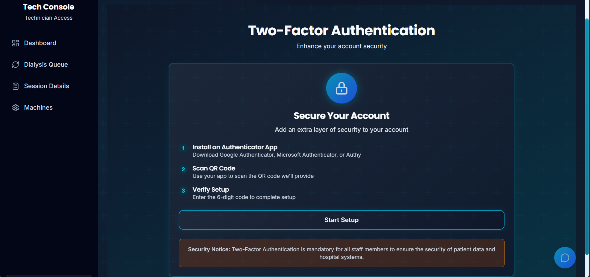

Figure 6.4: Patient Management Module – Registration and Patient Listing

6.5 Appointment Scheduling

The Appointment Scheduling module is the core of DialysisTrack's operational logic. The scheduling interface presents a calendar view showing existing appointments across all machines for the selected date. Time slots for each machine are displayed in a grid — green for available, blue for booked, and red for maintenance blocks.

To create a new appointment, the Receptionist selects the desired date, chooses a machine from the available ones, selects the treating doctor (filtered to those available on that day), and picks the patient being booked. The system automatically calculates the expected end time based on the patient's standard session duration. On submission, the backend runs the conflict check and either confirms the appointment or returns a specific conflict message indicating which resource is unavailable.

Confirmed appointments can be viewed, edited (up to a configurable number of hours before the scheduled time), or cancelled by the Receptionist. Cancellations can optionally trigger an SMS notification to the patient.

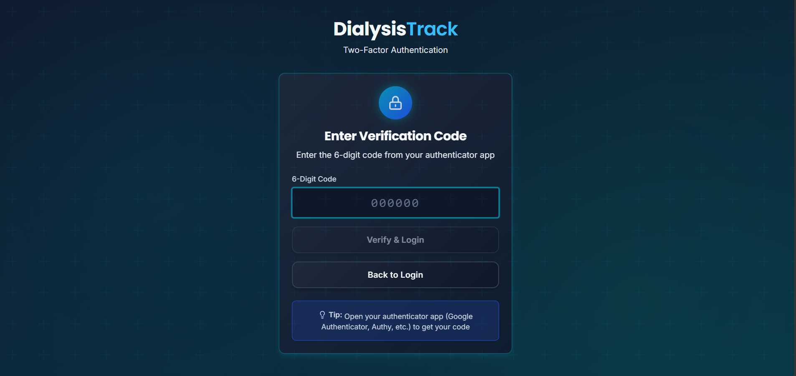

Figure 6.5: Appointment Scheduling – Calendar View with Machine Availability

6.6 Dialysis Queue Management

The Queue Management screen is primarily used by Nurse and Technician staff. It shows all appointments for the current day arranged as a live queue board. Each row represents one patient's scheduled session — showing the patient's name, assigned machine, scheduled start time, current session status, and time elapsed.

When a patient arrives at the centre, the Technician can click the "Check In" button on their queue entry, which changes the appointment status to "Arrived." When the machine is prepared and the session begins, the Technician clicks "Start Session," which creates the DialysisSession record and starts the session timer displayed on the board. The nurse can then enter vital sign readings at regular intervals directly from this screen without navigating away.

The queue board auto-refreshes every thirty seconds, or in near real-time for users on supported browsers via a WebSocket connection, ensuring that all staff looking at the board simultaneously see the same current state.

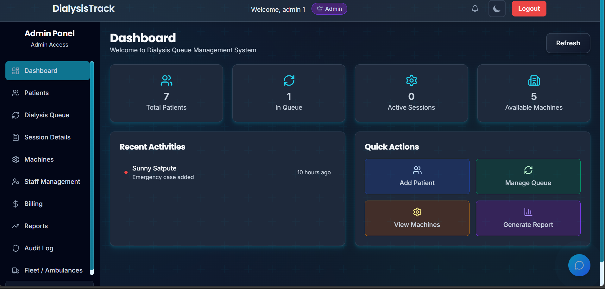

Figure 6.6: Queue Management – Live Session Status Board

6.7 Session Management and Vital Signs

The Session Management view provides a detailed interface for an active dialysis session. Accessible to Nurse and Technician roles, it shows the full session record for a patient currently on a machine — their pre-session weight and blood pressure, target fluid removal, and any special instructions from the treating doctor.

The vital sign recording form within this view allows the Nurse to log readings at any point during the session. Each entry is timestamped automatically. Common readings recorded include blood pressure (systolic/diastolic), pulse rate, temperature, and any symptoms reported by the patient. The form is designed to be fast to fill — it uses large input fields and a numeric keypad layout optimised for tablet use.

When the session is complete, the Technician clicks "Complete Session," which opens a final summary form asking for post-session weight and final blood pressure. Once submitted, the system automatically transitions the session to "Completed" status, triggers the billing signal, and removes the session from the active queue board.

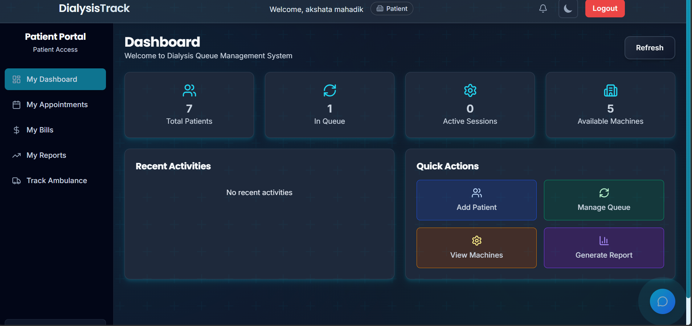

Figure 6.7: Session Management – Vital Sign Recording Interface

6.8 Machine Inventory and Status Monitoring

The Machine Inventory module, managed by the Admin and Technician, provides a complete view of all dialysis machines owned by the centre. Each machine is listed with its machine code, brand and model, current status (colour-coded), total sessions run since last service, and the due date for the next maintenance.

The Technician can update a machine's status directly from this screen — for example, marking it "Under Maintenance" when a service engineer is working on it, which automatically makes it unavailable for appointment booking during that period. When maintenance is complete, the Technician marks it as "Available" and the system resets the service interval counter.

Clicking on a machine opens its full history — a chronological log of all sessions run on that machine, maintenance events, and any incident reports, giving management complete visibility into machine utilisation and reliability.

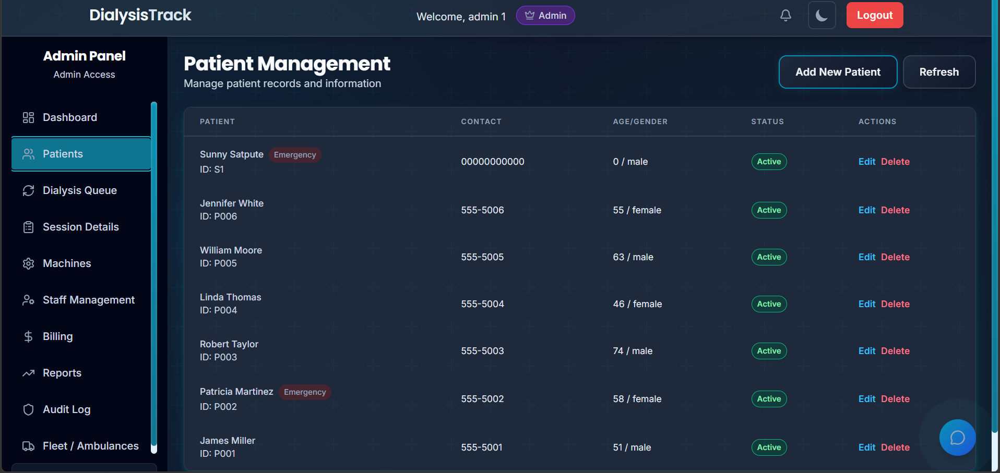

Figure 6.8: Machine Inventory – Status Overview and Maintenance Tracking

6.9 Staff Management

The Staff Management module allows the Admin to manage all members of the clinical and administrative team. The staff listing page shows each team member's name, role, department, and current shift status. The Admin can add new staff, deactivate accounts of departed employees, and update role assignments.

Shift scheduling is handled within this module. The Admin can assign shifts to individual staff members for each day of the week, and the system automatically factors in these shift assignments when validating doctor availability during appointment booking. If a doctor is not scheduled on a Wednesday and someone attempts to book an appointment with them on that day, the scheduler rejects it with a clear message.

Staff attendance is tracked via a daily check-in mechanism. When a staff member logs into DialysisTrack at the start of their shift, the system automatically records their login timestamp as their check-in time for attendance purposes.

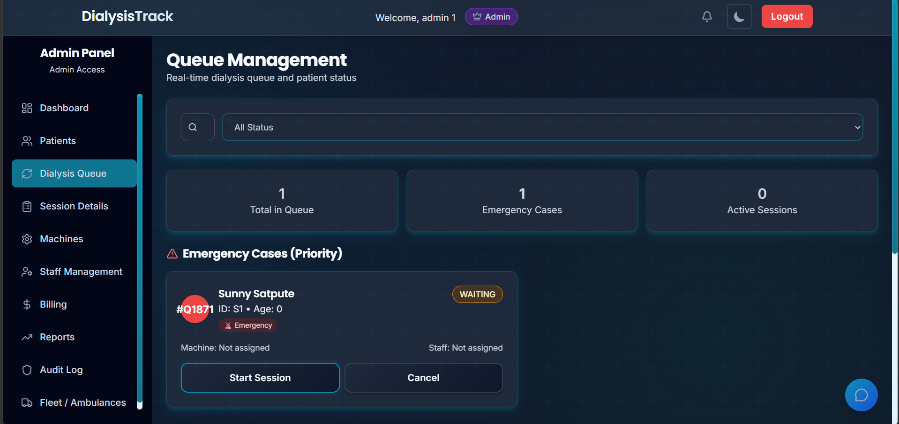

Figure 6.9: Staff Management – Team Directory and Shift Assignment

6.10 Doctor's Patient Panel

The Doctor's role-specific dashboard shows them a personalised view of their assigned patients and today's scheduled sessions. The Doctor can browse their patient list, view comprehensive treatment histories for each patient, and leave session notes or updated prescription instructions that are flagged for the nursing team.

Doctors cannot make appointments or access billing data — their interface is scoped exclusively to clinical information. The design prioritises medical information density over administrative features. A patient card, for instance, prominently displays recent blood pressure trends and post-session weight change patterns, the kind of clinical data a nephrologist needs to monitor for treatment efficacy.

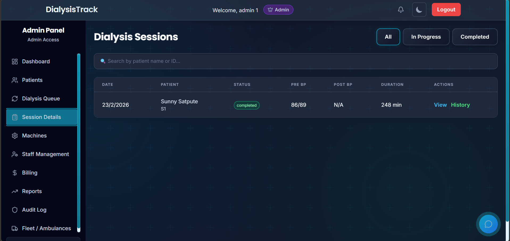

Figure 6.10: Doctor's Panel – Patient List and Clinical History View

6.11 Patient Registry – Detailed Profile View

The detailed patient profile view, accessible to Receptionist and Admin, compiles all information about a patient in one tabbed interface. The overview tab shows demographic details, contact information, and the assigned treating doctor. The medical tab shows the primary diagnosis, relevant comorbidities, and current medication. The sessions tab lists every completed dialysis session with the date, machine used, session duration, and the nurse who conducted it. The billing tab shows all generated bills and their payment status.

This consolidated profile eliminates the need to cross-reference multiple registers or systems to get a complete picture of a patient's history — a direct address of one of the primary pain points identified in the study of existing systems.

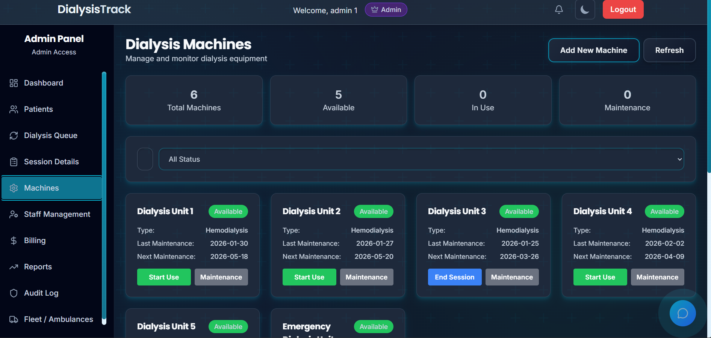

Figure 6.11: Patient Registry – Comprehensive Patient Profile View

6.12 Reports and Analytics Module

The Reports module provides the Admin and management with downloadable operational reports. Available reports include the Daily Session Summary, Weekly Revenue Report, Machine Utilisation Report, Patient Attendance Report, and Staff Shift Report. Reports can be filtered by date range and exported to CSV format for import into external accounting or auditing tools.

The backend generates these reports by executing aggregation queries on the MySQL database. For example, the Machine Utilisation report calculates the total hours each machine was in active use over the selected period, divided by the total available hours in that period, to produce a utilisation percentage for each machine.

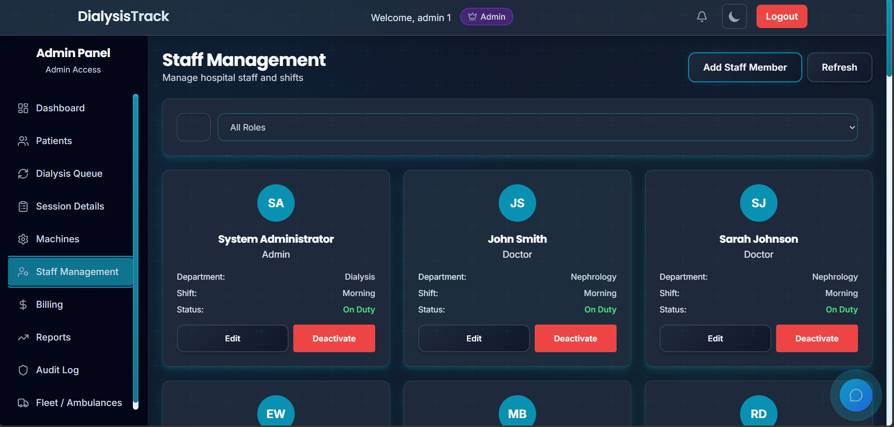

Figure 6.12: Reports Module – Operational Analytics and Export

6.13 Billing Module – Invoice Generation

The Billing module displays all generated invoices in a searchable list. The Receptionist can view any bill's details — the session it corresponds to, the itemised charges, the GST breakdown, and the payment status. Bills are automatically generated when a session is completed, but the Receptionist can also manually trigger a bill revision if an error is discovered before payment.

Each bill lists the session charges, any additional consumable or laboratory charges, the GST percentage and computed amount, and the grand total. The bill number is auto-generated in a sequential format for audit trail purposes.

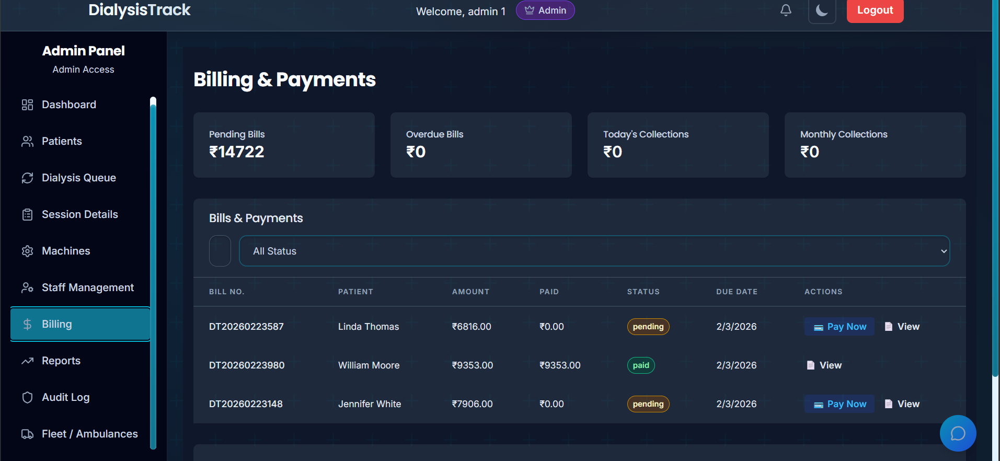

Figure 6.13: Billing Module – Invoice Generation and Management

6.14 Payment Processing – UPI QR Code Generation

Clicking "Process Payment" on any pending bill opens the payment processing screen. This screen shows the final bill amount and, prominently, a dynamically generated UPI QR code. The QR code encodes the payment amount, the payee UPI ID (the centre's registered UPI address), and the bill number as the payment reference. The patient or their family member can scan this QR code with any UPI-compatible application (Google Pay, PhonePe, Paytm, etc.) and complete the payment instantly.

Once payment is received, the Receptionist clicks "Mark as Paid" and selects the payment mode (UPI, Cash, or Card). The system updates the BillingRecord's payment_status to "Paid," records the timestamp, and closes the bill. A printable receipt can then be generated and handed to the patient.

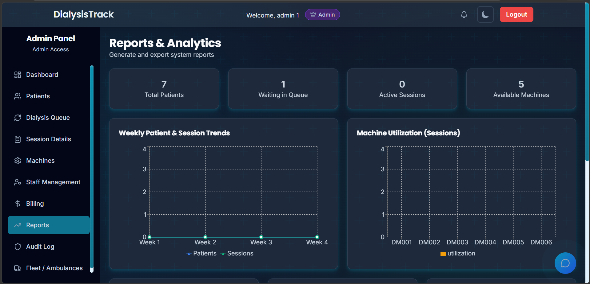

Figure 6.14: Payment Processing – Dynamic UPI QR Code for Digital Payment

6.15 Ambulance Fleet and GPS Tracking

The Fleet Management module provides the Admin and Receptionist with a live view of all ambulance dispatches. The dispatch list shows each vehicle's current status — Dispatched, En Route, or Arrived. Clicking on an active dispatch opens the live tracking map, which shows the vehicle's current GPS coordinates plotted on a map, updating in near real-time via the WebSocket connection.

The Receptionist uses this view to inform patients or their families of the estimated arrival time of their pick-up vehicle. The Driver, on their mobile device, runs the DialysisTrack Driver interface that continuously submits GPS coordinates to the server. The dispatcher's map view reflects these coordinates within seconds.

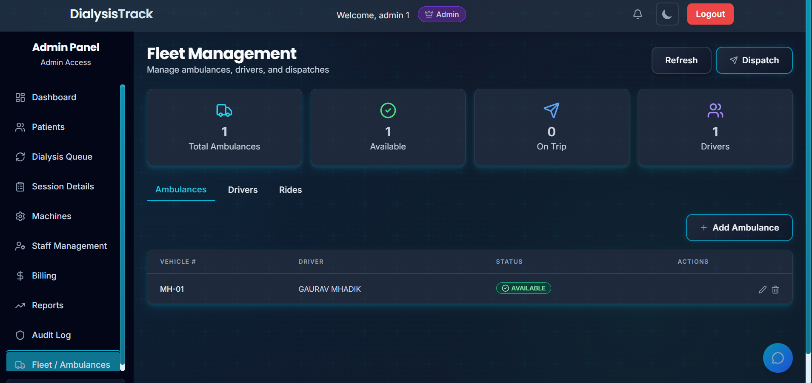

Figure 6.15: Fleet Management – Ambulance Dispatch and Live GPS Tracking

