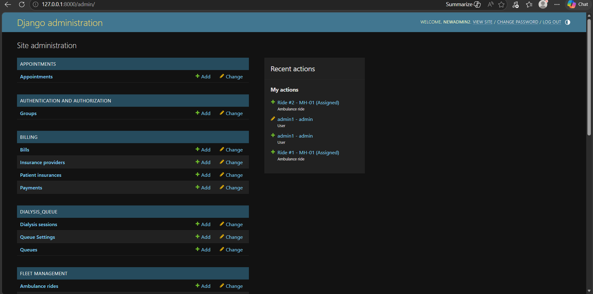

Chapter – 7 : Implementation Procedure

---

7.1 Overview of Implementation

Implementation is the phase where the theoretical system design is translated into functional software. For DialysisTrack, the implementation was carried out systematically, module by module, following an agile development methodology. The architecture is split into a Django-based backend application programming interface (API) and a React.js frontend single-page application (SPA). This decoupling allowed the data processing logic and the user interface to be developed and tested independently before integration.

---

7.2 Backend Implementation

The backend was implemented using Python 3.10 and Django 4.2. The project was structured into multiple discrete Django applications ("apps"), each responsible for a specific operational domain: users, patients, appointments, dialysis_queue, billing, fleet, and clinical.

Database Configuration: The implementation began with configuring the Django settings to connect to the MySQL 8.0 database using the PyMySQL adapter. The ORM models defined during the system design phase were written as Python classes inheriting from `django.db.models.Model`. Django's migration engine was then used to translate these models into actual MySQL tables with the correct column types, constraints, and foreign key relationships.

Authentication and RBAC: The custom User model was implemented by extending Django's `AbstractUser`, adding the `role` field as a mandatory attribute. Authentication was implemented using JSON Web Tokens (JWT) provided by the `djangorestframework-simplejwt` package. When a user logs in, the system generates an access token containing their user ID and role, and a refresh token for maintaining the session. The Role-Based Access Control (RBAC) was enforced by writing custom Django REST Framework permission classes (e.g., `IsAdmin`, `IsDoctorOrAdmin`) and applying them to the appropriate API views.

API Development: The business logic was exposed to the frontend via a RESTful API using Django REST Framework. Model serializers were created to convert complex database querysets into JSON format. The core business rules were implemented within these serializers and views. For example, the appointment conflict detection logic was implemented inside the `validate` method of the `AppointmentSerializer`, ensuring that no conflicting appointment could ever be saved to the database, regardless of how the API was called.

WebSocket Integration: The real-time ambulance tracking feature required WebSocket support, which standard Django does not provide natively. This was implemented by integrating Django Channels and the Daphne ASGI server. A custom `LocationConsumer` class was written to accept WebSocket connections from drivers, receive JSON payloads containing GPS coordinates, update the database, and broadcast these coordinates to any connected tracking clients (like the receptionist's dashboard).

---

7.3 Frontend Implementation

The frontend was implemented using React.js version 18, scaffolded with Vite for rapid development and optimised building.

State Management and Routing: The application uses React Router for client-side navigation, allowing users to move between screens without page reloads. Global state, such as the currently authenticated user's profile and JWT tokens, is managed using React Context. When the application loads, an authentication provider checks for existing tokens in local storage, decodes the role, and dynamically generates the routing table so that users only have access to the routes permitted for their role.

API Integration: Communication with the Django backend is handled using the Axios HTTP client. An Axios interceptor was implemented to automatically attach the JWT access token to the `Authorization` header of every outgoing request. A response interceptor catches 401 Unauthorised errors (indicating an expired access token), automatically sends the refresh token to the backend to get a new access token, and then retries the original request seamlessly without requiring the user to log in again.

Component Development: The user interface was built using a modular component approach. Reusable components were created for data tables, modal dialogs, form inputs, and metric cards. This ensured visual consistency across the application and reduced code duplication. The forms were implemented with client-side validation to provide immediate feedback to the user before submitting data to the server.

Payment Gateway Integration: The Razorpay payment gateway was integrated into the frontend by loading the Razorpay checkout script dynamically when a payment is initiated. Upon successful payment on the Razorpay popup, the frontend receives a payment signature, which it then sends to the Django backend for cryptographic verification before marking the bill as paid in the database.

---

7.4 Deployment Environment

DialysisTrack is designed for containerised deployment using Docker, ensuring that the application runs identically in development, testing, and production environments.

Containerization: A Dockerfile was written for the Django backend to install system dependencies, Python packages, and configure the ASGI server. A separate multi-stage Dockerfile was written for the React frontend, which first builds the static assets using Node.js and then serves them using a lightweight Nginx web server.

Docker Compose: A `docker-compose.yml` file was created to orchestrate the entire stack. This file defines three services: the MySQL database, the Django backend, and the Nginx server serving the frontend. It configures the internal network so the containers can communicate securely without exposing the database to the public internet, and sets up volume mounts to persist database data and media uploads across container restarts.

---

7.5 Django Admin as Super Admin Dashboard

One of the more deliberate architectural decisions in DialysisTrack was the choice not to build a separate "Super Admin" interface from scratch. Instead, Django's built-in Admin interface was adopted and heavily customised to serve as the exclusive Super Admin dashboard.

The Django Admin, accessible at `/admin/`, is a fully featured database management interface that Django generates automatically from registered models. By default, it provides Create, Read, Update, and Delete functionality for every registered Django model. Out of the box, it is functional but visually minimal.

For DialysisTrack, the Admin interface was registered with all application models and customised extensively. Custom `ModelAdmin` classes were written to:
- Display additional columns in the list view (e.g., showing a patient's assigned doctor and last session date alongside their name)
- Enable powerful search and filter panels for large tables
- Add custom administrative actions (e.g., "Bulk Export to CSV," "Force Session Closure," "Reset 2FA for User")
- Disable or restrict certain field edits to prevent accidental data corruption
- Apply a custom admin theme using the `django-unfold` package, giving the interface a clean, modern dark-themed appearance

Who Accesses Django Admin?
The Django Admin is strictly reserved for IT administration personnel — specifically, for the system Super Admin who has the `is_superuser = True` flag set in their CustomUser record. Regular Admin staff who manage the centre's day-to-day operations use the React frontend portal exclusively.

This separation is intentional. The React frontend is designed with workflow-appropriate constraints that prevent operational mistakes — for example, it won't let a Nurse directly edit a completed session's end time. The Django Admin bypasses all these React-level restrictions, giving the IT Super Admin direct database-level control. This makes it powerful but also potentially dangerous if misused, which is why access is tightly restricted.

Figure 7.1: Django Admin – Super Admin Dashboard of DialysisTrack

The screenshot above shows the Django Admin panel for DialysisTrack, displaying the list of registered models on the left sidebar. The Super Admin can directly select any model — such as CustomUser, PatientProfile, BillingRecord, or DialysisSession — and perform full CRUD operations with advanced filtering and search. This interface is accessed exclusively via `https://[domain]/admin/` and requires both the superuser credentials and the 2FA OTP to log in.

---
