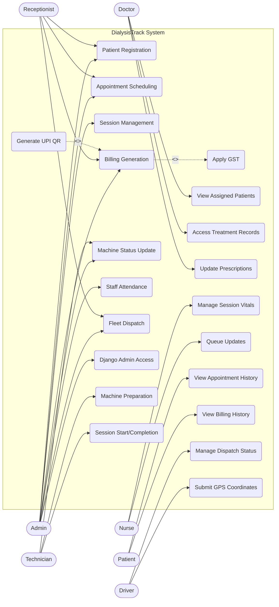
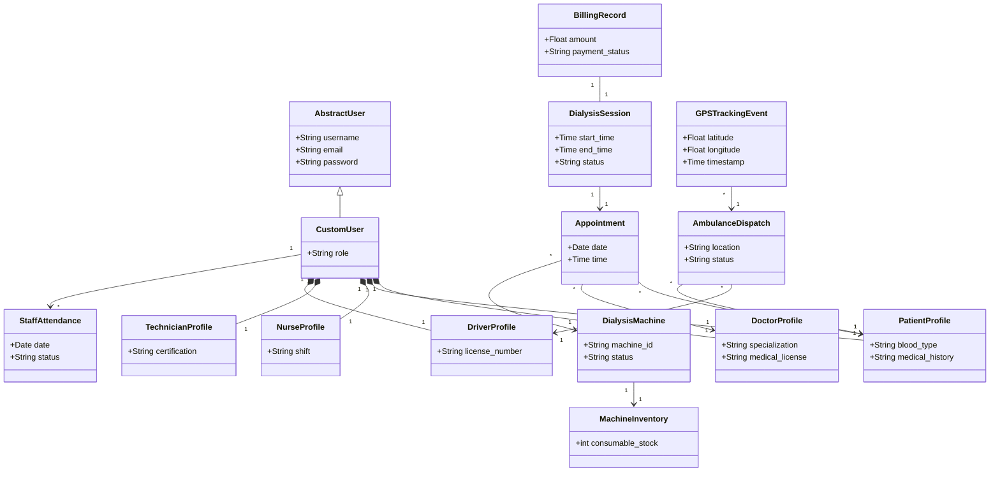
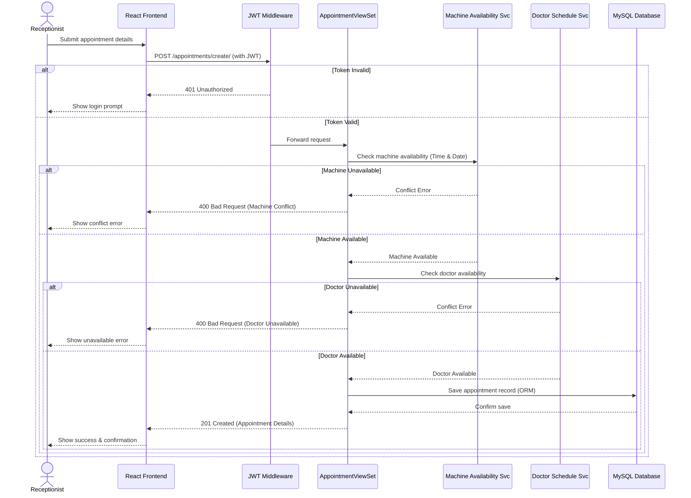
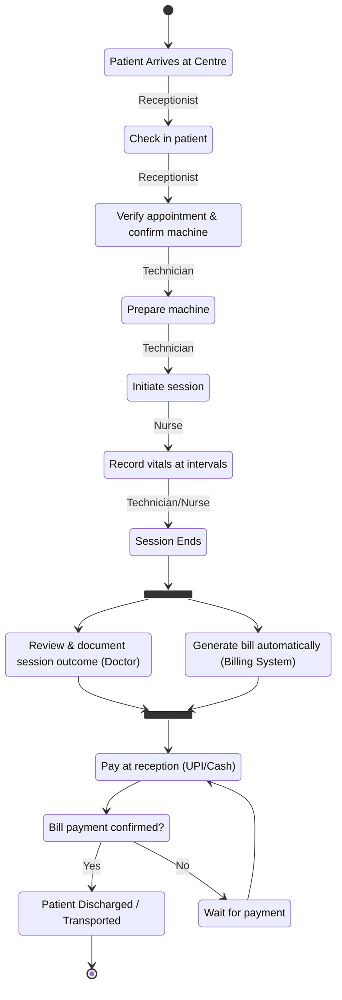
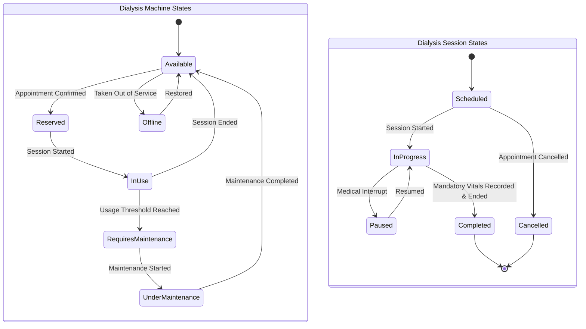
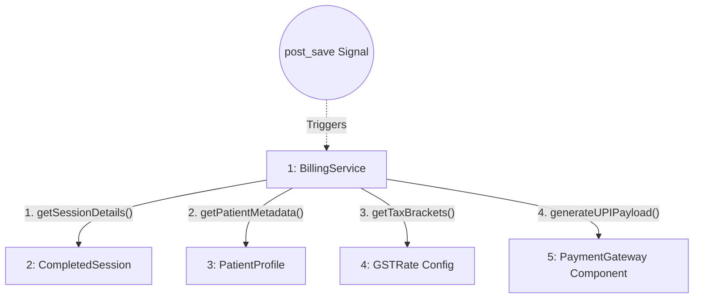
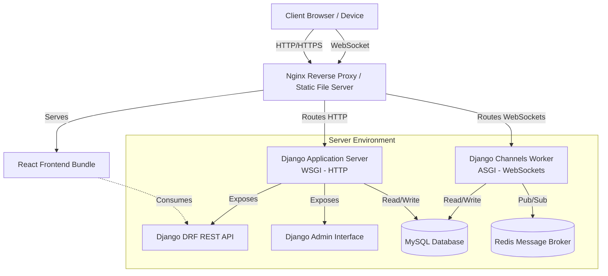
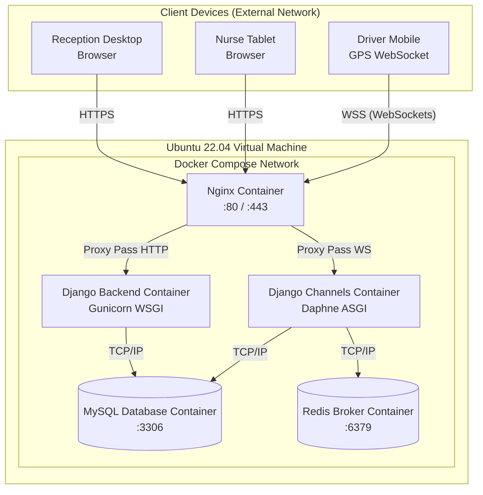

# DialysisTrack - UML Mermaid Diagrams

These Mermaid diagrams have been explicitly designed to perfectly match the textual descriptions and logic described in `Chapter_04_System_Design.md`. You can use these mermaid blocks in markdown editors (like GitHub, Notion, or VS Code) to dynamically generate the diagrams.

## 4.6 Use Case Diagram

## 4.7 Class Diagram

## 4.8 Sequence Diagram

## 4.9 Activity Diagram

## 4.10 Statechart Diagram

## 4.11 Collaboration Diagram

## 4.12 Component Diagram

## 4.13 Deployment Diagram

