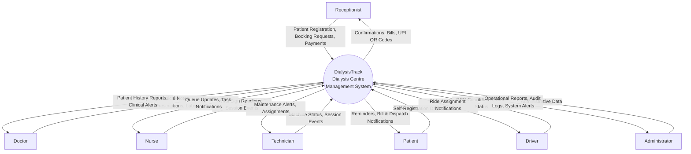
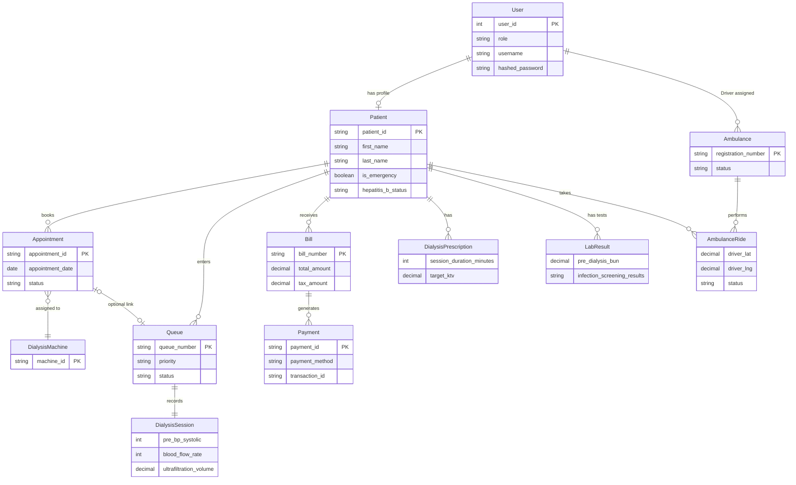
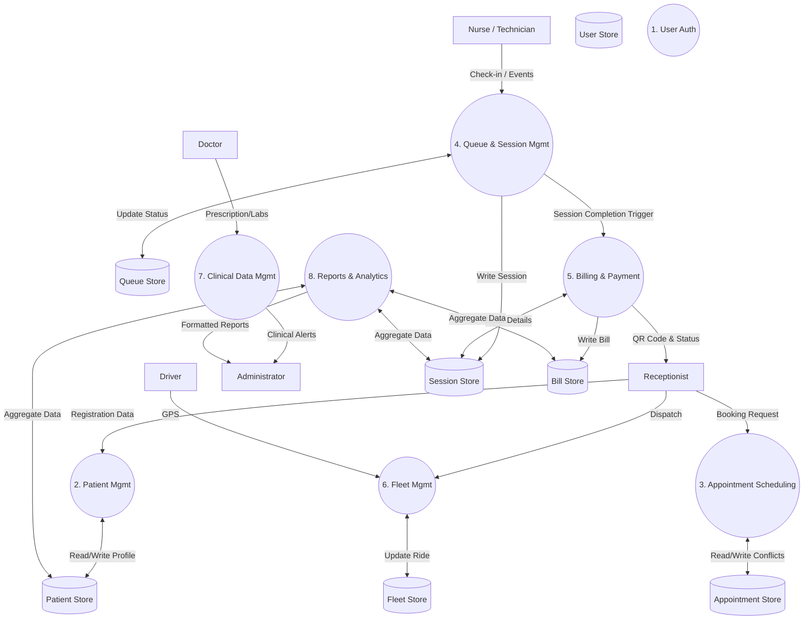

# DialysisTrack - Analysis Diagrams (ERD, DFD, FDD)

These Mermaid diagrams correspond to Chapter 3: Analysis (Sections 3.2 to 3.5). 

## 3.2 Functional Decomposition Diagram (FDD)

```mermaid
flowchart TD
    SYS[DialysisTrack System]
    
    %% Primary Modules
    SYS --> M1[User Management]
    SYS --> M2[Patient Management]
    SYS --> M3[Appointment & Scheduling]
    SYS --> M4[Queue & Session Mgmt]
    SYS --> M5[Machine Inventory Mgmt]
    SYS --> M6[Billing & Payment Processing]
    SYS --> M7[Fleet & Ambulance Mgmt]
    SYS --> M8[Clinical Data Mgmt]
    SYS --> M9[Reporting & Analytics]
    SYS --> M10[Notification Mgmt]
    SYS --> M11[Audit & Security]

    %% Sub-functions (abbreviated for diagram readability)
    M1 --> M1_1[User Registration]
    M1 --> M1_2[Role Assignment]
    M1 --> M1_3[Login & JWT Auth]
    
    M2 --> M2_1[Patient Registration]
    M2 --> M2_2[Profile View/Update]
    M2 --> M2_3[Emergency Flag Mgmt]
    
    M3 --> M3_1[Appointment Booking]
    M3 --> M3_2[Conflict Detection]
    M3 --> M3_3[Machine Availability]
    
    M4 --> M4_1[Patient Check-In]
    M4 --> M4_2[Vital Sign Entry]
    M4 --> M4_3[Session Recording]
    
    M6 --> M6_1[Auto Bill Generation]
    M6 --> M6_2[GST Computation]
    M6 --> M6_3[UPI & Razorpay]
    
    M7 --> M7_1[Ambulance Dispatch]
    M7 --> M7_2[Live GPS Tracking]
    
    M8 --> M8_1[Infection Status]
    M8 --> M8_2[Dialysis Prescription]
    M8 --> M8_3[Lab Results & Kt/V]
```

## 3.3 Context Level Diagram (DFD Level 0)

## 3.4 Entity Relationship Diagram (ERD)

## 3.5 Data Flow Diagram (DFD Level 1)

