# DialysisTrack - Comprehensive UML Diagrams

## Table of Contents
1. [Data Flow Diagrams](#data-flow-diagrams)
2. [Use Case Diagrams](#use-case-diagrams)
3. [Class Diagrams](#class-diagrams)
4. [Sequence Diagrams](#sequence-diagrams)
5. [Entity Relationship Diagram](#entity-relationship-diagram)
6. [Activity Diagrams](#activity-diagrams)
7. [Component Diagram](#component-diagram)
8. [Deployment Diagram](#deployment-diagram)

---

## 1. Data Flow Diagrams

### Level 0 - Context Diagram

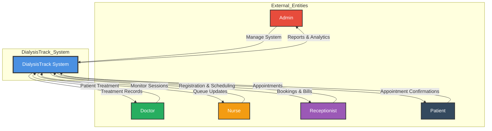
```mermaid
graph TB
    subgraph External_Entities
        Admin[Admin]
        Doctor[Doctor]
        Nurse[Nurse]
        Receptionist[Receptionist]
        Patient[Patient]
    end
    
    subgraph DialysisTrack_System
        DTS[DialysisTrack System]
    end
    
    Admin -->|Manage System| DTS
    Doctor -->|Patient Treatment| DTS
    Nurse -->|Monitor Sessions| DTS
    Receptionist -->|Registration & Scheduling| DTS
    Patient -->|Appointments| DTS
    
    DTS -->|Reports & Analytics| Admin
    DTS -->|Treatment Records| Doctor
    DTS -->|Queue Updates| Nurse
    DTS -->|Bookings & Bills| Receptionist
    DTS -->|Appointment Confirmations| Patient
    
    style DTS fill:#4a90e2,stroke:#333,stroke-width:3px,color:#fff
    style Admin fill:#e74c3c,stroke:#333,stroke-width:2px,color:#fff
    style Doctor fill:#27ae60,stroke:#333,stroke-width:2px,color:#fff
    style Nurse fill:#f39c12,stroke:#333,stroke-width:2px,color:#fff
    style Receptionist fill:#9b59b6,stroke:#333,stroke-width:2px,color:#fff
    style Patient fill:#34495e,stroke:#333,stroke-width:2px,color:#fff
```

### Level 1 - System Processes

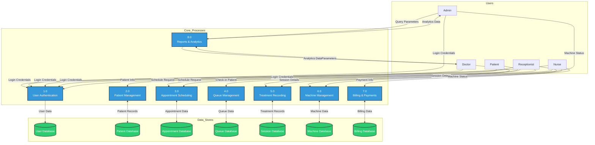
```mermaid
graph TB
    subgraph Users
        U1[Admin]
        U2[Doctor]
        U3[Nurse]
        U4[Receptionist]
        U5[Patient]
    end
    
    subgraph Core_Processes
        P1[1.0<br/>User Authentication]
        P2[2.0<br/>Patient Management]
        P3[3.0<br/>Appointment Scheduling]
        P4[4.0<br/>Queue Management]
        P5[5.0<br/>Treatment Recording]
        P6[6.0<br/>Machine Management]
        P7[7.0<br/>Billing & Payments]
        P8[8.0<br/>Reports & Analytics]
    end
    
    subgraph Data_Stores
        DS1[(User Database)]
        DS2[(Patient Database)]
        DS3[(Appointment Database)]
        DS4[(Queue Database)]
        DS5[(Session Database)]
        DS6[(Machine Database)]
        DS7[(Billing Database)]
    end
    
    U1 & U2 & U3 & U4 & U5 -->|Login Credentials| P1
    P1 -->|User Data| DS1
    
    U4 -->|Patient Info| P2
    P2 <-->|Patient Records| DS2
    
    U4 & U5 -->|Schedule Request| P3
    P3 <-->|Appointment Data| DS3
    
    U3 -->|Check-in Patient| P4
    P4 <-->|Queue Data| DS4
    
    U2 & U3 -->|Session Details| P5
    P5 <-->|Treatment Records| DS5
    
    U1 & U3 -->|Machine Status| P6
    P6 <-->|Machine Data| DS6
    
    U4 -->|Payment Info| P7
    P7 <-->|Billing Data| DS7
    
    U1 & U2 -->|Query Parameters| P8
    P8 -->|Analytics Data| U1 & U2
    
    style P1 fill:#3498db,stroke:#333,stroke-width:2px,color:#fff
    style P2 fill:#3498db,stroke:#333,stroke-width:2px,color:#fff
    style P3 fill:#3498db,stroke:#333,stroke-width:2px,color:#fff
    style P4 fill:#3498db,stroke:#333,stroke-width:2px,color:#fff
    style P5 fill:#3498db,stroke:#333,stroke-width:2px,color:#fff
    style P6 fill:#3498db,stroke:#333,stroke-width:2px,color:#fff
    style P7 fill:#3498db,stroke:#333,stroke-width:2px,color:#fff
    style P8 fill:#3498db,stroke:#333,stroke-width:2px,color:#fff
    
    style DS1 fill:#2ecc71,stroke:#333,stroke-width:2px,color:#fff
    style DS2 fill:#2ecc71,stroke:#333,stroke-width:2px,color:#fff
    style DS3 fill:#2ecc71,stroke:#333,stroke-width:2px,color:#fff
    style DS4 fill:#2ecc71,stroke:#333,stroke-width:2px,color:#fff
    style DS5 fill:#2ecc71,stroke:#333,stroke-width:2px,color:#fff
    style DS6 fill:#2ecc71,stroke:#333,stroke-width:2px,color:#fff
    style DS7 fill:#2ecc71,stroke:#333,stroke-width:2px,color:#fff
```

### Level 2 - Patient Management Process Detailed

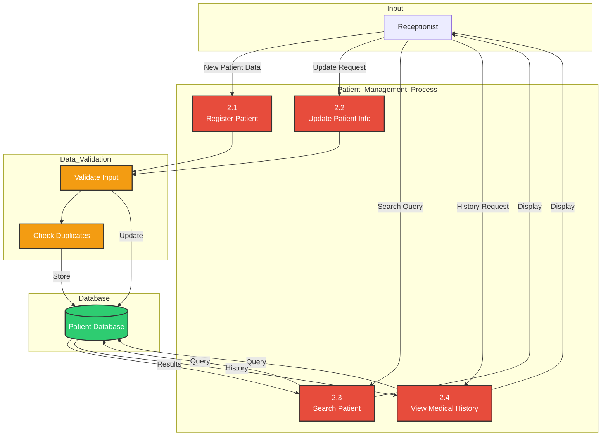
```mermaid
graph TB
    subgraph Input
        R[Receptionist]
    end
    
    subgraph Patient_Management_Process
        P1[2.1<br/>Register Patient]
        P2[2.2<br/>Update Patient Info]
        P3[2.3<br/>Search Patient]
        P4[2.4<br/>View Medical History]
    end
    
    subgraph Data_Validation
        V1[Validate Input]
        V2[Check Duplicates]
    end
    
    subgraph Database
        DB[(Patient Database)]
    end
    
    R -->|New Patient Data| P1
    R -->|Update Request| P2
    R -->|Search Query| P3
    R -->|History Request| P4
    
    P1 --> V1
    V1 --> V2
    V2 -->|Store| DB
    
    P2 --> V1
    V1 -->|Update| DB
    
    P3 -->|Query| DB
    DB -->|Results| P3
    
    P4 -->|Query| DB
    DB -->|History| P4
    
    P3 & P4 -->|Display| R
    
    style P1 fill:#e74c3c,stroke:#333,stroke-width:2px,color:#fff
    style P2 fill:#e74c3c,stroke:#333,stroke-width:2px,color:#fff
    style P3 fill:#e74c3c,stroke:#333,stroke-width:2px,color:#fff
    style P4 fill:#e74c3c,stroke:#333,stroke-width:2px,color:#fff
    style V1 fill:#f39c12,stroke:#333,stroke-width:2px,color:#fff
    style V2 fill:#f39c12,stroke:#333,stroke-width:2px,color:#fff
    style DB fill:#2ecc71,stroke:#333,stroke-width:2px,color:#fff
```

### Level 2 - Queue Management Process Detailed

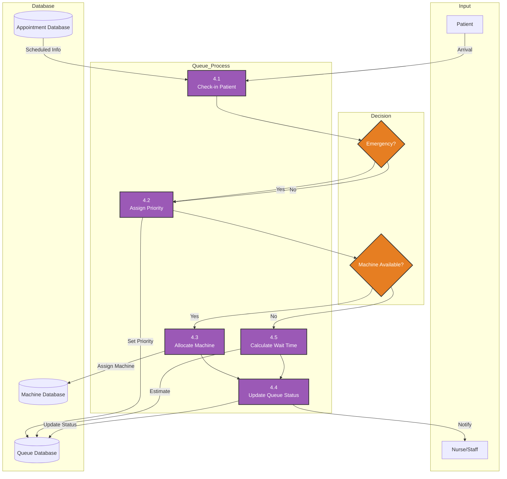
```mermaid
graph TB
    subgraph Input
        N[Nurse/Staff]
        P[Patient]
    end
    
    subgraph Queue_Process
        Q1[4.1<br/>Check-in Patient]
        Q2[4.2<br/>Assign Priority]
        Q3[4.3<br/>Allocate Machine]
        Q4[4.4<br/>Update Queue Status]
        Q5[4.5<br/>Calculate Wait Time]
    end
    
    subgraph Decision
        D1{Emergency?}
        D2{Machine Available?}
    end
    
    subgraph Database
        QDB[(Queue Database)]
        MDB[(Machine Database)]
        ADB[(Appointment Database)]
    end
    
    P -->|Arrival| Q1
    Q1 --> D1
    
    D1 -->|Yes| Q2
    D1 -->|No| Q2
    Q2 -->|Set Priority| QDB
    
    Q2 --> D2
    D2 -->|Yes| Q3
    D2 -->|No| Q5
    
    Q3 -->|Assign Machine| MDB
    Q3 --> Q4
    
    Q5 -->|Estimate| QDB
    Q5 --> Q4
    
    Q4 -->|Update Status| QDB
    Q4 -->|Notify| N
    
    ADB -->|Scheduled Info| Q1
    
    style Q1 fill:#9b59b6,stroke:#333,stroke-width:2px,color:#fff
    style Q2 fill:#9b59b6,stroke:#333,stroke-width:2px,color:#fff
    style Q3 fill:#9b59b6,stroke:#333,stroke-width:2px,color:#fff
    style Q4 fill:#9b59b6,stroke:#333,stroke-width:2px,color:#fff
    style Q5 fill:#9b59b6,stroke:#333,stroke-width:2px,color:#fff
    style D1 fill:#e67e22,stroke:#333,stroke-width:2px,color:#fff
    style D2 fill:#e67e22,stroke:#333,stroke-width:2px,color:#fff
```

---

## 2. Use Case Diagrams

### Overall System Use Cases

```mermaid
graph TB
    subgraph Actors
        Admin[👨‍💼 Admin]
        Doctor[👨‍⚕️ Doctor]
        Nurse[👩‍⚕️ Nurse]
        Receptionist[👤 Receptionist]
        Patient[🧑 Patient]
    end
    
    subgraph DialysisTrack_System
        UC1[Login/Logout]
        UC2[Manage Users]
        UC3[Register Patient]
        UC4[Update Patient Info]
        UC5[Schedule Appointment]
        UC6[View Appointments]
        UC7[Check-in Patient]
        UC8[Manage Queue]
        UC9[Record Treatment]
        UC10[View Medical Records]
        UC11[Monitor Machines]
        UC12[Schedule Maintenance]
        UC13[Generate Bills]
        UC14[Process Payments]
        UC15[Generate Reports]
        UC16[View Analytics]
        UC17[Manage Staff Schedule]
    end
    
    %% Admin Use Cases
    Admin --> UC1
    Admin --> UC2
    Admin --> UC15
    Admin --> UC16
    Admin --> UC17
    Admin --> UC12
    
    %% Doctor Use Cases
    Doctor --> UC1
    Doctor --> UC9
    Doctor --> UC10
    Doctor --> UC16
    
    %% Nurse Use Cases
    Nurse --> UC1
    Nurse --> UC7
    Nurse --> UC8
    Nurse --> UC9
    Nurse --> UC10
    Nurse --> UC11
    
    %% Receptionist Use Cases
    Receptionist --> UC1
    Receptionist --> UC3
    Receptionist --> UC4
    Receptionist --> UC5
    Receptionist --> UC6
    Receptionist --> UC13
    Receptionist --> UC14
    
    %% Patient Use Cases
    Patient --> UC6
    
    style UC1 fill:#3498db,stroke:#333,stroke-width:2px,color:#fff
    style UC2 fill:#3498db,stroke:#333,stroke-width:2px,color:#fff
    style UC3 fill:#3498db,stroke:#333,stroke-width:2px,color:#fff
    style UC4 fill:#3498db,stroke:#333,stroke-width:2px,color:#fff
    style UC5 fill:#3498db,stroke:#333,stroke-width:2px,color:#fff
    style UC6 fill:#3498db,stroke:#333,stroke-width:2px,color:#fff
    style UC7 fill:#3498db,stroke:#333,stroke-width:2px,color:#fff
    style UC8 fill:#3498db,stroke:#333,stroke-width:2px,color:#fff
    style UC9 fill:#3498db,stroke:#333,stroke-width:2px,color:#fff
    style UC10 fill:#3498db,stroke:#333,stroke-width:2px,color:#fff
    style UC11 fill:#3498db,stroke:#333,stroke-width:2px,color:#fff
    style UC12 fill:#3498db,stroke:#333,stroke-width:2px,color:#fff
    style UC13 fill:#3498db,stroke:#333,stroke-width:2px,color:#fff
    style UC14 fill:#3498db,stroke:#333,stroke-width:2px,color:#fff
    style UC15 fill:#3498db,stroke:#333,stroke-width:2px,color:#fff
    style UC16 fill:#3498db,stroke:#333,stroke-width:2px,color:#fff
    style UC17 fill:#3498db,stroke:#333,stroke-width:2px,color:#fff
```

### Detailed Use Case: Patient Registration

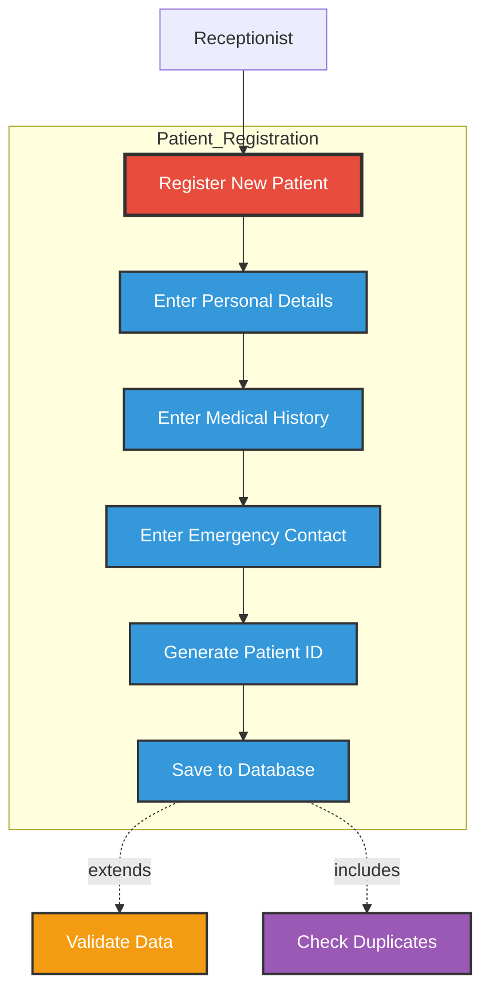
```mermaid
graph TB
    R[Receptionist]
    
    subgraph Patient_Registration
        UC[Register New Patient]
        UC1[Enter Personal Details]
        UC2[Enter Medical History]
        UC3[Enter Emergency Contact]
        UC4[Generate Patient ID]
        UC5[Save to Database]
    end
    
    R --> UC
    UC --> UC1
    UC1 --> UC2
    UC2 --> UC3
    UC3 --> UC4
    UC4 --> UC5
    
    UC5 -.->|extends| E1[Validate Data]
    UC5 -.->|includes| I1[Check Duplicates]
    
    style UC fill:#e74c3c,stroke:#333,stroke-width:3px,color:#fff
    style UC1 fill:#3498db,stroke:#333,stroke-width:2px,color:#fff
    style UC2 fill:#3498db,stroke:#333,stroke-width:2px,color:#fff
    style UC3 fill:#3498db,stroke:#333,stroke-width:2px,color:#fff
    style UC4 fill:#3498db,stroke:#333,stroke-width:2px,color:#fff
    style UC5 fill:#3498db,stroke:#333,stroke-width:2px,color:#fff
    style E1 fill:#f39c12,stroke:#333,stroke-width:2px,color:#fff
    style I1 fill:#9b59b6,stroke:#333,stroke-width:2px,color:#fff
```

### Detailed Use Case: Appointment Scheduling

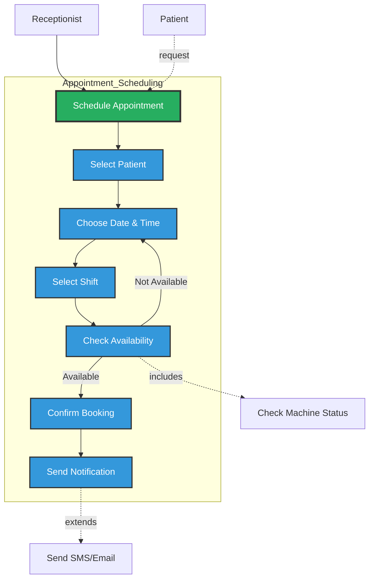
```mermaid
graph TB
    R[Receptionist]
    P[Patient]
    
    subgraph Appointment_Scheduling
        UC[Schedule Appointment]
        UC1[Select Patient]
        UC2[Choose Date & Time]
        UC3[Select Shift]
        UC4[Check Availability]
        UC5[Confirm Booking]
        UC6[Send Notification]
    end
    
    R --> UC
    P -.->|request| UC
    
    UC --> UC1
    UC1 --> UC2
    UC2 --> UC3
    UC3 --> UC4
    UC4 -->|Available| UC5
    UC4 -->|Not Available| UC2
    UC5 --> UC6
    
    UC4 -.->|includes| I1[Check Machine Status]
    UC6 -.->|extends| E1[Send SMS/Email]
    
    style UC fill:#27ae60,stroke:#333,stroke-width:3px,color:#fff
    style UC1 fill:#3498db,stroke:#333,stroke-width:2px,color:#fff
    style UC2 fill:#3498db,stroke:#333,stroke-width:2px,color:#fff
    style UC3 fill:#3498db,stroke:#333,stroke-width:2px,color:#fff
    style UC4 fill:#3498db,stroke:#333,stroke-width:2px,color:#fff
    style UC5 fill:#3498db,stroke:#333,stroke-width:2px,color:#fff
    style UC6 fill:#3498db,stroke:#333,stroke-width:2px,color:#fff
```

### Detailed Use Case: Treatment Session

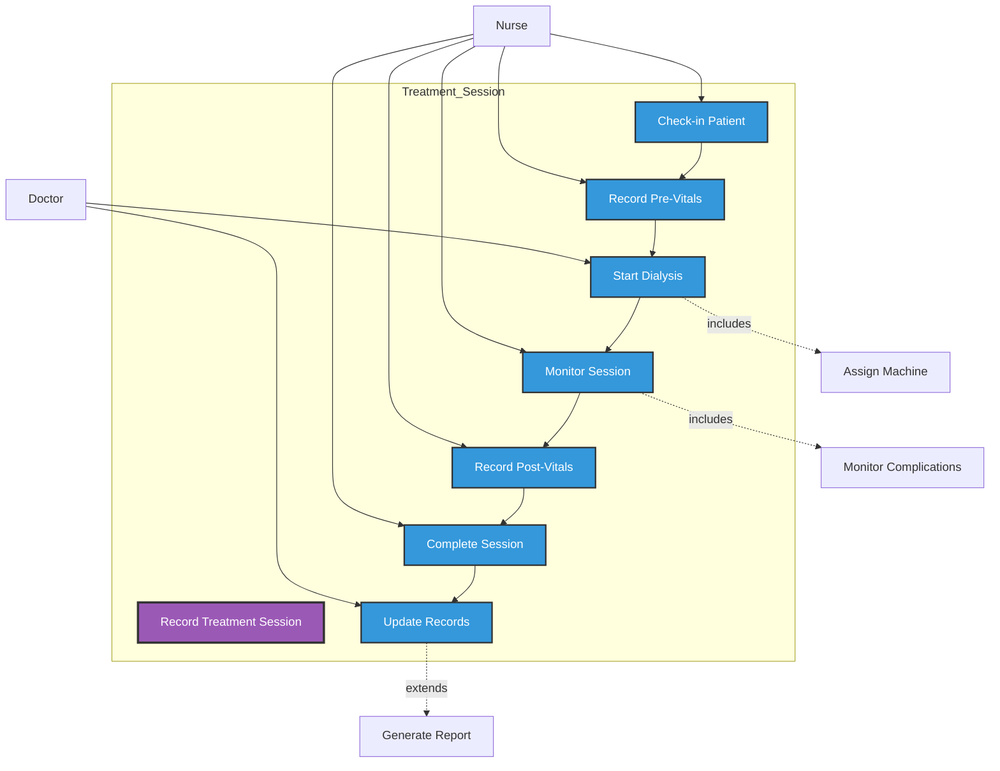
```mermaid
graph TB
    D[Doctor]
    N[Nurse]
    
    subgraph Treatment_Session
        UC[Record Treatment Session]
        UC1[Check-in Patient]
        UC2[Record Pre-Vitals]
        UC3[Start Dialysis]
        UC4[Monitor Session]
        UC5[Record Post-Vitals]
        UC6[Complete Session]
        UC7[Update Records]
    end
    
    N --> UC1
    N --> UC2
    
    D --> UC3
    D --> UC7
    
    N --> UC4
    N --> UC5
    N --> UC6
    
    UC1 --> UC2
    UC2 --> UC3
    UC3 --> UC4
    UC4 --> UC5
    UC5 --> UC6
    UC6 --> UC7
    
    UC3 -.->|includes| I1[Assign Machine]
    UC4 -.->|includes| I2[Monitor Complications]
    UC7 -.->|extends| E1[Generate Report]
    
    style UC fill:#9b59b6,stroke:#333,stroke-width:3px,color:#fff
    style UC1 fill:#3498db,stroke:#333,stroke-width:2px,color:#fff
    style UC2 fill:#3498db,stroke:#333,stroke-width:2px,color:#fff
    style UC3 fill:#3498db,stroke:#333,stroke-width:2px,color:#fff
    style UC4 fill:#3498db,stroke:#333,stroke-width:2px,color:#fff
    style UC5 fill:#3498db,stroke:#333,stroke-width:2px,color:#fff
    style UC6 fill:#3498db,stroke:#333,stroke-width:2px,color:#fff
    style UC7 fill:#3498db,stroke:#333,stroke-width:2px,color:#fff
```

---

## 3. Class Diagrams

### Core Domain Model

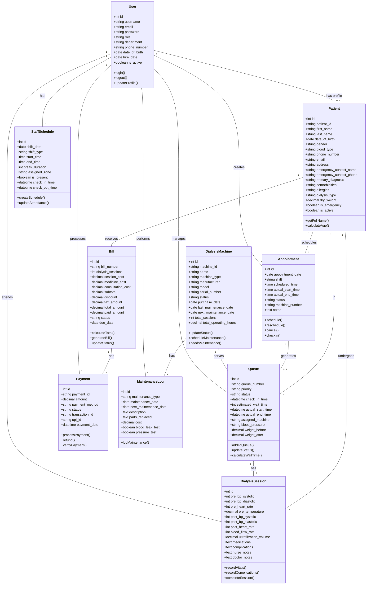
```mermaid
classDiagram
    class User {
        +int id
        +string username
        +string email
        +string password
        +string role
        +string department
        +string phone_number
        +date date_of_birth
        +date hire_date
        +boolean is_active
        +login()
        +logout()
        +updateProfile()
    }
    
    class Patient {
        +int id
        +string patient_id
        +string first_name
        +string last_name
        +date date_of_birth
        +string gender
        +string blood_type
        +string phone_number
        +string email
        +string address
        +string emergency_contact_name
        +string emergency_contact_phone
        +string primary_diagnosis
        +string comorbidities
        +string allergies
        +string dialysis_type
        +decimal dry_weight
        +boolean is_emergency
        +boolean is_active
        +getFullName()
        +calculateAge()
    }
    
    class Appointment {
        +int id
        +date appointment_date
        +string shift
        +time scheduled_time
        +time actual_start_time
        +time actual_end_time
        +string status
        +string machine_number
        +text notes
        +schedule()
        +reschedule()
        +cancel()
        +checkIn()
    }
    
    class Queue {
        +int id
        +string queue_number
        +string priority
        +string status
        +datetime check_in_time
        +int estimated_wait_time
        +datetime actual_start_time
        +datetime actual_end_time
        +string assigned_machine
        +string blood_pressure
        +decimal weight_before
        +decimal weight_after
        +addToQueue()
        +updateStatus()
        +calculateWaitTime()
    }
    
    class DialysisSession {
        +int id
        +int pre_bp_systolic
        +int pre_bp_diastolic
        +int pre_heart_rate
        +decimal pre_temperature
        +int post_bp_systolic
        +int post_bp_diastolic
        +int post_heart_rate
        +int blood_flow_rate
        +decimal ultrafiltration_volume
        +text medications
        +text complications
        +text nurse_notes
        +text doctor_notes
        +recordVitals()
        +recordComplications()
        +completeSession()
    }
    
    class DialysisMachine {
        +int id
        +string machine_id
        +string name
        +string machine_type
        +string manufacturer
        +string model
        +string serial_number
        +string status
        +date purchase_date
        +date last_maintenance_date
        +date next_maintenance_date
        +int total_sessions
        +decimal total_operating_hours
        +updateStatus()
        +scheduleMaintenance()
        +needsMaintenance()
    }
    
    class Bill {
        +int id
        +string bill_number
        +int dialysis_sessions
        +decimal session_cost
        +decimal medicine_cost
        +decimal consultation_cost
        +decimal subtotal
        +decimal discount
        +decimal tax_amount
        +decimal total_amount
        +decimal paid_amount
        +string status
        +date due_date
        +calculateTotal()
        +generateBill()
        +updateStatus()
    }
    
    class Payment {
        +int id
        +string payment_id
        +decimal amount
        +string payment_method
        +string status
        +string transaction_id
        +string upi_id
        +datetime payment_date
        +processPayment()
        +refund()
        +verifyPayment()
    }
    
    class StaffSchedule {
        +int id
        +date shift_date
        +string shift_type
        +time start_time
        +time end_time
        +int break_duration
        +string assigned_zone
        +boolean is_present
        +datetime check_in_time
        +datetime check_out_time
        +createSchedule()
        +updateAttendance()
    }
    
    class MaintenanceLog {
        +int id
        +string maintenance_type
        +date maintenance_date
        +date next_maintenance_date
        +text description
        +text parts_replaced
        +decimal cost
        +boolean blood_leak_test
        +boolean pressure_test
        +logMaintenance()
    }
    
    %% Relationships
    User "1" -- "0..1" Patient : has profile
    Patient "1" -- "*" Appointment : schedules
    Patient "1" -- "*" Queue : in
    Patient "1" -- "*" DialysisSession : undergoes
    Patient "1" -- "*" Bill : receives
    
    Appointment "1" -- "0..1" Queue : generates
    Queue "1" -- "1" DialysisSession : has
    
    DialysisMachine "1" -- "*" Queue : serves
    DialysisMachine "1" -- "*" MaintenanceLog : has
    
    Bill "1" -- "*" Payment : has
    
    User "1" -- "*" Appointment : creates
    User "1" -- "*" Queue : manages
    User "1" -- "*" DialysisSession : attends
    User "1" -- "*" StaffSchedule : has
    User "1" -- "*" MaintenanceLog : performs
    User "1" -- "*" Payment : processes
```

### Authentication & Authorization Class Diagram

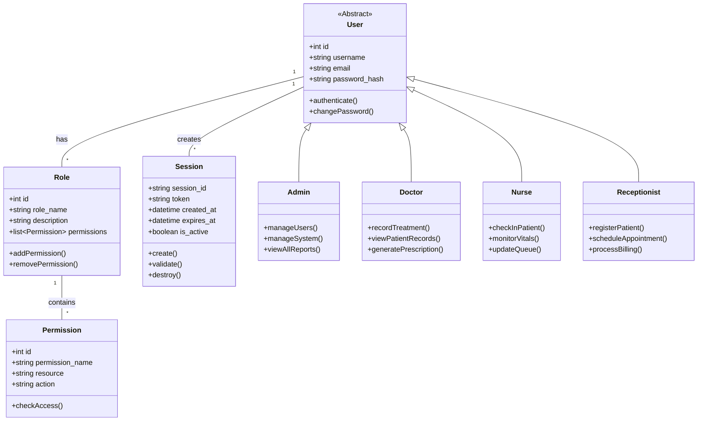
```mermaid
classDiagram
    class User {
        <<Abstract>>
        +int id
        +string username
        +string email
        +string password_hash
        +authenticate()
        +changePassword()
    }
    
    class Role {
        +int id
        +string role_name
        +string description
        +list~Permission~ permissions
        +addPermission()
        +removePermission()
    }
    
    class Permission {
        +int id
        +string permission_name
        +string resource
        +string action
        +checkAccess()
    }
    
    class Session {
        +string session_id
        +string token
        +datetime created_at
        +datetime expires_at
        +boolean is_active
        +create()
        +validate()
        +destroy()
    }
    
    class Admin {
        +manageUsers()
        +manageSystem()
        +viewAllReports()
    }
    
    class Doctor {
        +recordTreatment()
        +viewPatientRecords()
        +generatePrescription()
    }
    
    class Nurse {
        +checkInPatient()
        +monitorVitals()
        +updateQueue()
    }
    
    class Receptionist {
        +registerPatient()
        +scheduleAppointment()
        +processBilling()
    }
    
    User <|-- Admin
    User <|-- Doctor
    User <|-- Nurse
    User <|-- Receptionist
    
    User "1" -- "*" Role : has
    Role "1" -- "*" Permission : contains
    User "1" -- "*" Session : creates
```

---

## 4. Sequence Diagrams

### Patient Registration Sequence

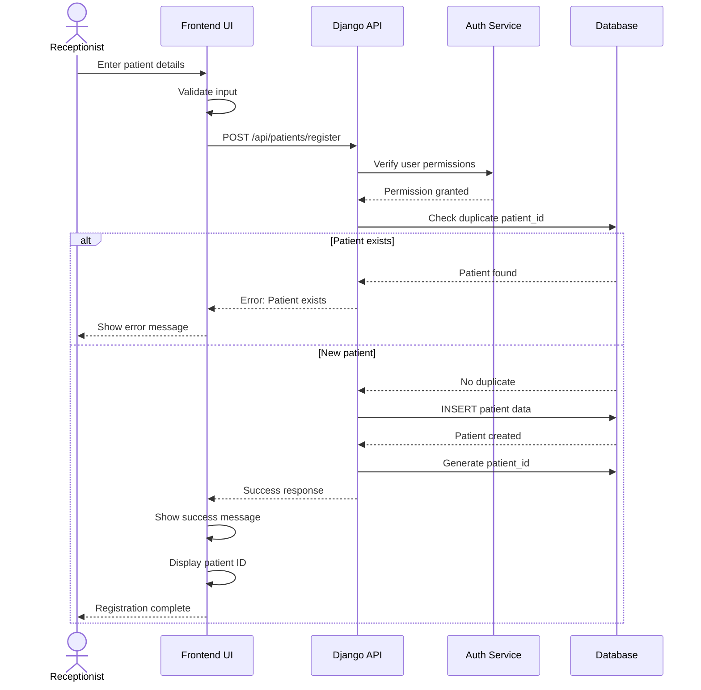
```mermaid
sequenceDiagram
    actor R as Receptionist
    participant UI as Frontend UI
    participant API as Django API
    participant Auth as Auth Service
    participant DB as Database
    
    R->>UI: Enter patient details
    UI->>UI: Validate input
    UI->>API: POST /api/patients/register
    API->>Auth: Verify user permissions
    Auth-->>API: Permission granted
    API->>DB: Check duplicate patient_id
    alt Patient exists
        DB-->>API: Patient found
        API-->>UI: Error: Patient exists
        UI-->>R: Show error message
    else New patient
        DB-->>API: No duplicate
        API->>DB: INSERT patient data
        DB-->>API: Patient created
        API->>DB: Generate patient_id
        API-->>UI: Success response
        UI->>UI: Show success message
        UI->>UI: Display patient ID
        UI-->>R: Registration complete
    end
```

### Appointment Scheduling Sequence

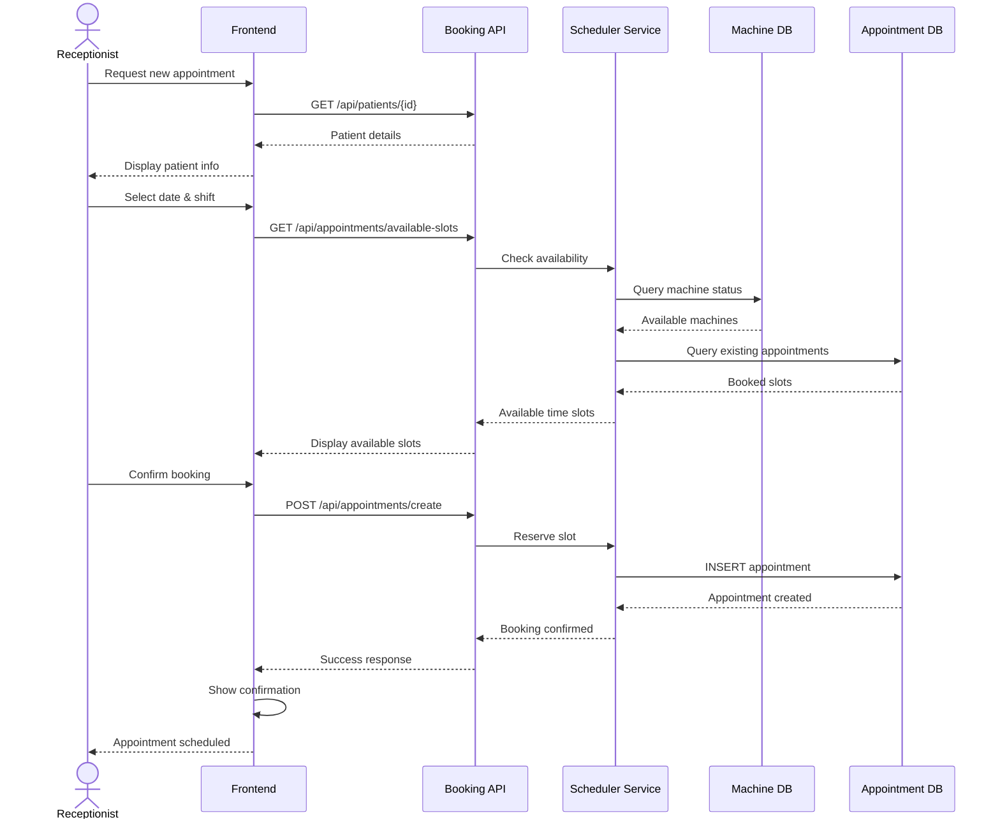
```mermaid
sequenceDiagram
    actor R as Receptionist
    participant UI as Frontend
    participant API as Booking API
    participant Scheduler as Scheduler Service
    participant MachineDB as Machine DB
    participant AppointDB as Appointment DB
    
    R->>UI: Request new appointment
    UI->>API: GET /api/patients/{id}
    API-->>UI: Patient details
    UI-->>R: Display patient info
    
    R->>UI: Select date & shift
    UI->>API: GET /api/appointments/available-slots
    API->>Scheduler: Check availability
    Scheduler->>MachineDB: Query machine status
    MachineDB-->>Scheduler: Available machines
    Scheduler->>AppointDB: Query existing appointments
    AppointDB-->>Scheduler: Booked slots
    Scheduler-->>API: Available time slots
    API-->>UI: Display available slots
    
    R->>UI: Confirm booking
    UI->>API: POST /api/appointments/create
    API->>Scheduler: Reserve slot
    Scheduler->>AppointDB: INSERT appointment
    AppointDB-->>Scheduler: Appointment created
    Scheduler-->>API: Booking confirmed
    API-->>UI: Success response
    UI->>UI: Show confirmation
    UI-->>R: Appointment scheduled
```

### Dialysis Session Sequence

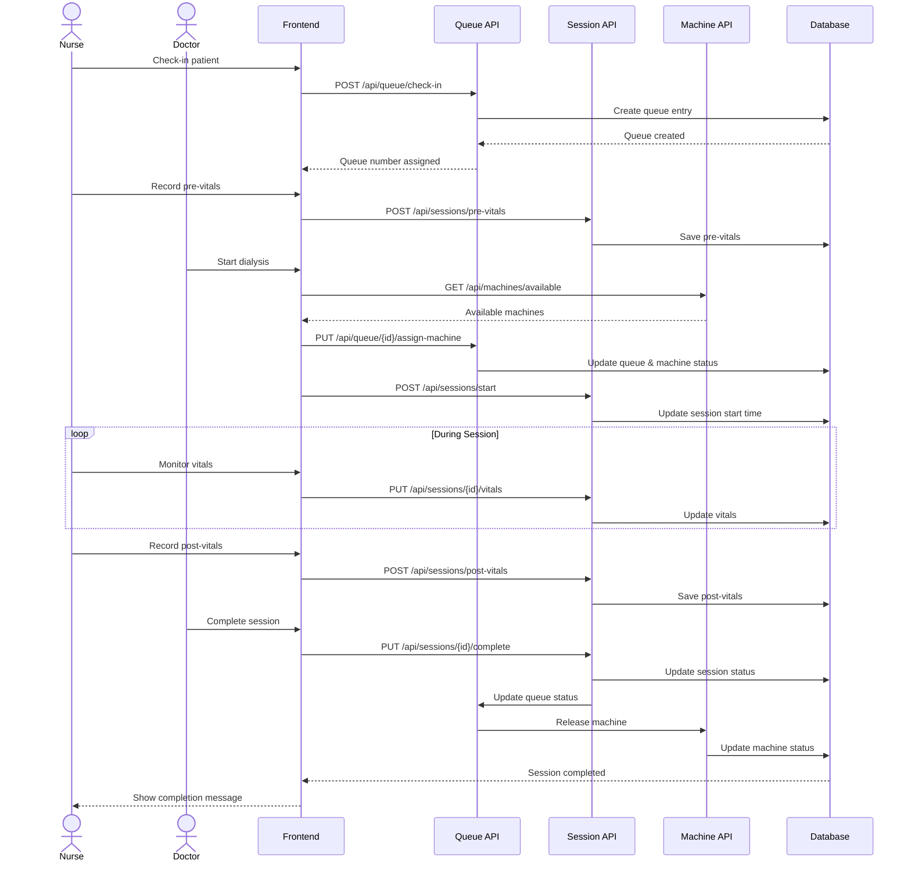
```mermaid
sequenceDiagram
    actor N as Nurse
    actor D as Doctor
    participant UI as Frontend
    participant QueueAPI as Queue API
    participant SessionAPI as Session API
    participant MachineAPI as Machine API
    participant DB as Database
    
    N->>UI: Check-in patient
    UI->>QueueAPI: POST /api/queue/check-in
    QueueAPI->>DB: Create queue entry
    DB-->>QueueAPI: Queue created
    QueueAPI-->>UI: Queue number assigned
    
    N->>UI: Record pre-vitals
    UI->>SessionAPI: POST /api/sessions/pre-vitals
    SessionAPI->>DB: Save pre-vitals
    
    D->>UI: Start dialysis
    UI->>MachineAPI: GET /api/machines/available
    MachineAPI-->>UI: Available machines
    UI->>QueueAPI: PUT /api/queue/{id}/assign-machine
    QueueAPI->>DB: Update queue & machine status
    UI->>SessionAPI: POST /api/sessions/start
    SessionAPI->>DB: Update session start time
    
    loop During Session
        N->>UI: Monitor vitals
        UI->>SessionAPI: PUT /api/sessions/{id}/vitals
        SessionAPI->>DB: Update vitals
    end
    
    N->>UI: Record post-vitals
    UI->>SessionAPI: POST /api/sessions/post-vitals
    SessionAPI->>DB: Save post-vitals
    
    D->>UI: Complete session
    UI->>SessionAPI: PUT /api/sessions/{id}/complete
    SessionAPI->>DB: Update session status
    SessionAPI->>QueueAPI: Update queue status
    QueueAPI->>MachineAPI: Release machine
    MachineAPI->>DB: Update machine status
    DB-->>UI: Session completed
    UI-->>N: Show completion message
```

### Payment Processing Sequence

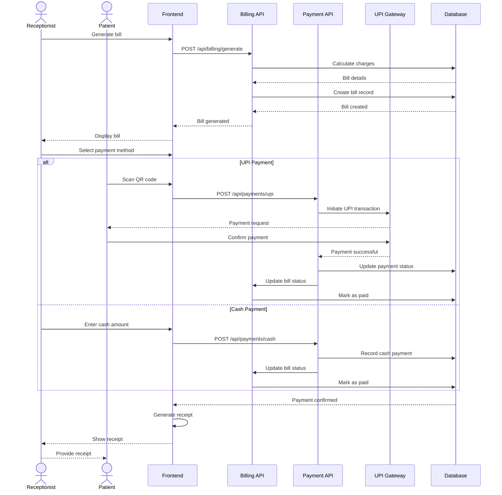
```mermaid
sequenceDiagram
    actor R as Receptionist
    actor P as Patient
    participant UI as Frontend
    participant BillingAPI as Billing API
    participant PaymentAPI as Payment API
    participant PaymentGateway as UPI Gateway
    participant DB as Database
    
    R->>UI: Generate bill
    UI->>BillingAPI: POST /api/billing/generate
    BillingAPI->>DB: Calculate charges
    DB-->>BillingAPI: Bill details
    BillingAPI->>DB: Create bill record
    DB-->>BillingAPI: Bill created
    BillingAPI-->>UI: Bill generated
    UI-->>R: Display bill
    
    R->>UI: Select payment method
    alt UPI Payment
        P->>UI: Scan QR code
        UI->>PaymentAPI: POST /api/payments/upi
        PaymentAPI->>PaymentGateway: Initiate UPI transaction
        PaymentGateway-->>P: Payment request
        P->>PaymentGateway: Confirm payment
        PaymentGateway-->>PaymentAPI: Payment successful
        PaymentAPI->>DB: Update payment status
        PaymentAPI->>BillingAPI: Update bill status
        BillingAPI->>DB: Mark as paid
    else Cash Payment
        R->>UI: Enter cash amount
        UI->>PaymentAPI: POST /api/payments/cash
        PaymentAPI->>DB: Record cash payment
        PaymentAPI->>BillingAPI: Update bill status
        BillingAPI->>DB: Mark as paid
    end
    
    DB-->>UI: Payment confirmed
    UI->>UI: Generate receipt
    UI-->>R: Show receipt
    R-->>P: Provide receipt
```

---

## 5. Entity Relationship Diagram

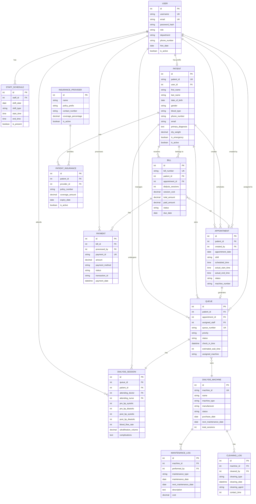
```mermaid
erDiagram
    USER ||--o{ STAFF_SCHEDULE : has
    USER ||--o{ APPOINTMENT : creates
    USER ||--o{ QUEUE : manages
    USER ||--o{ DIALYSIS_SESSION : attends
    USER ||--o{ PAYMENT : processes
    USER ||--o| PATIENT : "has profile"
    
    PATIENT ||--o{ APPOINTMENT : schedules
    PATIENT ||--o{ QUEUE : joins
    PATIENT ||--o{ DIALYSIS_SESSION : undergoes
    PATIENT ||--o{ BILL : receives
    PATIENT ||--o{ PATIENT_INSURANCE : has
    
    APPOINTMENT ||--o| QUEUE : generates
    APPOINTMENT }o--|| USER : "created by"
    
    QUEUE ||--|| DIALYSIS_SESSION : has
    QUEUE }o--|| DIALYSIS_MACHINE : "uses"
    QUEUE }o--|| USER : "assigned to"
    
    DIALYSIS_MACHINE ||--o{ MAINTENANCE_LOG : has
    DIALYSIS_MACHINE ||--o{ CLEANING_LOG : has
    
    BILL ||--o{ PAYMENT : has
    BILL }o--|| PATIENT : "belongs to"
    BILL }o--o| APPOINTMENT : "for"
    
    INSURANCE_PROVIDER ||--o{ PATIENT_INSURANCE : provides
    
    USER {
        int id PK
        string username UK
        string email UK
        string password_hash
        string role
        string department
        string phone_number
        date hire_date
        boolean is_active
    }
    
    PATIENT {
        int id PK
        string patient_id UK
        int user_id FK
        string first_name
        string last_name
        date date_of_birth
        string gender
        string blood_type
        string phone_number
        string email
        text primary_diagnosis
        decimal dry_weight
        boolean is_emergency
        boolean is_active
    }
    
    APPOINTMENT {
        int id PK
        int patient_id FK
        int created_by FK
        date appointment_date
        string shift
        time scheduled_time
        time actual_start_time
        time actual_end_time
        string status
        string machine_number
    }
    
    QUEUE {
        int id PK
        int patient_id FK
        int appointment_id FK
        int assigned_staff FK
        string queue_number UK
        string priority
        string status
        datetime check_in_time
        int estimated_wait_time
        string assigned_machine
    }
    
    DIALYSIS_SESSION {
        int id PK
        int queue_id FK
        int patient_id FK
        int attending_doctor FK
        int attending_nurse FK
        int pre_bp_systolic
        int pre_bp_diastolic
        int post_bp_systolic
        int post_bp_diastolic
        int blood_flow_rate
        decimal ultrafiltration_volume
        text complications
    }
    
    DIALYSIS_MACHINE {
        int id PK
        string machine_id UK
        string name
        string machine_type
        string manufacturer
        string status
        date purchase_date
        date next_maintenance_date
        int total_sessions
    }
    
    BILL {
        int id PK
        string bill_number UK
        int patient_id FK
        int appointment_id FK
        int dialysis_sessions
        decimal session_cost
        decimal total_amount
        decimal paid_amount
        string status
        date due_date
    }
    
    PAYMENT {
        int id PK
        int bill_id FK
        int processed_by FK
        string payment_id UK
        decimal amount
        string payment_method
        string status
        string transaction_id
        datetime payment_date
    }
    
    STAFF_SCHEDULE {
        int id PK
        int staff_id FK
        date shift_date
        string shift_type
        time start_time
        time end_time
        boolean is_present
    }
    
    MAINTENANCE_LOG {
        int id PK
        int machine_id FK
        int performed_by FK
        string maintenance_type
        date maintenance_date
        date next_maintenance_date
        text description
        decimal cost
    }
    
    CLEANING_LOG {
        int id PK
        int machine_id FK
        int cleaned_by FK
        string cleaning_type
        datetime cleaning_date
        string cleaning_agent
        int contact_time
    }
    
    PATIENT_INSURANCE {
        int id PK
        int patient_id FK
        int provider_id FK
        string policy_number
        decimal coverage_amount
        date expiry_date
        boolean is_active
    }
    
    INSURANCE_PROVIDER {
        int id PK
        string name
        string policy_prefix
        string contact_number
        decimal coverage_percentage
        boolean is_active
    }
```

---

## 6. Activity Diagrams

### Patient Registration Activity

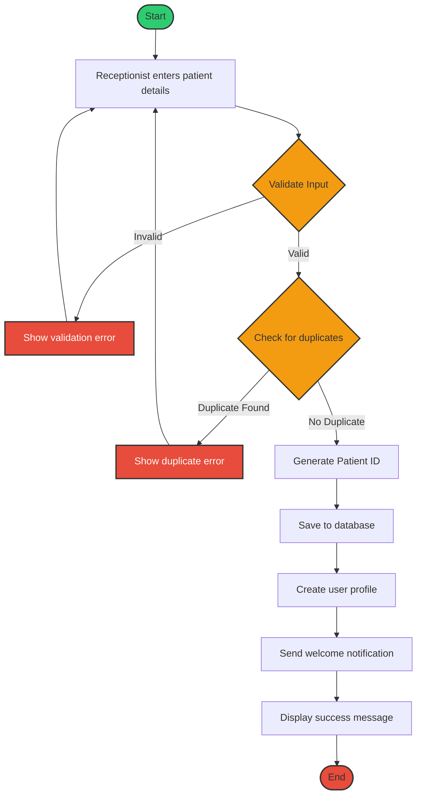
```mermaid
graph TB
    Start([Start]) --> Input[Receptionist enters patient details]
    Input --> Validate{Validate Input}
    
    Validate -->|Invalid| Error1[Show validation error]
    Error1 --> Input
    
    Validate -->|Valid| CheckDup{Check for duplicates}
    
    CheckDup -->|Duplicate Found| Error2[Show duplicate error]
    Error2 --> Input
    
    CheckDup -->|No Duplicate| GenID[Generate Patient ID]
    GenID --> SaveData[Save to database]
    SaveData --> CreateProfile[Create user profile]
    CreateProfile --> SendNotif[Send welcome notification]
    SendNotif --> ShowSuccess[Display success message]
    ShowSuccess --> End([End])
    
    style Start fill:#2ecc71,stroke:#333,stroke-width:2px
    style End fill:#e74c3c,stroke:#333,stroke-width:2px
    style Validate fill:#f39c12,stroke:#333,stroke-width:2px
    style CheckDup fill:#f39c12,stroke:#333,stroke-width:2px
    style Error1 fill:#e74c3c,stroke:#333,stroke-width:2px,color:#fff
    style Error2 fill:#e74c3c,stroke:#333,stroke-width:2px,color:#fff
```

### Dialysis Session Activity

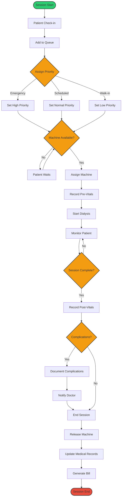
```mermaid
graph TB
    Start([Session Start]) --> CheckIn[Patient Check-in]
    CheckIn --> AddQueue[Add to Queue]
    AddQueue --> AssignPriority{Assign Priority}
    
    AssignPriority -->|Emergency| HighPriority[Set High Priority]
    AssignPriority -->|Scheduled| NormalPriority[Set Normal Priority]
    AssignPriority -->|Walk-in| LowPriority[Set Low Priority]
    
    HighPriority --> CheckMachine
    NormalPriority --> CheckMachine
    LowPriority --> CheckMachine
    
    CheckMachine{Machine Available?}
    CheckMachine -->|No| Wait[Patient Waits]
    Wait --> CheckMachine
    
    CheckMachine -->|Yes| AssignMachine[Assign Machine]
    AssignMachine --> RecordPreVitals[Record Pre-Vitals]
    RecordPreVitals --> StartDialysis[Start Dialysis]
    
    StartDialysis --> Monitor[Monitor Patient]
    Monitor --> CheckTime{Session Complete?}
    
    CheckTime -->|No| Monitor
    CheckTime -->|Yes| RecordPostVitals[Record Post-Vitals]
    
    RecordPostVitals --> CheckComplications{Complications?}
    
    CheckComplications -->|Yes| RecordComplications[Document Complications]
    RecordComplications --> NotifyDoctor[Notify Doctor]
    NotifyDoctor --> EndSession
    
    CheckComplications -->|No| EndSession[End Session]
    
    EndSession --> ReleaseMachine[Release Machine]
    ReleaseMachine --> UpdateRecords[Update Medical Records]
    UpdateRecords --> GenerateBill[Generate Bill]
    GenerateBill --> End([Session End])
    
    style Start fill:#2ecc71,stroke:#333,stroke-width:2px
    style End fill:#e74c3c,stroke:#333,stroke-width:2px
    style AssignPriority fill:#f39c12,stroke:#333,stroke-width:2px
    style CheckMachine fill:#f39c12,stroke:#333,stroke-width:2px
    style CheckTime fill:#f39c12,stroke:#333,stroke-width:2px
    style CheckComplications fill:#f39c12,stroke:#333,stroke-width:2px
```

### Appointment Booking Activity

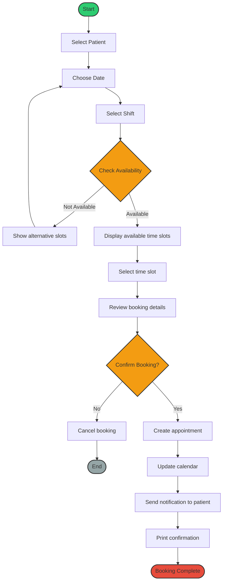
```mermaid
graph TB
    Start([Start]) --> SelectPatient[Select Patient]
    SelectPatient --> ChooseDate[Choose Date]
    ChooseDate --> SelectShift[Select Shift]
    SelectShift --> CheckAvail{Check Availability}
    
    CheckAvail -->|Not Available| ShowAlternate[Show alternative slots]
    ShowAlternate --> ChooseDate
    
    CheckAvail -->|Available| ShowSlots[Display available time slots]
    ShowSlots --> SelectTime[Select time slot]
    SelectTime --> Review[Review booking details]
    Review --> Confirm{Confirm Booking?}
    
    Confirm -->|No| Cancel[Cancel booking]
    Cancel --> End([End])
    
    Confirm -->|Yes| CreateAppt[Create appointment]
    CreateAppt --> UpdateCalendar[Update calendar]
    UpdateCalendar --> SendNotif[Send notification to patient]
    SendNotif --> PrintConfirm[Print confirmation]
    PrintConfirm --> Success([Booking Complete])
    
    style Start fill:#2ecc71,stroke:#333,stroke-width:2px
    style End fill:#95a5a6,stroke:#333,stroke-width:2px
    style Success fill:#e74c3c,stroke:#333,stroke-width:2px
    style CheckAvail fill:#f39c12,stroke:#333,stroke-width:2px
    style Confirm fill:#f39c12,stroke:#333,stroke-width:2px
```

---

## 7. Component Diagram

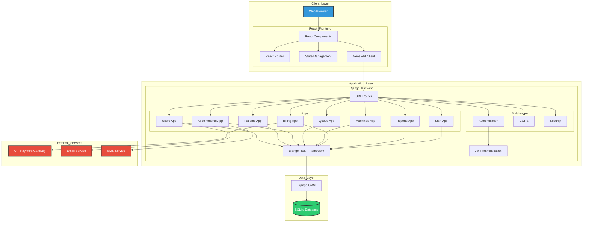
```mermaid
graph TB
    subgraph Client_Layer
        WebBrowser[Web Browser]
        
        subgraph React_Frontend
            Components[React Components]
            Router[React Router]
            StateManagement[State Management]
            APIClient[Axios API Client]
        end
    end
    
    subgraph Application_Layer
        subgraph Django_Backend
            URLRouter[URL Router]
            
            subgraph Apps
                UsersApp[Users App]
                PatientsApp[Patients App]
                AppointmentsApp[Appointments App]
                QueueApp[Queue App]
                MachinesApp[Machines App]
                BillingApp[Billing App]
                ReportsApp[Reports App]
                StaffApp[Staff App]
            end
            
            subgraph Middleware
                AuthMiddleware[Authentication]
                CORSMiddleware[CORS]
                SecurityMiddleware[Security]
            end
            
            DRF[Django REST Framework]
            JWT[JWT Authentication]
        end
    end
    
    subgraph Data_Layer
        ORM[Django ORM]
        Database[(SQLite Database)]
    end
    
    subgraph External_Services
        PaymentGateway[UPI Payment Gateway]
        EmailService[Email Service]
        SMSService[SMS Service]
    end
    
    WebBrowser --> Components
    Components --> Router
    Components --> StateManagement
    Components --> APIClient
    
    APIClient --> URLRouter
    
    URLRouter --> UsersApp
    URLRouter --> PatientsApp
    URLRouter --> AppointmentsApp
    URLRouter --> QueueApp
    URLRouter --> MachinesApp
    URLRouter --> BillingApp
    URLRouter --> ReportsApp
    URLRouter --> StaffApp
    
    AuthMiddleware --> JWT
    URLRouter --> AuthMiddleware
    URLRouter --> CORSMiddleware
    URLRouter --> SecurityMiddleware
    
    UsersApp --> DRF
    PatientsApp --> DRF
    AppointmentsApp --> DRF
    QueueApp --> DRF
    MachinesApp --> DRF
    BillingApp --> DRF
    ReportsApp --> DRF
    StaffApp --> DRF
    
    DRF --> ORM
    ORM --> Database
    
    BillingApp --> PaymentGateway
    UsersApp --> EmailService
    AppointmentsApp --> SMSService
    
    style WebBrowser fill:#3498db,stroke:#333,stroke-width:2px,color:#fff
    style Database fill:#2ecc71,stroke:#333,stroke-width:2px,color:#fff
    style PaymentGateway fill:#e74c3c,stroke:#333,stroke-width:2px,color:#fff
    style EmailService fill:#e74c3c,stroke:#333,stroke-width:2px,color:#fff
    style SMSService fill:#e74c3c,stroke:#333,stroke-width:2px,color:#fff
```

---

## 8. Deployment Diagram

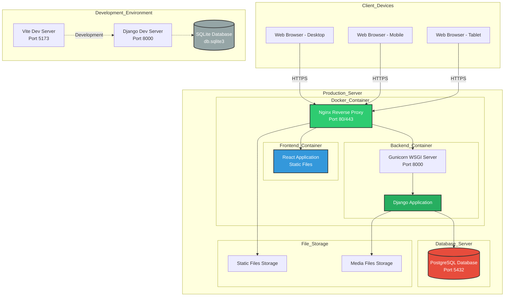
```mermaid
graph TB
    subgraph Client_Devices
        Browser1[Web Browser - Desktop]
        Browser2[Web Browser - Mobile]
        Browser3[Web Browser - Tablet]
    end
    
    subgraph Production_Server
        subgraph Docker_Container
            Nginx[Nginx Reverse Proxy<br/>Port 80/443]
            
            subgraph Frontend_Container
                ReactApp[React Application<br/>Static Files]
            end
            
            subgraph Backend_Container
                Gunicorn[Gunicorn WSGI Server<br/>Port 8000]
                Django[Django Application]
            end
        end
        
        subgraph Database_Server
            PostgreSQL[(PostgreSQL Database<br/>Port 5432)]
        end
        
        subgraph File_Storage
            StaticFiles[Static Files Storage]
            MediaFiles[Media Files Storage]
        end
    end
    
    subgraph Development_Environment
        ViteDev[Vite Dev Server<br/>Port 5173]
        DjangoDevServer[Django Dev Server<br/>Port 8000]
        SQLite[(SQLite Database<br/>db.sqlite3)]
    end
    
    Browser1 -->|HTTPS| Nginx
    Browser2 -->|HTTPS| Nginx
    Browser3 -->|HTTPS| Nginx
    
    Nginx --> ReactApp
    Nginx --> Gunicorn
    Nginx --> StaticFiles
    
    Gunicorn --> Django
    Django --> PostgreSQL
    Django --> MediaFiles
    
    ViteDev -.->|Development| DjangoDevServer
    DjangoDevServer -.-> SQLite
    
    style Nginx fill:#2ecc71,stroke:#333,stroke-width:2px,color:#fff
    style ReactApp fill:#3498db,stroke:#333,stroke-width:2px,color:#fff
    style Django fill:#27ae60,stroke:#333,stroke-width:2px,color:#fff
    style PostgreSQL fill:#e74c3c,stroke:#333,stroke-width:2px,color:#fff
    style SQLite fill:#95a5a6,stroke:#333,stroke-width:2px,color:#fff
```

### Deployment Architecture Details

```mermaid
graph LR
    subgraph Internet
        Users[Users/Clients]
    end
    
    subgraph Load_Balancer
        LB[Nginx Load Balancer]
    end
    
    subgraph Application_Servers
        App1[App Server 1<br/>Django + Gunicorn]
        App2[App Server 2<br/>Django + Gunicorn]
    end
    
    subgraph Database_Cluster
        DBMaster[(Master DB<br/>Read/Write)]
        DBSlave[(Slave DB<br/>Read Only)]
    end
    
    subgraph Cache_Layer
        Redis[(Redis Cache)]
    end
    
    subgraph CDN
        StaticCDN[Static Files CDN]
    end
    
    Users -->|HTTPS| LB
    LB --> App1
    LB --> App2
    
    App1 --> DBMaster
    App2 --> DBMaster
    App1 --> DBSlave
    App2 --> DBSlave
    
    DBMaster -.->|Replication| DBSlave
    
    App1 --> Redis
    App2 --> Redis
    
    LB --> StaticCDN
    
    style LB fill:#3498db,stroke:#333,stroke-width:2px,color:#fff
    style App1 fill:#27ae60,stroke:#333,stroke-width:2px,color:#fff
    style App2 fill:#27ae60,stroke:#333,stroke-width:2px,color:#fff
    style DBMaster fill:#e74c3c,stroke:#333,stroke-width:2px,color:#fff
    style DBSlave fill:#e67e22,stroke:#333,stroke-width:2px,color:#fff
    style Redis fill:#c0392b,stroke:#333,stroke-width:2px,color:#fff
```

---

## Summary

This comprehensive UML diagram documentation for **DialysisTrack** includes:

1. **Data Flow Diagrams (DFD)**: 
   - Level 0: Context diagram showing external entities
   - Level 1: System processes and data stores
   - Level 2: Detailed process flows for Patient Management and Queue Management

2. **Use Case Diagrams**:
   - Overall system use cases for all actors
   - Detailed use cases for Patient Registration, Appointment Scheduling, and Treatment Sessions

3. **Class Diagrams**:
   - Core domain model with all major entities
   - Authentication and authorization model

4. **Sequence Diagrams**:
   - Patient registration flow
   - Appointment scheduling flow
   - Dialysis session management
   - Payment processing

5. **Entity Relationship Diagram (ERD)**:
   - Complete database schema with all tables and relationships

6. **Activity Diagrams**:
   - Patient registration workflow
   - Dialysis session workflow
   - Appointment booking workflow

7. **Component Diagram**:
   - System architecture showing all layers and components

8. **Deployment Diagram**:
   - Production and development deployment architectures

All diagrams are created using Mermaid syntax and can be rendered in any Markdown viewer that supports Mermaid diagrams.
